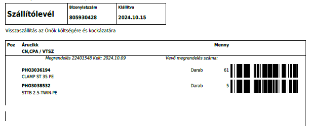

# Bejövő készlet helyre rakása

A bejövő készletről mindenképpen beszerzési szállítólevél kerül rögzítésre, az az alapja a raktárkészlet növelésnek.

> Lásd: [Beszerzési szállítólevél](../Beszerzes/Szallitolevel)

Minden raktárcsoportnak definiálva van egy INP végződésű raktárhely, mindent ezekre a raktárhelyekre vételezünk be.

## Szállítólevél nyomtatása

A szállítólevél rögzítése után, ki kell nyomtatni a szállítólevelet voalkódokkal. Ehhez a szállítólevelet meg kell nyitni, majd a nyomtatásnál a "Beszerzési szállítólevél vonalkóddal" layoutot válasszuk ki.

Olyan nyomatot kapunk, ahol az árucikkek vonalkóddal is fel vannak tüntetve:

## Átraktározás

A készletet a PDA segítségével az Átraktározás funkcióval tudjuk a helyére mozgatni.
