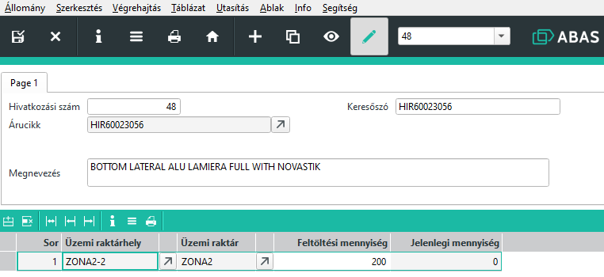

# Üzemi raktárhelyek

Üzemi raktárhelyeket egy adott cikkhez lehet egy kiegészítő adatbázisban definiálni.

Ebben az adatbázisban azoknak az alapanyagonknak, amelyeknek akarunk üzemi készletet tartani, üzemi zónánként lehet definiálni raktárhelyet, és meg kell adni egy feltöltési mennyiség értéket.

A feltöltési mennyiség az a mennyiség, ami feltöltött állapot mennyisége. Ennél nagyobb mennyiség is átraktározható.

Amennyiben a zónában a készlet a feltöltési mennyiség 50%-a alá csökken, akkor az ABAS javaslatot tesz a készlet feltöltésre.

## ÜZEMI raktárhelyek definiálása

A Céges/ERC/Raktár/Üzemi raktárhelyek MASK megnyitása.

+ jellel tudunk új árucikket felvenni.

Adott árucikket csak egyszer kell felvenni.

Árucikk megadásával a keresőszó és a megnevezés automatikusan kitöltődik.

Legalább egy táblázati sort ki kell tölteni.
Meg kell adni a zónában a raktárhelyet, ahol tároljuk a cikket. Az üzemi raktár mező automatikusan töltődik. Üzemi raktáranként egy raktárhely adható meg.

A feltöltési mennyiséghez a zónán belüli ideális feltöltési mennyiséget írjuk. Minden zónában egyedi értéket adhatunk meg.

> Fontos! Zónán belül egy raktárhelyet adhatunk meg, de fizikailag ez lehet több tároló is. Nem volt cél, hogy munkahelyenkét kezeljük a készletet, ezért zónán belül minden rekesz ami azonos árucikket tartalmaz, azonos raktárhelyet jelöl. Ha a készlet 505 alá csökken, azt jelenti, hogy a zónán belül az összes azonos árucikket tartalmazó rekesz összmennyisége csökkent 50% alá, de lehet valamelyik tele van, valamelyik pedig teljesen üres.

A jelenlegi mennyiség oszlopban az adott zónában nyilvántartott pillanatnyi készlet értéket látjuk.

