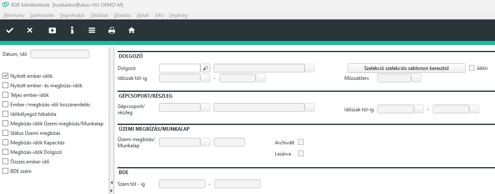

# Bde kiértékelések

A 10211 LAZEIT infosystem, üzemi adatok rögzítése (BDE) munkatartomány, az alábbi funkciókkal rendelkezik:

Megbízás idők kiadása üzemi megbízások, gépcsoportok, dolgozók vagy az üzemi adat rögzítés (BDE) számai szerint
Egy dolgozó ember és megbízás idő bélyegzéseinek az idő összehasonlítása
Nyomtatás JasperReports-on keresztül, LAZEIT layout

Használat előtt ki kell választani a funkciót a fejrészen.

|Mező|Jelentés|
|----|-----|
|Nyitott ember idők|Ehhez be kell írnia egy dolgozót vagy egy dolgozó tartományt. Ezután a dolgozókhoz vagy dolgozó tartományokhoz megjelenítésre kerül az összes nyitott ember idő. Egy nyitott ember idő rendelkezik kezdő idővel, befejező idővel azonban NEM. Ezen a kiválasztáson keresztül a jelenlévő dolgozók választhatók ki.|
|Nyitott ember és megbízás idők|Ezzel megjelenítésre kerül az összes nyitott ember idő és a nyitott megbízás idők egy dolgozóhoz vagy egy dolgozó tartományhoz. Ez az összes ember idő és megbízás idő, aminél a befejező idő hiányzik.|
|Időbélyegzés továbbítása|A könyvelt megbízás idők befolynak a visszajelentésekbe. Az ember idők NEM folynak be a visszajelentésekbe.|
|Teljes ember idők Dolgozó|Ezen a kiválasztáson keresztül egy dolgozóhoz vagy dolgozótörzshöz szelektálhatók a teljes ember idők. A teljes ember idők kezdő és befejező idővel rendelkeznek. Ezen a kiválasztáson keresztül a Nyitott ember időkkel összehasonlítva a fordított nézetet kapja az adatokra vonatkozóan. Kiadathatja az összes dolgozót, amely nem rendelkezik nyitott ember idővel és így jelenleg nincs jelen.|
|Ember/megbízás idő hozzárendelés|Ezen a kiválasztáson keresztül összehasonlításra kerülnek az ember idők és megbízás idők egy dolgozóhoz vagy dolgozótörzshöz. A megbízás idők ebben a nézetben hozzárendelésre kerülnek az ember időkhöz. Így látható, hogy egy dolgozó mely megbízás időket bélyegezte egy ember időben.|
|Időbélyegző hibalista|A mező jelenleg nem támogatott.|
|Megbízás idők Üzemi megbízás/Munkalap|Ehhez a kiválasztáshoz írjon be alapként egy üzemi megbízást vagy munkalapot! A megbízás idők munkalapokon kerülnek bélyegzésre. Ezen a kiválasztáson keresztül szelektálható az összes megbízás idő egy üzemi megbízáshoz. Ennél mind nyitott, mind teljes megbízás idők megjelenítésre kerülnek.|
|Státus Üzemi megbízás|Ehhez a kiválasztáshoz írjon be egy üzemi megbízást! Most a megbízás idők munkalaponként összegzésre és a táblázatban megjelenítésre kerülnek. Ennél a normaidők (cél idő) a megbízási gyártási listából szembeállításra kerülnek a bélyegzett megbízás időkkel (tény idők). Ezen keresztül meghatározható, hogy mennyire plauzibilis a megadott cél idő.|
|Megbízás idők Kapacitás|Alapként írjon be egy kapacitást! Ezután megjelenítésre kerül az összes nyitott és teljes megbízás idő ehhez a kapacitáshoz.|
|Megbízás idők Dolgozó|Alapként írjon be egy dolgozót vagy dolgozó tartományt! Ezután megjelenítésre kerül az összes nyitott és teljes megbízás idő ehhez a dolgozóhoz vagy dolgozó tartományhoz.|
|Összes ember idő|Alapként írjon be egy dolgozót vagy dolgozó tartományt! Ezután megjelenítésre kerül az összes nyitott és teljes ember idő ehhez a dolgozóhoz vagy dolgozó tartományhoz.|
|BDE szám|Ezen kiválasztás után a BDE szakaszban beírhatja a Szám tól - ig mezőkben az üzemi adatok rögzítése (BDE) adatbázis hivatkozási számait, pl. 1-999. Ezután megjelenítésre kerül az összes megbízás és ember idő, ami megfelelő hivatkozási számmal rendelkezik.|