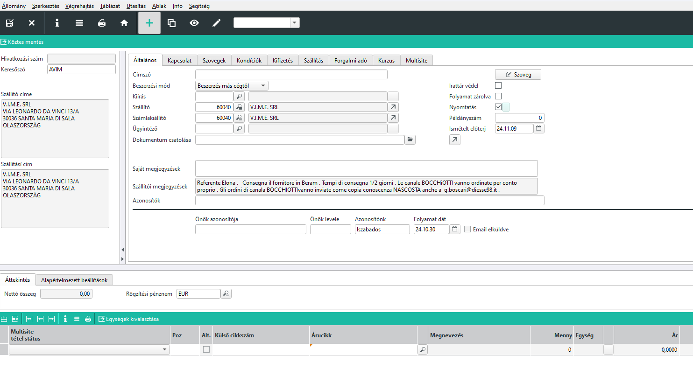
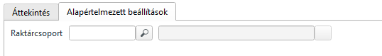

# Ajánlatkérések

Az ajánlatkérés maskba tudunk ajánlatkéréshez egy szállítónak bizonylatot küldeni.

A szállító kiválasztásával a szállító törzsből a legtöbb kitöltendő információ átvételre kerül, csak a tételeket kell feltölteni.

Ha külső raktárcsoportra akarunk rendelni, akkor a tételek felvitele előtt mindenképpen állítsuk be a raktárcsoportot az alapértelmezett beállítások regiszteren.

Külső cikkszámhoz a szállító cikkszáma is megadható, amennyiben az ismert, de javasolt a belső cikkszám használata a sebesség miatt.

Árucikk, mennyiség kötelezően kitöltendő, és az ár is fontos.

A rendszer ellenőrzi, van e a szállítónak árlistája és, amennyiben van, onnan felajánlja a cikk árát.

> Amennyiben eltérő árat viszünk fel, a rendszer feldobja az Árak-rabatok maskot az ár javítására. Ha nem volt ár, akkor pedig az ár mentéséhez.

A poz mezőt is töltsük, hogy a szállító tudjon a sorra hivatkozni.

Szállítási határidőt is megadhatunk, valamit tételszövegnek megjegyzést.

> amennyiben conto lavoró cikkeket kérünk, a sornagyítónál a számla releváns pipát vegyük ki!
