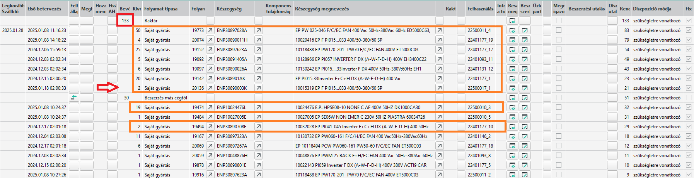

# Árucikk helyettesítése

Alapesetben az ABAS [beszerzési javaslataiból](beszerzesi-javaslatok.md) kellene kiindulnia a beszerzésnek. Ha valamit az ABAS nem kér, akkor annak oka van. Ha a beszerzés tudja, hogy biztosan kell rendelnie, de az abas javaslatában nem szerepel, akkor a gyártási lista nem jó. Azt kell javíttatni, és ha ki van javítva, akkor az ABAS javasolni fogja a beszerzét.

> A javaslattól eltérő beszerzések, biztosan hibához vezetnek, ezért kerüljük! (Természetesen itt most nem a mennyiségekről beszélek, meg az időpontokról, hanem a cikktípusról)

## Helyettesítés oka, jóváhagyatása

Ha a javaslatban olyan tétel szerepel, ami helyett a beszerzés mást rendelne, (mert pl sokkal olcsóbb, vagy a régi már nem elérhető többé), akkor előzetesen ezt a technikusokkal jóvá kell hagyatni, hogy valóban helyettesíthető e azzal. (Ez számos esetben a megrendelőn is múlik, vagy egy megrendelőt is érintő jóváhagyási folyamatnak is meg kell történnie.)

## Helyettesítés ütemezése

példának vegyük a FIN385100240060 árucikket, amiből a jelenlegi készlet 133 db
Az adott cikknek meg kell nézni a tervlapját:

Látható, hogy a nyíllal jelzett pontig a tervezett gyártások még a régi készlettel teljesíthetőek. Ekkor 21 db marad a készlet.
Ezt követően a 19 és a 2 db-os megbízás teljesíthető a régi készletből, de lehet más tetszőleges variációt is kitalálni.

A lényeg, a tervezést értesíteni kell:
- cserélje a gyártási listákon az alapanyagot az új típusra
- a már létező üzemi gyártási listákon pedig a keretezettek kivételével szintén cserélni kell. Ami keretezve van,az még a régi készletből kerül felhasználásra a régi típussal, azokon nem cseréljük az alapanyagot.

Ha ez a folyamat időben megtörténik, akkor csak olyan megbízásokat fog érinteni, ahol a gyártás nem kezdődött el, ezért nem okoz nagy fennakadást.

A tervezés feladata, hogy azokon a megbízásokon, ahol cserélni kellen az alapanyagot, amennyiben szükséges jóváhagyassa az új alapanyagot. Ha az új alapanyag oda nem megfelelő, akkor alternatív alapanyagot kell keresni és azt beállítani.

## ANNULLATO

A régi alapanyagon be kell állítani az ANNULLATO állapotot, hogy a tervezés véletlenül se használja a későbbiekben. Természetesen, ha bármi okból újra rendeljük, ezt vissza lehet vonni.

