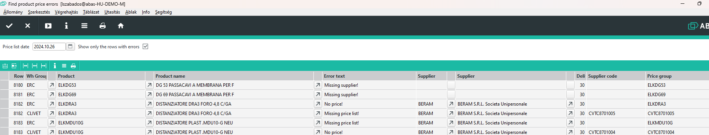

# Árucikkek hibás árlistáinak keresése infosystem

A Céges/ERC/RAKTÁR/Find Product Price Errors Infosystemmel indítható

> Ez a program elavult. Adhat érdemi információkat, de helyette javasolt inkább a [Tervezés](../tervezes/index.md) részben a [összesített előkalkuláció](../tervezes/osszesitett-elokalkulacio.md) infosystemből a tömeges hibakeresés részt használni.

Az Infosystemmel az árucikkeket lehet végigellenőrizni, és a program kilistázza az árucikkeket és az árlistával kapcsolatos beállításokat.

Keres lehetséges hbákat is, de minden előkalkulációs hibát nem tud megtalálni. A hibakeresés abból indul ki, hogy az adott árucikkből 1 raktári egység fog kelleni.

## Paraméterek a lekérdezéshez

- "Price list date" mezőbe azt a dátumot írjuk, ameyik napon az ár érvényes legyen. Alapértelmezetten az aktuális dátum kerül ide.
- "Show only the rows with errors" alapértelmezetten be van kapcsolva, így csak azokat a sorokat mutatja, ahol hibát feltételez a rendszer.

> A program nem fog gyorsabban végezni akkor sem, ha csak a hibás sorokat kérjük, mert az ellenőrzést mindenképpen végig kell futtatni, de eredményül kevesebb sorunk lesz.

> Néha érdemes ezt a mezőt kikapcsolni, mert attól, hogy a rendszer nem érzékel hibát, még nem biztos, hogy jó értékek szerepelnek.

## Eredmény oszlopok

- Row   
sorszám

- Wh Group
Raktárcoport kódja. Belső raktárcsoport (ERC) mindenképpen létezik. Külső raktárcsoportok csak abban az esetben, ha definiálva vannak

> Ha csak a hibás sorok mutatását kértük, lehetséges, hogy a belső raktárcsoport vagy egyes külső raktárcsoport sorai nem látszódnak!

- Product, Product name
Az árucikk keresőszava és neve

- Error Text
Ha a rendszer hibát talál, akkor ezek leírása.

- Supplier
Az elsődlegesnek beállított szállító a raktárcsoporton. Ha üres, akkor hibát jelez a rendszer.

> a jelenlegi rendszer csak az elsődleges szállítókat ellenőrzi le, és csak ezekhez keres árat is!

- Delivery date
A szállítási határidő a raktárcsoporton. Üres vagy 0 esetén hibát jelez a rendszer.

- Supplier code
A szállító saját kódja. Ennek hiánya nem hiba.

- Price group
A raktárcsoporton beállított árcsoport

- Warehouse unit
Árucikk raktári egysége

- Commercial unit
Beszerzési egység

- Commercial faktor
Beszerzési faktor

- Warehouse factor
Raktár faktor beszerzésnél

> Beszerzésnél a beszerzett mennyiséget el kell osztani a Beszerzési faktorral és megszorozni a Raktár beszerzési faktorával. Pl. ha a beszerzési faktor 1 és a Raktár beszerzési faktor 10.000 egy címkénél, akkor 2db vásárlása esetén 2*10000/1 = 20.000 db raktári készlet keletkezik. Ezek az értékek befolyásolják az árlistában kiválasztandó árat.

- Commercial price faktor
Beszerzési ár faktor

- Warehouse price factor
Raktár ár faktor beszerzésnél

> Beszerzésnél a beszerzett mennyiséget el kell osztani a Beszerzési ár faktorral és megszorozni a Raktár ár beszerzési faktorával. Pl. ha a beszerzési ár faktor 1 és a Raktár beszerzési ár faktor 10.000 egy címkénél, akkor 200EUR költség esetén a negvett 2db,  2*10000/1 = 20.000 db. Vagyis a 20.000 db ára volt összesen 200 EUR. 

- Standard quantity
Előkalkulációnál beállított standard mennyiség, amivel kalkuláljon a rendszer.

> Csak akkor kalkulál az itt beállított értékkel az előkalkuláció, ha az "Előkalkuláció mindíg a standard mennyiséggel" mező be van kapcsolva. Ha a Standard mennyiség nem alapértelmezett (0 vagy 1) és az  "Előkalkuláció mindíg a standard mennyiséggel" mező nincs bepipálva, akkor ez a mező piros háttérrel jelenik meg, jelezve, hogy a beállított értéket nem használja a rendszer.

- Included in the production list
Ez a jelölő be van kapcsolva, ha az árucikk rajt van legalább egy standard gyártási listán.

> Fontos! A raktárcsoport is figyelembe van véve, vagyis a gyártási listának a sor raktárcsoportjához kell tartoznia. Pl. ha egy cikk SCM paneloknál van csak, ezért ott van csak árlista, ott mindenképpen kapni fogunk egy belső raktárcsoporthoz tartozó sort hibával, mert a belső raktárcsoport mindenképpen létezik!

- Price end of validity
Ha talál érvényes árlistát a rendszer, akkor itt az árlista érvényességi határideje látható.

> Az itt látható határidő nem zárja ki, hogy van egy újabb időintervallumra érvényes árlista.

- Purchase price
Beszerzési ár, ha van érvényes ár, akkor ezt találta a rendszer.

> A beszerzési ár meghatározásánál a rendszer egy raktári egységhez keres árat.

## Árlista keresése

A rendszer az árat egy raktári egységhez keresi. Az áraknál viszont beszerzési egység van megadva.

Legtöbb esetben a beszerzéshez tartozó faktor és raktári faktor értéke 1, vagyis 1 beszerzési egység 1 raktári egységnek felel meg. 
Ebben az esetben ez visszafelé is igaz, vagyis egy raktári egységhez 1 beszerzési egység tartozik, vagyis 1 beszerzési egységhez keresünk árat.

Abban az esetben, ahol pl. ahol a beszerzési egység 1db és a raktári egység 2,4 méter, ott 1 raktári egység (1 méter) az 1/2,4 = 0,4166 db beszerzési egységnek felel meg. Ha az árak 1 db-tól vannakmegadva, akkor az ár nem meghatározható.

Itt kell beállítani a Standard mennyiséghez 2,4 raktári egység értéket. Ekkor nem 1 hanem 2,4 mennyiséghez keres árat, vagyis 2,4/2,4 = 1 db. Ilyen árunk viszont van, jó a beállítás.

## Hibaüzenetek a Hiba oszlopban
- Missing supplier!   -> Nincs a raktárcsoporton szállító megadva
- Delivery date not specified! -> A raktárcsoporton a szállítási határidő üres vagy 0
- Missing price list! -> Nem található a megadott dátumon érvényes árlista.
- No price! -> Van érvényes árlista, de az egy raktári egységhez nem meghatározható az ár.
- Missing price group! -> A raktárcsoporton az árcsoport nincs kitöltve