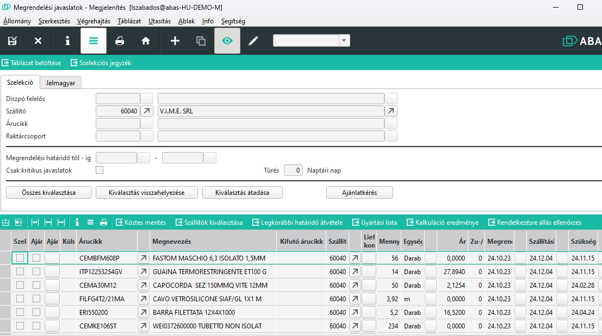
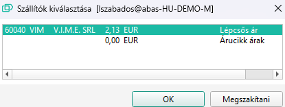
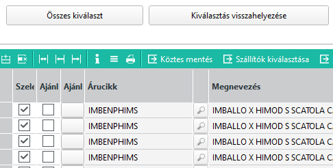
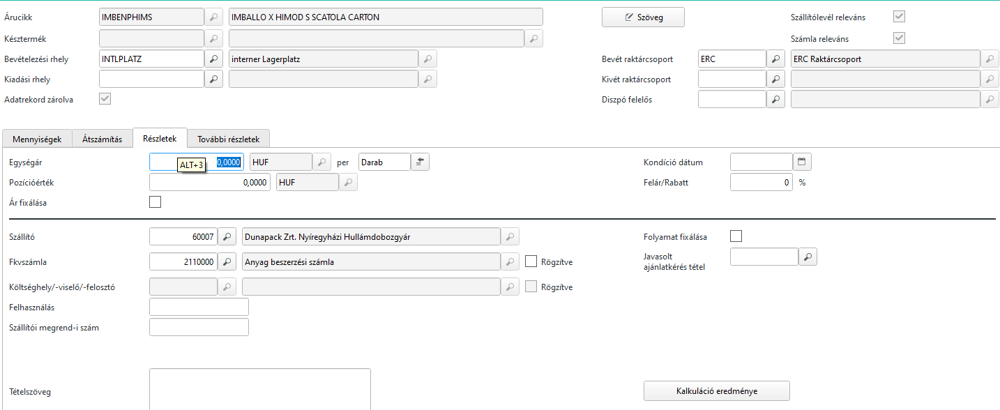
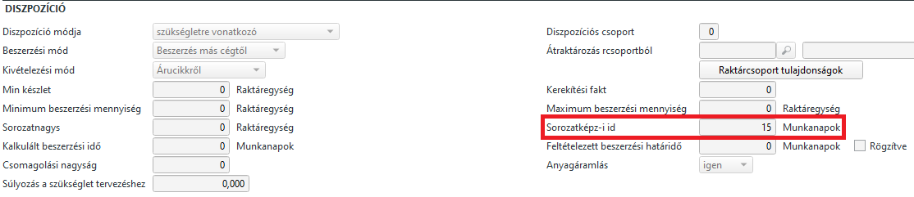

# Megrendelési javaslatok

A Megrendelési javaslatokat a dispo állítja elő, és az igények és készletek változása esetén dinamikusan változik.

## A javaslatok forrása

### Szükségletre vonatkozó

A szükségletre vonatkozó igények akkor merülnek fel, ha egyes árucikkekből a készlet a minimális szint alá csökken, vagy egyéb félkész vagy késztermék előállítása miatt keletkezett igény.

### Vevői megrendelésre vonatkozó

A vevői megrendelésre az igény akkor lép fel, ha a vevő közvetlenül rendeli tőlünk az alkatrészt, valamint a vevő által igényelt termék előállításához szükséges.

> A fenti igény keveredve is előállhat. Vagyis a vevői megrendelésre vonatkozó igény fog szükségletre vonatkozó igényt is létrehozni. Minden cikknél be kell állítani, hogy a Dispo hogy fusson le. Vagyis, ha valahol Vevői megrendelésre vonatkozó van beállítva, ott csak akkor akar a rendszer rendelni, ha vevő rendelte, vagy vevői rendelés előállításához kell.
> Ha szükségletre vonatkozó van beállíva, akkor raktár szint és vevői igény esetén (az is egyfalyta szükséglet) is megrendelési javaslatba kerül.

Fontos, hogy szükségletre vonatkozó beállítás esetén az igényből nem fog kiderülni, miért rendelek, vevői rendelésre vonatkozó beállítás esetén viszont konkrétan tudjuk, melyik megrendelés miatt kell az árucikk. Gyakorlatban a legtöbb alaktrész szükségletre vonatkozó beállításon van!

## Megrendelési javaslat mask

Az ABAS rendszerben az árajánlat kéréshez és a megrendelésekhez ezt a maskot használjuk.

> Lehet csak nézegetni, alapértelmezetten így nyílik meg a maszk, de ha szeretnénk Árajánlatot vagy megrendelést létrehozni, akkor szerkesztő módba kell váltani.

A listát a "Táblázat betöltése" gombbal lehet betölteni.Előtte kell szerkesző módba váltani, hamódosítani szeretnénk. Pl elfogadni.
Egyszerre max 2000 sort tölt be a rendszer, érdemes szűkíteni a találatokat, ha túl hosszú a lista.

Legnagyobb értelme szállítóra vagy árucikkre leszűrni a javaslatokat, de ez nem kötelező.

### Javaslatok szűkítése

A mask felső részén szűrési feltételeket adhatunk meg az adatok betöltése előtt.

#### Szállító
 
Adott szállítót kiválasztva, csak azokat a javaslatokat jelenítíi meg, ami a kiválasztott szállítótól rendelnénk meg.

Fontos tudni, hogy a javaslatokban az ABAS az árucikknél elsődlegesnek beállított beszállítót ajánlja fel.

A javaslatokban természetesen soronként javíthatjuk a beszállítót, választhatunk másikat.

#### Árucikk

Konkrét árucikkre is szűrhetünk. Fontos, hogy a lista az igényeket nem összesíti. Ha egy árucikkre 5 különböző megrendelés miatt van szükség, akkor az 5 soron fog megjelenni. Szállítási határidő rendszerint ilyenkor különbözik, hiszen a szükséglet ideje is különböző.

#### Megrendelési határidő

Az ABAS, ha az alapanyag egy megbízás teljesítéséhez kell, akkor az alapanyag szállítási idejének, és a megrendelt késztermék gyártási listájának beállításai alapján meghatározza azt a legutolsó dátumot, amikor meg kell rendelni az alapanyagot ahhoz, hogy ne késsünk a szállítással. Ez a dátum az egyes soroknál a megrendelési határidő. 

> Ez lehet a múltba mutató dátum is, ha már késtünk a megrendeléssel!

Erre a megrendelési határidőre is szűrhetünk, ahol a tól-ig dátumok közötti határidőket látjuk csak.

Pl. egy adott árucikk 5 sorban is szerepel. Ebből 3 határideje 1 hónapon belüli, míg a másik kettő egy távolabbi időpont. Úgy döntünk, csak azt rendeljük meg, amit 30 napon belül kell rendelni. Ekkor beállítjuk az ig dátumot a jelenlegi dátumot követő egy hónapra, így már csak 3 sor jelenik meg a cikkből.

> Az ABAS minden árucikkre ad megrendelési javaslatot, amire a megbízások miatt szükség lesz bármikor a jövőben és ehhez nincs elegendő készlet az adott pillanatban.

#### Csak kritikus javaslatok

Csak azok a javaslatok jelennek meg, amelyeknél a megrendelési határidő lejárt vagy nagyon közeli. A nagyon közeli értéket a Tűrés mezőben lehet 0 napról elmozdítani. Ha pl 0 van benne és a tegnapi nap volt határidő, akkor az kritikus. Ha tűrésnek 3 -at írok be, akor a mai dátum mínusz 3 nap előtti határidők csak a kritikusak.

## Legjobb ár keresés

Alapesetben a javaslatban az árucikknél beállított elsődleges beszállító van a javaslatban. Ha egy javaslat soron állunk, akkor a "Szállító kiválasztása" gombbal megkapjuk a szállítók listáját akikhez van ár és választhatunk.

## Javaslatok kiválasztása

A szűkített listában egérrel az első oszlopban lehet sorokat kijelölni. Az összes sor kijelölése is lehetséges egy gombnyomásra az "Összeset kiválaszt" gombbal.

## Javaslatok módosítása

A javaslat, ahogyan a nevében is van, csupán javaslat. Az egyes sorokban, ha kell sornagyítással, meg lehet változtatni az értékeket.

Mennyiség, beszállító, szállítási határidő, raktárcsoport, raktárhely, egységár, tételszöveg a leg tipikusabb.

Szintén lehet állítani, hogy a megrendelt tétel szállítólevél és számla releváns e.

Alapesetben mindkettő be vankapcsolva, ami azt jelenti, hogy szállítólevéllel kapom meg az árut és majd számlát is kapok.

## Átadás

 Ha az Ajánlatkérés oszlopot is bejelöljük, akkor megrendelés helyett árajánlat készül. 

A Kiválasztás átadása nyomógombal elfogadtuk a javaslatot.

> Ha az elfogadott sorokban többszállító is szerepelt, akkor az abas feldob egy megrendelést az első szállítóval és a hozzá tartozó tételekkel.Ha mentettük és bezárjuk a maskot, feldobja a következő megrendelést a következő szállítóval. Ezt addig csinálja, amíg el nem fogynak a sorok.

## Hibás javaslatok keletkezésének okai

### nincs ár

Bizonyos esetekben a javaslatoknál nem jelenik meg beszerzési ár, pedig a rendszerben van ár rögzítve.

Ha egy adott cikkre pl. csak 1000 darabtól van ár és 10001 darabtól nincs, ez azt jelenti, hogy a minimum rendelhető mennyiség 1000 db és max 10000-et lehet rendelni. (Mert ehhez van ár!)

A megrendelési javaslatban viszont látunk a termékből 3 sort rendre 1, 13, 886, darabos rendeléseket, ár viszont nincs hozzá.
Ez azért van, mert az árucikknél nincs beáálítva a minimális és maximális rendelési mennyiség.

Ha a cikknél beállítom a minimális rendelési mennyiséget 1000-re, a maximálisat pedig 10000-re, akkor a fenti 3 sor helyett egy sor lesz 1000 db mennyiséggel. Az 1000 db-hoz van ár, így már jól működünk.

### A termék nem jelenik meg a javaslatokban

Ennek lehet az is oka, hogy most jelent meg az igény a rendszerben és a diszpót azóta nem futtattuk le.

Másik ok, hogy a terméknek nincs szállítója.

### Ugyan az a termék nem egyszer hanem sokszor szerepel a listában, akár egyazon napon

Az abas alapesetben minden igényt külön soron jelenít meg a javaslatokban, és ha több megrendeléshez is kell ugyan az az alapanyag, akkor megrendelésenként tesz javaslatot, akár ugyan azon a napon is.

Amennyiben az árucikk Diszpozíció mód értéke szüségletre vonatkozó, akkor az ABAS összevonja több megrendelésből is a tételeket. De itt felmerül a kérdés, mennyit? Hiszen ha fél évre előre vannak megrendeléseim, ha azokat is összevonja, akkor túl sokat rendelek. Mi alapján dönti el az ABAS, mekkora intervallumokat vonjon össze.

Ennek paraméterezésére van a Sorozatképzési idő érték minden termék adatlapján. Munkanapokban!

Sorozatképzési idő működése

0 érték esetén, nem fog semmit összevonni. EZ az alapértelmezés
1 érték esetén, az egy napon beszerzendőket vonja össze
15 esetén a 15 napon belülieket vonja össze
stb, stb..

> Ne feledjük, ez egy diszpozíciót befolyásoló módosítás, vagyis változtatás után le kell futtatni a diszpozíciót ahhoz, hogy a javaslatokban a változtatás érvényesüljön.
