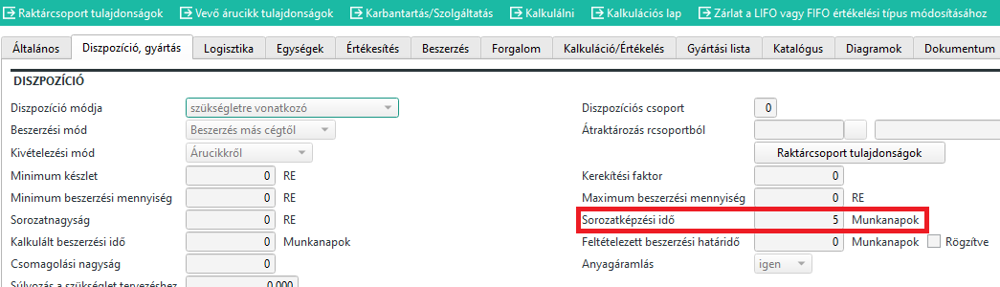

# Beszerzés

A beszerzési részleg felel, hogy a gyártáshoz szükséges alapanyagok rendelkezésre álljanak.

## Megrendelések ABAS logika szerint

Az ABAS működése során, amikor felveszünk egy megbízást és utána lefut a dispo, akkor a megbízás tételeit végignézi a rendszer.
- ha olyan tételt talál, amit vásárolunk, akkor megnézivan e szabad készlet raktáron, és ha nincs akkor beszerzési javaslatot tesz.
- ha olyan tételt talál, amit átraktározással szerzünk be, akkor kéri a külső raktárcsoporttól a tételt. A külső raktárcsoporton, ugyan ez a folyamat ennek hatására lezajlik.
- ha olyan tételt talál, ami saját gyártású, akkor a termék gyártási listáját lemásolja, lesz egy megbízási gyártási lista, és ennek minden elemén ugyan ezt a folyamatot végigköveti.

- ezzel némileg összefüggésben, egyes tételeknél van minimális beszerzési mennyiség, minimális raktárkészlet, stb beállíva. Ha ilyen tétel mennyisége a minimális mennyiség alá csökken, akkor nem csak a hiányzó mennyiséget rendeli a rendszer, hanem a minimális rendelési mennyiséget, megbízástól függetlenül.

Az egész eredményeként, vagy a belső vagy a külső raktárcsoportokon beszerzési javaslatok keletkeznek egyes tételekre.

### Árucikkek a megbízási gyártási listákon

A beszerzési osztálynak feladata, hogy folyamatosan monitorozza a megbízási gyártási listákat. Fontos, csak olyan árucikk szerepeljen, ami beszerezhető. Ha valami nem beszerezhető, egyrészt ANNULLATO-ra kell állítani az árucikket. Lásd: [Gyártási lista](../tervezes/gyartasi-lista.md) ANNULLATO bekezdése. A tervezési részleget is értesíteni kell, hogy keressenek helyettesítő terméket.

Az árucikkenk legyen kivét raktárhely beállítva, amennyiben van neki raktárhely fenntartva. (Ez minden raktárcsoporton)

Fontos, hogy legyen megfelelő szállító, szállítási határidővel és külső cikkszámmal, ha ismert.

Fontos, hogy az összes árucikknek legyen érvényes [ára](arak/arak.md) minden megadott beszállítóra, különben az előkalkulációk nem működnek. 

Amennyiben releváns, legyen minimális beszerzési mennyiség, minimum raktárkészlet, stb beállítás.

Fontos, amennyiben egy árucikk conto lavoro listán szerepel, de egy kedvezőbb beszerzés miatt közvetlen beszerzés fog történni, akkor a tervezést erről értesíteni kell, hogy a gyártási listákat ennek megfelelően javítsa. Hanyomtatva lettek a papírok, akkor ismét nyomtatni kell. Lásd: [Papírok nyomtatása](../gyartas/papirok-nyomtatasa.md)

A beállításokban van korlátozottan hibakeresési lehetőség:
- [Gyártási lista ellenőrzés](../tervezes/gyartasi-lista-ellenorzes.md)
- [Árucikk hibás árlista keresése](arucikk-hibas-arlista-keresese.md)

### Beszerzési dátumok

Minden árucikknél lehet beállítva több beszállító is. Minden kalkuláció és érék a javaslatban az alapértelmezettnek beállított szállítóval történik!

Az ABAS tudja a megbízásból, mikor kellene szállítani a készterméket. A gyártás lista alapján a műveleti időkből tudja, a gyártás melyik napján (mennyivel a szállítás előtt) lenne szükség az alapanyagra. Ez lenne a legkésőbbi szállítási határidő, amit kérni kell a szállítól, ha beszerzésre kerülne sor.
A szállító mellett az árucikken ott van a feltételezett szállítási határidő, vagyis ebből tudja, mennyivel korábban kell az árucikket megrendelni, hogy időben ideérjen az alapanyag. Ez a dátum az a legvégső dátum, amikor még úgy adhatjuk le a megrendelést, hogy a megbízással ne csússzunk.

Ideális esetben, ez a dátum nem korábbi a jelenlegi napnál, mert ha igen, az ABAS azonnal jelezni fogja, hogy emiatt az alapanyag miatt a megbízási határidő nem lesz tartható.

### Megrendelési javaslatok sorai

A fenti logika alapján kapunk egy listát alapanyagokból. Minden alapanyag esetén tudja melyik megbízás miatt kell beszerezni és hogy ki a szállító.
Ezen felül kapunk egy megrendelési dátumot, ami a legkésőbbi megrendelési dátum ahhoz, hogy időben szállítsunk.
Van továbbá egy szállítási határidő, amit mi kérünk a szállítótól.

Ezen információ alapján lehet a szállítótól rendelni.

### Sorozatképzési idő

Az árucikkeknél a diszpozíció részen tudjuk állítani a sorozatképzési időt. Ezt munkanapokban lehet megadni.

A megrendelési javaslatok sorai tételesen listázva vannak, vagyis ha pl. 3 megbízás miatt egy napon kell rendelni x alapanyagból 3 5 ill 10 db-ot, akkor ez 3 sor a javaslatban 3, 5 és 10 darab megvételéről.

Ha a sorozatképzési időt az árucikknél 0-ról 1 értékre állítjuk, akkor az 1 napon belül megrendelendő mennyiséget összevonja. Vagyis a fenti példa esetében egy sort kapunk 18 db megrendelési javaslatával.

Ebből logikusan következtethetünk, hogy ha a sorozatképzési időt 5-re állítjuk, akkor az 5 munkanapon belüli tételek kerülnek összevonásra.

> Ha több napot összevon a rendszer, akkor a megrendelési dátum és a szállítási határidő, mindíg a legkorábbi a tételek közül.

### Megrendelési javaslatok infosystem

Olvassa el a [Megrendelési javaslatok](beszerzesi-javaslatok.md) infosystem leírását!

Természetesen a javaslat az csak javaslat, el lehet előbb is fogadni, sőt változtatni is lehet a javaslaton, pl. a szállítási határidőt korábbi dátumra állítani.

## Megrendelés az E.R.C.logika szerint

Jelenlegi megállapodás szerint, minden gyártáshoz szükséges alapanyagot azonnal megrendelünk a legkorábbi szállítási határidővel.

Ez két részre kell bontanunk.

Vannak az "Alkatrész" típusú cikkek, amik rendszerint dedikáltan egy megbízáshoz kellenek, jellemzően nem tartunk belőle készletet, csak annyit rendelünk, amennyi a megbízás állomány szerint kell.

> Vannak olyan nagyszámban használt ilyen alkatrészek, amik ebbe a logikába illenek, de mégis többet rendelünk a látható igénynél, mert folyamatosan fogy és így biztosítható a készlethiány elkerülése. Ezeknél a cikkeknél a logika továbbra is fennáll, de a minimum rendelési mennyiség és a minimum raktárkészlet állításával belenyúlunk a rendelési mennyiségbe.

> A többi árucikk a minden gyártásnál általánosságban használatos cikkek, csavarok, matricák, biléták, réz és lemez alkatrészek, stb.. Ezekből készletet tartunk és a minimum készlet alá csökkenés esetén rendelünk ismét.

### Nem "Alkatrész" típusú cikkek rendelése

Ebben az esetben jellemzően az ABAS minimális rendelési mennyiség és minimum raktárkészlet és sorozatnagyság állításával szabályozzuk a beszerzést és elfogadjuk az ABAS javaslatát. Jól beállított paraméterek esetén, nem fodulhat elő készlethiány.

Az ABAS a megbízások alapján látja, hogy pl van 4000 csavar raktáron, de 5 hónap múlva a készlet minimális raktárkészlet 1000 db alá fog csökkenni, ezért betesz egy javaslatot 10000 db beszerzéséről (javaslat szerint majd 6 hónap múlva kell megrendelni.)

Egy másik cikkből is van 2000 darab, de a jelenlegi összes megbízás teljesítése esetén sem csökken a készlet a minimális készlet alá, ezért nincs rá megrendelési javaslat.

### "Alkatrész" típusú cikkek

Mivel az E.R.C. logika szerint azonnal megrendeljük, ezért semmi más dolgunk nincs, mint az ABAS javaslatoknál minden javaslatot azonnal el kell fogadni, vagyis megrendelést készítünk belőle.

Fontos viszont, hogy az ABAS ennek ellenére mint szállítás határidőt, az eredetit tartaná meg, ezért ezt át kell állítanunk a legkorábbi dátumra.

### Árucikk helyettesítése

Kifutó vagy egyéb okból kicserélendő alapanyag esetén nem elegendő csak mást beszerezni, a gyártási listákon is cserélni kell az alapanyagot, figyelembe véve a megrendelő igényeit, a technikai követelményeket és a régi alapanyag készletét.

Ennek ügymenete a [Árucikk helyettesítése](arucikk-helyettesitese.md) leírásban található.

### Beszerzési részleg feladata

Igazából ebben a logikában a beszerzési részlegen nem kell sokat gondolkodni mit és mikor rendeljünk, mert azonnal rendelünk mindent amit az ABAS javasol.

Persze ettől még van feladat ezzel, hiszen el kell dönteni, az alapértelmezett beszállító jó e, és ha nem cserélni kell. Árakat is ellenőrizni, javítani kell. A szállítási határidőket javítani, ellenőrizni kell.

Kapcsolódó anyagok:

- [Árajánlat](ajanlatkeresek.md)
- [Megrendelések](megrendeles.md)
- [Szállítólevelek](szallitolevel.md)
- [Visszaszállítás](visszaszallitas.md)
- [Mennyiségi újraértékelés](mennyisegi-ujraertekeles.md)

## Üzemi raktárhelek

Bár raktáros feladat, a beszerzési osztálynak fontos tisztában lennie ill karbantartania az üzemi raktárhelyeket. 

Lásd: [Üzemi raktárhelyek](../raktarozas/uzemi-raktarhelyek.md)