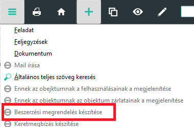

# Beszerzési megrendelés

Az ABAS rendszerben a megrendeléseket lehet kézzel is létrehozni, de van számos egyéb lehetőség is a megrendelések kezelésére.

## Megrendelési javaslatokból

Olvassa ela [Megrendelési javaslatok](beszerzesi-javaslatok.md) leírást!

## Árajánlatokból

Olvassa el az [Árajánlat](ajanlatkeresek.md) részt.

A menüsoron az Árajánlatkérésekből menüponttal, ahol az ajánlat számát kéri a rendszer.

Megnyitott árajánlat esetén a hamburger menüből

Egy új megrendelés megnyitsa után a tételek hozzáadása funkcióval

És rögzíthetjük kézzel is.

### Megrendelés módosítása

A megrendelések módosíthatóak addig a pontig, amíg minden tétel teljesült vagy stornózva lett. 

Sort törölni nem lehet, de a mennyiség 0-ra állításával storózhatjuk a tételt.

A mennyiséget, csak a még nem teljesült mennyiséggel lehet csökkenteni, a már leszállított, könyvelt mennyiség rögzül.

Mennyiséget növelni lehet, és új sorok rögzítése is lehetséges.

### Megrendelések hatása a javaslatokra

A javaslatoknál beállíthatunk nagyobb mennyiséget is mint a javaslat, valamint a javaslatoktól függetlenül is rögzíthetünk megrendeléseket.

Minden esetben, amikor a dispo lefut, átnézi az igényeket és a megrendelt állományt és a raktárkészletet. Ezek összesítése után új javaslatot készít.

### Külső raktárcsoportra megrendelések

A Conto lavoro megrendelések a külső raktárcsoportokra érkeznek. Ezek a tételek nem számla relevánsak, ezért érdemes itt a megrendeléseknél ezt jelezni a rendszerbek.

Ehhez a tételeken a Számla releváns jelölést ki kell kapcsolni

Másik lehetőség, egy belső fejlesztés, a már meglévő megbízások esetén lehet használni a "Nem számlareleváns" gombot a felső menüsorról. Ez az összes tétel esetén kikapcsolja a mezőt.

