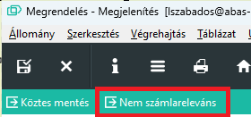

# Beszerzési szállítólevél

Beszerzési szállítóleveleket az áruátvétele után kell rögzíteni.

## Előfeltételek

A szállítólevelek rögzítése előtt az árut tételesen le kell ellenőrizni, hogy az átvett áru típusa és mennyisége megfelel e a szállítólevélen feltüntetettnek.

> Amennyiben eltérés van, azt rá kell vezetni a szállítólevélre. Rögzíteni azt a mennyiséget kell, ami valójában jött, nem pedig ami eredetileg a szállítólevélen szerepelt!

## Rendelt áru szállítólevelének rögzítése

Amennyiben az árut rendeltük, akkor a szállítólevélen valószínüleg szerepel a rendelés számunk és a rendelés pozíció száma.

A szállítólevél rögzítését többféle módon is elkezdhetjük:

- Beszerzés/Szállítólevelek/Szállítólevél indításával

A tételek hozzáadása lehetőséggel adjuk meg a megrendelési bizonylat számunkat.

A szállítót automatikusan átveszi a bizonylatról.

Az ABAS a rendelés eddig nem teljesített sorait átmásolja. Ha nem minden tétel jött, azokat töröljük. Ha szükséges, módosítsuk a mennyiségeket.
Ha más megrendelés is jött a szállítással, akkor új bizonylatszám megadásával szintén át lehet venni, de nyilván, csak olyan bizonylatszámokat fogad el, ahol ugyan az a szállító.

- Beszerzés/Szállítólevelek/Megrendelésekből

Ez ugyan az a módszer, mint az előző, csak a legelső bizonylatszámot induláskor bekéri a rendszer.

- Beszerzési ügyletekből

Az infosystemmel listázzuk ki a megrendeléseket. A megrendelés melletti átadás gommbal tudunk szállítólevelet készíteni.

Hatása ugyan az, mint a többi módszernél az első lépés.

Olyan megrendelés esetén is használhatjuk, amihez már van szállítólevél, de még van nem teljesített tétel. 

A sátusz sor üres a még nem teljesített tételeknél.

Ha az így elindított szállítólevél több megrendelésből áll össze, akkor az első módszernél leírtak szerint lehet további megrendelésekkel bővíteni.

## Conto Lavoro, nem megrendelt áru átvétele, ahol van részletes szállítólevél

A BERAM mint szállítótól érkezőalapanyagok esetében, ha nem is volt megrendelés, de részletes, tételes szállítólevelet küldtek, akkor kézi rögzítés helyett, át tudjuk venni a BERAM ABAS ból a tételadatokat.

Ehhez külső program áll rendelkezésre: [https://huerp.abasclient.erckft.hu](https://huerp.abasclient.erckft.hu)

A bejelentkezés után a Készletkezelés/Átraktározás BERAM-ból lehetőséget kell választani.

Meg kell adni a kapott szállítólevél számát mint bemenő paramétert:

Ha olyan számot adunk meg, amit már átvettünk, az átvétel leáll:

Amennyiben sikeres a futtatás, akkor egy könyveletlen szállítólevél kerül rögzítéssel azokkal a sorokkal, ami a kapott szállítólevélen is van.

> Amennyiben az áru átvételekor volt javítás a szállítólevélen, akkor az itt is javítani kell!

## Conto Lavoro "KIT"

Vannak jelenleg olyan szállítások, amikor a szállítólevélen egyetlen sor utal a KIT-re, de ez sok alkatrészt jelöl. Mivel ez nem hiánytalan kit, ezért nem tudjuk kész kitként felvenni, valójában csupán a kithez érkezik alapanyag.

Egy külön papír (nem szállítólevél) tartalmazza, hogy mit küldtek, és még mi várható (hiány).

Mivel nincs dokumentum, amit át lehetne venni, sem eredeti szállítólevél hivatkozást sem tételeket nem tudunk átvenni.

Kell egy üres, új szállítólevelet nyitni. Szállítónak BERAM-ot beállítani.
A lista alapján a küldött tételeket fel kell rögzíteni egyesével, megadva a mennyiségeket is.

Külső bizonylatszámnak olyan egyedi kódot kell megadni, ami nem fog ismétlődni.

A Conto lavoro megrendelések a külső raktárcsoportokra érkeznek. Ezek a tételek nem számla relevánsak, ezért érdemes itt a megrendeléseknél ezt jelezni a rendszerbek.

Ehhez a tételeken a Számla releváns jelölést ki kell kapcsolni

Másik lehetőség, egy belső fejlesztés, a már meglévő megbízások esetén lehet használni a "Nem számlareleváns" gombot a felső menüsorról. Ez az összes tétel esetén kikapcsolja a mezőt.

## Szállítólevél könyvelése

Amennyiben a szállítólevél rögzítése teljes, le kell könyvelni. 

A Köbyvelés nyitott mező be van jelölve akkora könyvelés mező aktív. Mentés előtt jelöljük be.

Mentéskor, ha nincs hiba, könyvelődik a szállítólevél.

> Rendkívül fontos! Az ABAS csak akkortól tudja készletre venni a bejövő árut, amikor a kyönvelés megtörtént, ezért enélkül a bejött készlet nem mozgatható.

