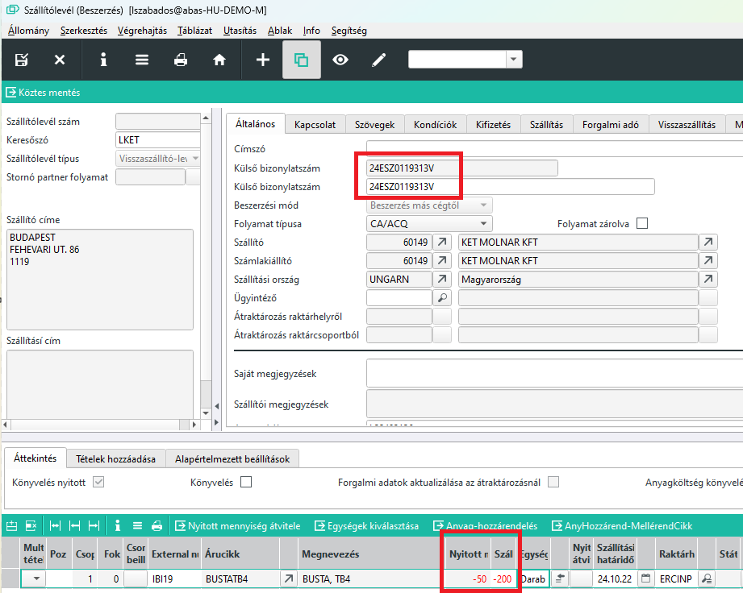
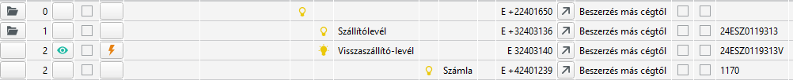
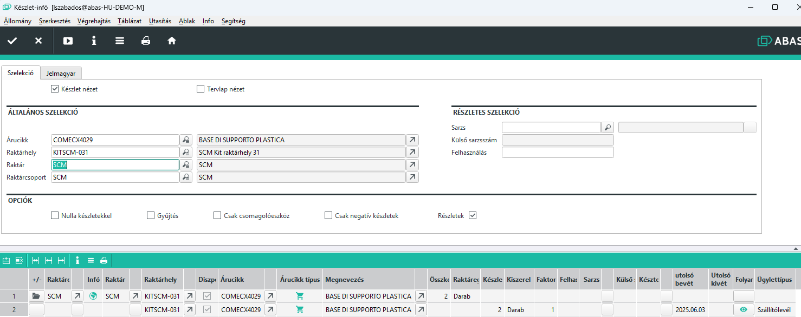
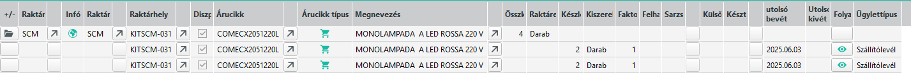
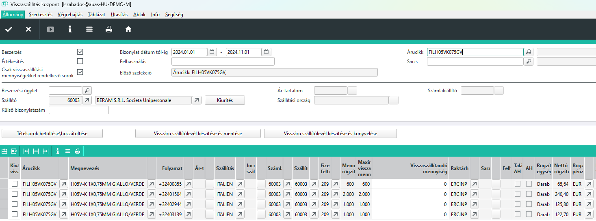
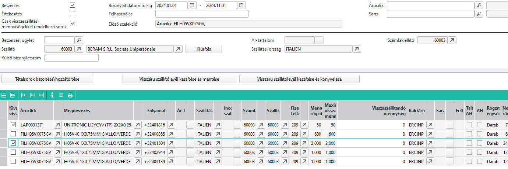
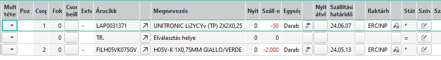

# Beszerzett áru visszaszállítása

A visszaszállítás folyamata egy összetett műveletsor és gondos tervezést igényel több részleg együttműködésével.

## Mi az a visszaszállítás

Visszaszállítás az a folyamat, amikor egy rendelt árucikket visszaküldünk a szállítónak.

A visszaszállításkor egy nagyon fontos dolog, hogy az adott árucikk készletének csökkennie kell!

Mivel megállapodás szerint, minden külső készletmozgást szállítólevél kísér ezért kétféleképpen lehet szállítólevéllel készletet csökkenteni:

- értékesítési szállítólevéllel
- negatív előjelü beszerzési szállítólevéllel

Mivel a visszaszállítás egy beszerzési folyamatot fordít meg, azért célszerű a beszerzési ügyletekkel megoldani.

> értékesítési szállítólevélle is működik, de így nehezebb nyomon követni, mi miért történt, hiszen a szállító akinek visszaküldjük nem ad megbízást. Fel kell venni vevőnek, stb.

## Storno szállítólevél

A szállítólevél stornozása megoldás lehet, de igazából nem megfelelő. Egyrészt nem valószínű, vagy elenyésző az az eset, amikor a teljes szállított tételt visszaszállítunk. Valamint a storno szállítólevél a készletet valóban csökkenti, de nem lehet alapja a visszaszállítás tényének, vagyis a szállítás során ez nem bizonylat.

## Visszaszállító levél

Visszaszállító-levél készíthető menüből a Beszerzés/szállítólevelek alatt. Lehet szállítólevél vagy számla is a kiindulási pont. 
Megadva a bizonylatot, az összes sort átveszi, ebből törölni kell azokat, amit nem szállítunk vissza.
Ha nem a teljes szállított mennyiséget küldjük vissza, akkor a mennyiséget is csökkenteni kell.
A visszaszállított mennyiségeket negatív előjellel kell beírni.

Ha egy bizonylaton több más-más szállításból eredő árucikket küldünk vissza, akkor a tételek hozzáadása lehetőséggel további bizonylatok is felvehetőek.

Az alábbi példánál a szállított 250 darabból 200-at küldünk vissza.
Fontos, hogy a külső bizonylatszám az eredeti szállítólevélre mutat. Ha több szállítólevél tételt is visszaküldünk, ez félrevezető lehet. Ezenkívül a példában egy V betűt írtam a végére, jelezve visszaszállítás. Erre azért van szükség, mert egy szállítónak a külső bizonylatszáma csak egszer fordulhat elő, nyilván az eredeti már könyvelve van, ezt kell módosítani.

A beszerzési ügyletekben szépen látszik a folyamat

## Visszaszállítás - megrendelés - költségek összefüggése

Fontos, hogy a visszaszállító-levél a megrendelésekbe nem nyúl vissza, vagyis az eredeti megrendelésen az igény nem jelentkezik újból. Ez abból a szempontból lényeges, hogy amennyiben a vevőnek kifizettük, vagy legalábbis kaptunk róla számlát, a visszaszállító levélnél a tételek továbbra is számla relevánsaknak kell lenniük, és a vevőtől ezért jóváíró számlát várunk.

Ezt akkor is tegyük meg, ha amúgy a tételeket a vevő újra megküldi. (pl hibás termékek cseréje). Ekkor a vevő küld egy módosító számlát, mivel az előző tételeket visszavonja, és amikor küldi a csere alkatrészeket, akkor küldi vele a számlát is.

Ha nem ez az eljárás, és a tételeknél bejelöljük, hogy nem számla releváns, akkor az a probléma merül fel, hogy kifizettük, de ha a szállító mégsem küldi a tételeket, akkor hiányunk keletkezik. Ha küldi a tételeket, de számlát is küld vele, akkor duplán fizetjük ki. Az nem elvárható a pénzügyi kollégáktól, hogy ezeket fejben nyomon kövessék.

Ezen hibalehetőség miatt a legtisztább és követhető, hogy ha számla relevánsan jött az áru, akkor a visszaszállítás is az legyen, és a szállítótól várjuk el a módosító számlát.

Másik probléma, hogy a visszaszállítással az árukészlet csökken. Megrendelés viszont már le lett zárva. Vagyis ha a szállító csak úgy küldi az alapanyagokat, nem tudjuk megrendelésből rögzíteni.

Amennyiben a megbízások miatti alapnyag igény volt a visszaküldött alapanyag, a visszaküldéssel a dispo szerint készlethiány fog fellépni, ezért azonnal megrendelési javaslatot tesz a visszaküldött cikkekre.

Szóval a visszaszállító-levél könyvelése után célszerű dispo futtatást indítani és a megrendelési javaslatokkal a visszaküldött cikkeket újból megrendelni. 

> Itt egy nagy hibalehetőség, amit a vevővel mindenképpen tisztázni kell. Az előző megrendelés lezárult, a visszaszállítás nem jelenti, hogy automatikusan küldjenek helyette árucikket, csak akkor, ha újból megrendeljük. Ezt a megrendelési javaslatok elfogadásával könnyedén  megtehetjük. Ha nem így állapodunk meg, előfordulhat, hogy a szállító újból küldi a visszaszállított cikkeket és küldi mégegyszer az új megrendelés miatt.

## Visszaszállítás előfeltétele

A visszaszállításkor is egy szállítólevél kerül kiállításra. A visszaszállító levél a készletet csökkenti, vagyis az egyes táblázati sorokban minden visszaszállítandó tételnél meg kell adni azt a raktárhelyet, ahonnan a készlet csökkeni fog.

Mivel a szállítólevél kiállítása irodai munkatársak végzik, ezért szükséges konkrétan meghatározni, milyen kimenő raktárhelyet kell a szállítólevélen rögzítenie.

A visszaszállítás azon a ponton történk, ahol az áruátvétel. Standardan arról a raktárhelyről akarja az ABAS visszaszállítani az árut, ahonnan bejött, mert az az alap feltételezés, hogy a szállító autójával történik a visszaszállítás. Ezek az INP raktárhelyek. Ezért a visszaszállító levél elkészítése előtt a terméknek megfelelő INP raktárhelyre kell a visszaszállítandó árut a polcról vagy egyéb helyről, pl üzem átraktározni.

Ehhez, ha a visszaszállítást nem a raktár kezdeményezte, akkor ki kell állítani egy [Árucikk mozgási kérelmet](../raktarozas/arucikk-mozgas-kerelem.md).

## Annak megállapítása, hogy a visszaszállítandó árucikk melyik folyamattal indult 

Az abasznak azt a szállítólavelet kell megadni, aminn az adott árucikk bejött. Fontos, hogy az abas, követi a a konkrét cikk folyamatát, vagyis nem tetszőleges, melyik szállítólevelet választjuk ki.

Első lépésben keressük meg a konkrét árucikket. Ha már belejelentettük egy panelba, ki kell szerelni, és kiszereléskor egy adott raktárhelyre kerül.
Keressük meg a cikket a raktárhelyen a készlet infó Infosystemmel. A gyűjtés és "Nulla készletekkel" jelölöt vegyük ki, Részletek legyen bekapcsolva.

Látható, hogy a raktárhelyen 2 db termék van, és a részletek sor végén ott a szállító aminn bejött. (A folyamat oszlopban a szemre kattintva, meg is nyílik a szállítólevél). Teljesen mindegy, hogy közben a cikk hány raktárhelyen fordult meg, beszereltük, kiszereltük, stb, az ABAS tudja, melyik szállítóval jött be. Visszaszállításnál errea a szállítóra kell hivatkozni.

> Itt fontos, hogy ebben a pillanatban , ha pl. 4 terméket kell visszaküldeni láthetjuk ezt is:

Láthatjuk, hogy a raktárhelen lévő 4 db termék 2 szállítón érkezett be, vagyis visszaszállíásnál mindkét szállítóra hivatkozni kell, külön- külön sor lesz a visszaszállító levélen a 2-2 darab így tudjuk a 4 db-ot visszaszállítani.

> Érdemes a visszaszállító levél elkészítése előtt tételesen leellenőrizni, melyik tétel melyik szállítólevéllel (akár többel) érkezett be, hogy tudjuk melyikre kell hivatkozni.

## Visszaszállítási központ

A visszaszállítást nem minden esetben a beszerzési osztály kezdemémyezi, és jelneleg többnyire az iroda készíti a szállítóleveleket.
Emiatt fontos, hogy az iroda megtudja, melyik szállítólevél tételeit küldjük vissza.

A visszaküldésnél fontos az árucikk kódja, mennyisége, és a szállítólevél száma, aminn bejött a tétel.

Azért, hogy azonosítani lehessen a bizonylatot, használjuk a visszaszállítási központ Infosystemet

"Beszerzés/Kiértékelések és jelnetések/Visszaszállítás központ"

Megadhatjuk milyen időintervallumban keressük a bizonylatot, szállítót és ami a legfontosabb árucikket is.

Tételsorok betöltése\hozzárendelése gombbal láthatjuk azokat a bizonylatokat, aminn beszerzés történt az árucikkből. 
Ebből válaszzuk ki az első oszlopban azt vagy azokat a sorokat, amit szeretnénk visszaszállításba helyezni.

Ha van további árucikk amit ugyan ennek a szállítónak vissza szeretnénk szállítani, akkor fent adjuk meg a következő árucikket és ismét kattintsunk a "Tételsorok betöltése\hozzárendelése" gombra. A kijelölt sorok nem törlődnek és mellé betöltődnak az újból megadott cikk sorai. 
Ezután az eljárás ugyan az, jelöljük ki a szükséges sorokat. így tovább minden cikkre.

Ha minden cikket felsoroltunk és a mennyiségeket beállítottuk, akkor válasszuk a "Viszáru szállítólevél készítése és mentése" gombot.

Felugrik az előkészített de még könyveletlen viszáru szállítólevél.

Ha a "Viszáru szállítólevél készítése és könyvelése gombot választjuk, azonnal könyvelődik is a szállítólevél.