# Szállítók mennyiségi forgalma / Fatturato in volume del fornitore

Első lépés, hogy megnyissuk a Raktári nyilvántartás infosystemet. / Il primo passo è aprire l'infosistema Inventario di magazzino.

Standard/Raktárgazdálkodás/Raktárkezelés/Raktári nyilvántartás / Standard/Gestione magazzino/Gestione magazzino/Giornale magazzino

A normál szelekció nem megfelelő, ezért válasszuk a szelekciós sablon lehetőséget / La selezione normale non è appropriata, quindi scegliere l'opzione modello di selezione

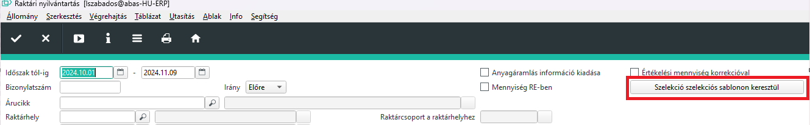
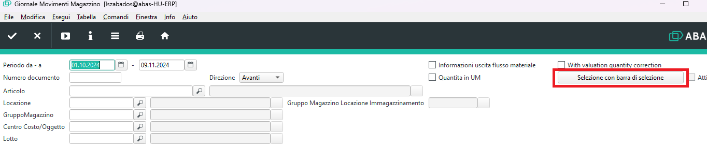

Hoztam létre az igényeknek megfelelő sablont, ezt válasszuk ki. / Ho creato un modello adatto alle vostre esigenze, selezioniamolo.

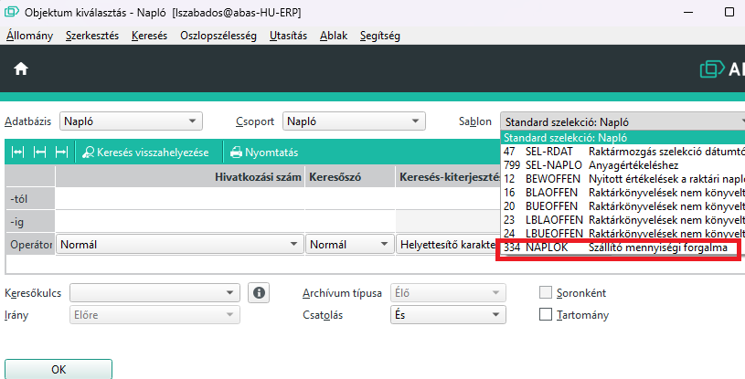
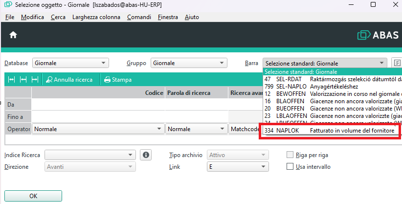

Adjuk meg a dátumokat és a szállítót. A harmadik oszlopot ne módosítsuk! / Inserire le date e il fornitore. Non modificare la terza colonna!

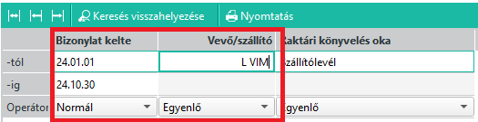
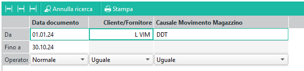

> A második mezőbe szállító és vevő kódot is elfogad az ABAS. Alapértelmezetten vevő kódot vár. Tudatnunk kell a rendszerrel, hogy szállító kódot adunk meg, ezért az "L " előtaggal kell kezdenünk a kód megadását.

> Nel secondo campo, ABAS accetta sia un codice vettore che un codice destinatario. Per impostazione predefinita, si aspetta un codice destinatario. Dobbiamo far sapere al sistema che stiamo inserendo un codice fornitore, quindi dobbiamo iniziare il codice con il prefisso “L ”.

OK választása után az ablak bezárul és a bal alsó sarokban látszik a szelekciós parancs. / Dopo aver selezionato OK, la finestra si chiude e il comando di selezione viene visualizzato nell'angolo in basso a sinistra. 

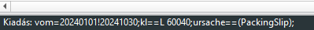
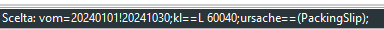

Futtassuk az infosystemet, és látjuk az eredményt. / Eseguire l'infosistema e vedere il risultato.

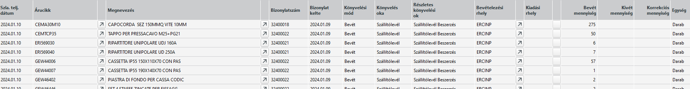
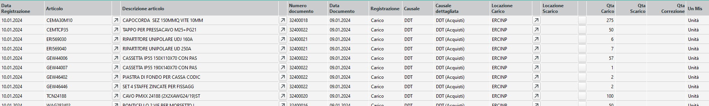

Az eredményt excelbe átmásolva, összesítéseket, statisztikákat készíthetünk. / Copiando i risultati in Excel, è possibile creare riepiloghi e statistiche.

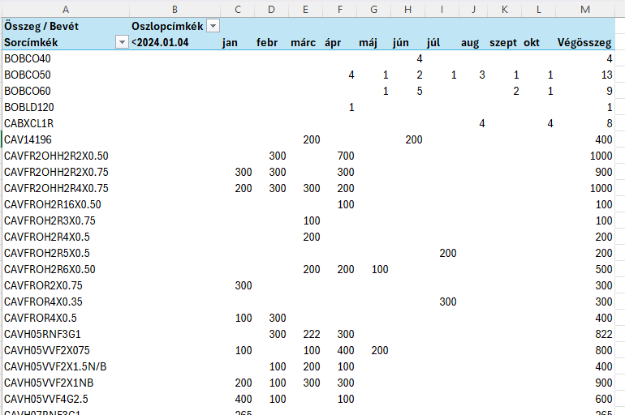

