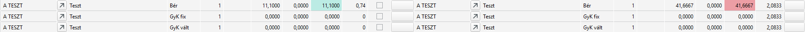

# BDE kiértékelések lezárt gyártásoknál

A megbízások részben vagy teljesen teljesításre kerülhetnek. A megbízások teljesítése számos esetben nagyobb időintervallumon belül teljesül, vagy sok sort tartalmazhat. Ekkor célszerűbb a kiértékelést árucikkenként elvégezni.

Ha a gyártás lezárul, a gyártási központból a sorok eltűnnek és a továbbiakban már nem tudjuk elérni.

Ez a leírás azt mutatja meg, hogyan tudjuk az ABAS-ból kinyerni az üzemi megbízások számát a lezárt gyártások esetében.

## Megbízás keresése

Nyissuk meg az értékesítési ügyletek infosystemet.

Szűréskor az irattár típusa legyen mindkettő, hogy az archivált megbízásokat is láthassuk.
További szűrésekkel, próbáljuk a találati listát szűkíteni: vevő, bizonylatszám és dátum intervallum megadásával.

Ha avevő megrendelési számát tudjuk, akkor arra is kereshetünk:

## Megbízás keresése árucikk alapján

Ha nem a megbízást, hanem az árucikk kódját tudjuk, akkor az "Árucikk előfordulások folyamatokban" infosystemet nyissuk meg:

Állítsuk be az irattár típusát "Mindkettő" értékre.
Ügylettípust "Megbízás" értékre
Árucikkhez adjuk meg a készterméket.

Folyamat dátumával szűrjük az időszakot

Eredményül megkapjuk a megbízások listáját a feltételeknek megfelelően. Ha több megbízás is volt az időszakban, akkor több sort kapunk.

Válasszuk ki a megfelelő megbízást a Folyamat oszlopnál.

## Megbízásból a szűrési adatok kinyerése

### Felhasználás

A felhasználás a megbízás sorszáma + "_" jel + sorszám alakú.

Ha a teljes megbízásra akarunk szűrni majd, akkor a felhasználás a "_" jel előtti része, - ami a megbízás sorszámával azonos. - kell nekünk.

Ha adott megbízás sorra akarunk kiértékelni, akkor a teljes felhasználási számra szükségünk van.

> Ha a megbízáson többször is szerepel ugyan az az árucikk, akkor a felhasználás különbözteti meg az adott sort!

### Dátumok a szűréshez

A keresést nagyon meggyorsítja, ha dátum intervallumok között keresünk, ezért be kell határolni a gyártás idejét.

A gyártás mindenképpen a megbízást követően végeztük el, ezért a megbízás folyamat dátuma a kiindulási alap.

A gyártásta szállítást megelőzően már biztosan lezártuk, ezért a szállíási határidő a végdátum.

> Itt a célszállítási határidőt látjuk. Előfordul a késve szállítás, ezért vagy adjunk meg eleve későbbi dátumot, vagy az értékesítési ügyletek infosystemben szűrjünk rá a megbízásra és ott láthatóak a kiállított szállítólevelek és ott látható a szállítólevél dátuma is.

## Raktári napló szűrése

Nyissuk meg a Raktári nyilvántartás infosystemet.

Válasszuk a szelekciós sablonon keresztül lehetőséget.

Válasszuk ki a BDE sablont

Bizonylat keltének adjuk meg a fentebb meghatározott dátum intervallumokat

Felhasználáshoz írjuk be a felhasználási számot (vagy csak a megbízás sorszámát), a tól és az ig mezőbe is!

Eredményül megkapjuk a gyártás visszaigazolási bizonylatokat, ahol a bizonylatszám eleje az üzemi megbízás sorszáma. (Az utolsó 3 számot kell levágni)

## BDE kiértékelés indítása

Nyissuk meg a BDE kiértékelések Infosystemet

Ott válasszuk az üzemi megbízás módot, és adjuk meg az üzemi megbízás sorszámát.

> Ha már archív az üzemi megbízás, akkor a rendszer automatikusan egy + jelet tesz elé.

Futtassuk az Infosystemet és megkapjuk a visszajelentéseket

## Utókalkuláció

Ha a panel elő és utókalkulációját akarjuk összehasonlítani, akkor nyissuk meg a infosystemet:

Adjuk meg az üzemi megbízás sorszámát és futassuk az infosystemet

Az elő és utókalkuláció összehasonlítása megjelenik.

## BDE és utókalkuláció kapcsolata

Mivel a gépcsoportok az E.R.C. Kft esetében nem gépek, ezért azoknak nincs költségük. 
A költségeknél ezért a fix és változó költségek 0 értékűek.

Bérköltség viszont van, ami a művelet idejéből és a bértábla alapján számolódik ki.

Előkalkuláció esetén a tervezett bérköltség és a tervezett műveleti időből számolja a rendszer a költségeket.

Utókalkulációban a visszajelentett idők és a dolgozó bérköltsége alapján számolja a rendszer.

Ez előbbi példából a Teszt művelet a következőképpen alakul:

Az utolsó oszlopoknál a 41,6 EUR költséggel és 2,08 óra normaidővel számolt a rendszer.

Visszajelentések alapján 11,1 EUR költség volt, mert a visszajelentett idő 0,74 óra volt.

BDE-ben:

A 2 panelre összesen 1,48 órát jelentett vissza a dolgozó, ebből jött ki a fenti adat.

BDE-ben egy műveletre lehet több dolgozó több visszajelentésének az összege adja az eredményt.

Pl.A kitszedés:

0,5 óra előkalkulált idő helyett 0,3 óra lett visszajelentve, de az 2 részletben.

