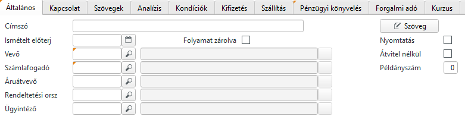
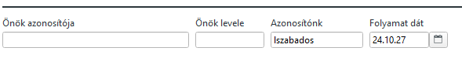
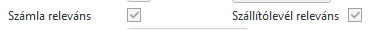

# Értékesítési ajánlat

Az ajánlat maskon tudunk árajánlatokat rögzíteni.

Az általános fül főbb elemei

A vevő és számlafogadó kötelező mező, de ha a vevőt kiválasztjuk, alapértelmezetten a számlafogadó, áruátvevő és a rendeltetési ország is kitöltésre kerül.

> Itt fontos megjegyezni, hogy a rendeltetési országot az áruátvevő (ez lesz a szállítási cím is) fogja meghatározni, és az Áfa szabályok a számlán ez alapján kerülnek meghatározásra. Vagyis hiába EU-s külföldi partner a számlafogadó, ha belföldi a szállítási cím, akkor a belföldi értékesítésiszabályok szerinti áfa elszámolással lesznek a számlák kiállítva.

Az önök azonosítójához a vevő megrendelési számát írhatjuk be, amennyiben rendelkezésre áll.

A fejlécen lévő további füleken számos beállítás található, de ezek nagy része alapértelmezés vagy a vevő, áruátvevő, számlafogadó kitöltésével, automatikusan kitöltésre került a vevő adatbázisból. Ezért fontos, hogy a vevő adatbázist megfelelően paraméterezzük be.

## Tételsorok rögzítése

Tételsoroknál kötelező az árucikket, a mennyiséget megadni. 
Az árat is töltsük ki, anélkül sok értelme nincs az árajánlatnak.

Amennyiben van érvényes árlista, az ár automatikusan töltődik a mennyiség megadása után.

A beszerzési idő napokban beírásra kerül, amennyiben az ABAS tudja kalkulálni. 

> Saját gyártású terméknél az ABAS az alapanyag szükséglet figyelembe vételével kalkulálja mennyi idő kell az alapanyagok beszerzéséhez és gyártáshoz.

A szállítási határidőt az ABAS a beszerzési idő alapján határozza meg, figyelembe véve a naptári adatokat. (Szabadnapok, ünnepek, stb). Ez így az ABAS szerinti legkorábbi szállítási határidő. A dátum átírható pl. veő kérése alapján, ekkor a naptári információk nem kerülnek figyelembe vételre.

> Ha korábbi dátumot írunk be, mint az ABAS legkorábbi határidőnek javasolt, akkor az ABAS szerint a gyártásban sok piros zászló jelezni fogja, hogy nem fogunk időben elkészülni.

Ajánlott a **POZ** oszlopot is tölteni. Ha a vevőtől olyan formában érkezett a kérés, ahol az egyes tételeknek adott sor pozíciót, akkor ezt írjuk mi is a sorok mellé, mert a nyomatokban ez feltüntetésre kerül, könnyítve a kommunikációt.

A sornagyítóval elérhető még a részletek fülön a tételszöveg, amennyiben az egyes tételekhez kiegészítő megjegyzést fűznénk.

> Figyelem! Ezek a szövegek a vevői nyomatokon is megjelennek!

Szállítólevél releváns, számla releváns

Ezek a kapcsolók hatására a tétel rákerül a szállítólevélre és/vagy számlára vagy sem.

