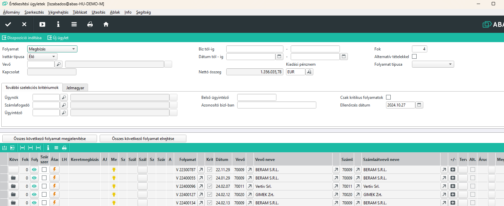
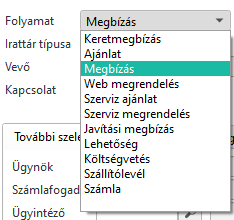
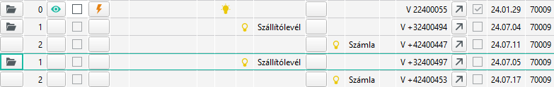
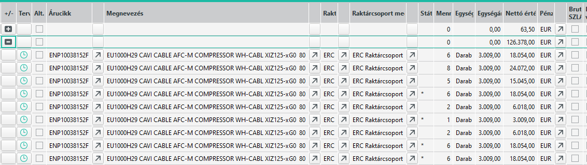

# Értékesítési ügyletek

Az értékesítési ügyletek infosystem a teljes értékesítési folyamatot egyben láthatóvá teszi.

Elindítva egy alábbihoz hasonló ablakot kapunk

A kiindulási folyamat most megbízás, de lehet Ajánlatot is választani, vagy szállítólevelet vagy számlát.

Vannak további lehetőségek is speciális esetekre.

## Fontosabb szelekciós kritériumok

Folyamat: pl. Árajánlat, Megbízás, Szállító, Számla
Vevő: Ha csak adott vevőt szeretnénk látni
Biz tól-ig.: Bizonylat száma. (Nyilván a folyamatnak megfelelő bizonylatszámok)
Dátum tól-ig:Csak a meadott dátumú bizonylatok

## Táblázatos rész

Olyan típusú sorok jelennek meg, amik a folyamatnak megfelelnek. Pl. a fenti példában megbízás sorokat látunk.

Oszlopok és jelentésük:

- Folyamat gomb: rákattintva megnyílik a sornak megfelelő folyamat, pl a megbízás MASK
- Átadás gomb: Átadással a következő szintnek adja át a nyitott sorokat. Pl. megbízás esetén a nyitott megbízás sorokból szállítólevelet készít.
- Folyamat mező: Látjuk a sor folyamat típusának megfelelő folyamat utaló mezőjét.
- Détum: a folyamat dátuma. Figyelem! Nem a szállítási határidő, mert az tételsornál van!
- Nettó érték: a folyamat nettó értéke

## Táblázat rész folyamat kibontása

Az első oszlopban lévő gomb, amennyiben mappa jelet tartalmaz, azt jelöli, hogy a sor alatt vannak további folyamatok.
Árajánlat alattmegbízás, megbízás alatt szállítólevél vagy számla, számla alatt szállítólevél, stb

A mappákkal sorban ki lehet nyitni a teljes hiarerhiát.

Természetesen egy megbízás alatt lehet több szállító és/vagy számla is.

## Táblázat rész tételek kibontása

Az sorok "+/-" oszlopában a + jellel megnézhetjük a folyamat tétel sorait.

Ha nem a megbízás sorában nyitom le, hanem a megbízás alatti szállítólevél sorában, akkor a szállítólevél tételeit látom.

> Figyelem: a szállítólevélen lehet más megbízás tételsora is!

