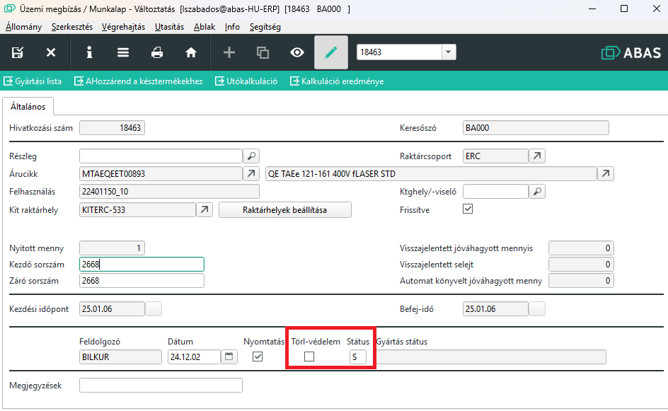
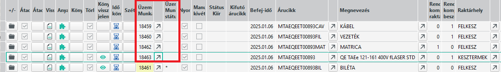
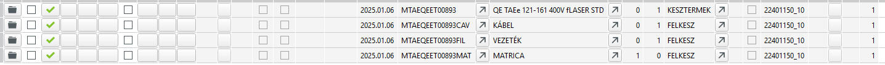
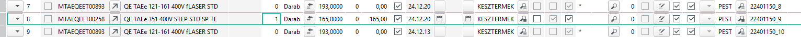
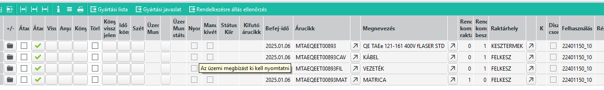
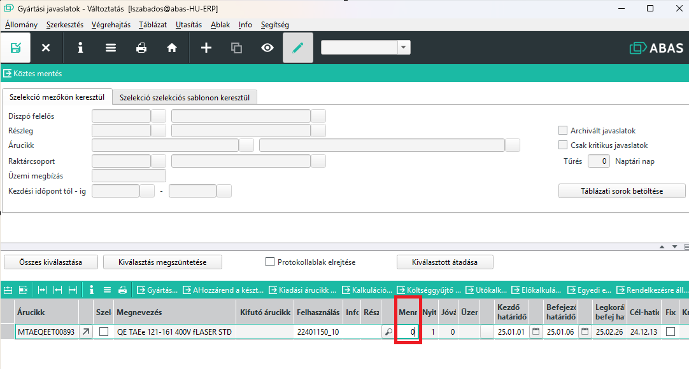

# Elindított gyártás törlése

Ha elindítunk egy gyártást, de mégsem kell gyártani, akkor törölnünk kell a gyártást.

## Felhasznált alapanyagok kiszerelése 

A visszajelentett de minőségben felhasználható alapanyagokat ki kell szerelni.

Ehhez kövessük a [Kiszerelés](szetszereles.md) leírást.

## Üzemi megbízás stornózása

Ha már nem tartalmaz az üzemi megbízás kiszerelendő alapanyagot, akkor az üzemi megbízást stornózni kell.

Ehhez a gyártásközpontban keressük meg és nyissuk az üzemi megbízást vagy a Standard -> Üzemi megbízások/Munkalapok -> Szerkesztés menüpontal nyissuk ki a megbízást.

A megbízáson ha a törlésvédelem be volt kapcsolva, akkor vegyük ki a pipát és a Státusz mezőbe írjunk be egy "S" betűt.

Mentsük el és kész is vagyunk az üzemi megbízás stornózásával.

Amennyiben a felhasználáshoz több üzemi megbízás tartozik, akkor minden üzemi megbízáson ezt végre kell hajtani, ami még nincs készre jelentve. (Üres a státusz mező)

A készre jelentett sornál a törlésvédelmet kivehetjük, de stornózni már a gyártást nem lehet, hiszen a termék elkészült. Amennyiben a legyártott félkész termék máshova nem használható fel, akkor az elkészült félkészterméket selejtezni kell, különben raktár készleten marad.

## Javaslatok ellenőrzése

Az üzemi megbízások törlése után mindenképpen futtassunk le a diszpozíciót. 
Futtatás után láthatjuk, hogy a gyártásközpontban a felhasználásra leszűrve gyártási javaslatokat látunk, vagyis az ABAS továbbra is gyártani akarja az eredeti megbízást.

Első lépésként, ha még nem tettük meg stornózzuk a megbízás sorait, amit visszavontak.

A törléshez a megbízást nyissuk ki és a mennyiséget állítsuk 0-ra. Ha már készre gyártottunk pl 10 db-os megbízásból 3-at, akkor az elkészült 3-at nem lehet visszamondani, ekkor a mennyiséget 3-ra állítsuk.

A státusz sorban a * jelzi, hogy a sorok teljesítettek, vagy az esetünkben stornózva lettek a megbízáson.

## Javaslatok törlése

Attól, hogy a megbízást töröltük, a gyártási javaslatok életben lehetnek, ezeket is törölni kell.

> Lehet a dispo törli automatikusan, de csak azokat, amire nem volt visszajelentés. Ha volt visszajelentés, akkor nem törli és az így nem töröltbe beépülő félkésztermékek javaslatait sem. Ezeket kell kézzel törölni!

A gyártásközpontban látjuk a javaslatokat

Minden soron egyesével nyissuk meg a gyártási javaslat maskot és a mennyiséget állítsuk 0-ra.(Vagy annyira, ami a készre jelentett mennyiség)

Kész is vagyunk, amegbízást teljesen töröltük a rendszerből.

> Fontos, hogy ha a megbízáson a sort nem töröljük, akkor hiába töröljük a gyártási javaslatot, a dispo futtatása után ismét létrejönnek a javaslatok.

