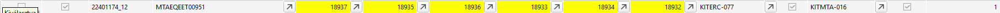
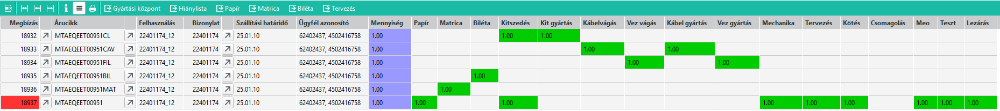

# Gyártási állapot Infosystem

Ez az infosystem viszonylag gyorsan lefut és egy áttekintést ad a gyártásban lévő üzemi megbízásokból.

Egy sor egy felhasználás. Az oszlopokban a készermék mellett a főbb beépülő félkész termékek állapotát is látjuk. BIL, MAT, CAV, FIL, CL

Ha sárga, akkor készre van jelentve ha nem akkor még nem.
A fő termékhez és a CL-hoz rendelt Kit is látható, ha van.
A Kit üres akkor van bejelölve, ha a kit nem tartalmaz semmit, üres a raktárhely.

A hiányos megbízások oszlopban 0 van, ha minden üzemi megbízás hiánytalan anyagfelhasználással vissza van jelentve.
Ha nem 0, akkor a szám jelzi, hogy hány üzemi megbízáson van hiány. Pl az eslő sorban a 4-ből 3 üzemi megbízáson van hiány.

> Fontos. A hiány nem azt jelenti, hogy nincs alapanyag, hanem azt, hogy nem lett a felhsználás lejelentve!

A "Teljesen kész" oszlop be van jelölve, ha minden üzemi megbízás készre van jelentve.

> Fontos! Attól , hogy teljesen kész, még lehet anyagfelhasználás hiány!

A "Kiválasztva" oszlop be van jelölve, ha a sor teljesen kész, nincs hiány és a kitek üresek.

> Ha a kit nem üres, de a sor hiánytalan, akkor a kitbe került valamiért olyan alapanyag, aminek nem kellene ott lennie. A rendszer elvárja, hogy a kit üres legyen lezárás előtt, hogy a kit újra felhasználásakor ne legyen ott -akár tévesen- alapanyag.

## Kiválasztott sorok lezárása

A kiválasztott sorokat a "Készek zárása" gombbal le tudjuk zárni. A gyakorlatban ez a törlésvédelmet veszi le az üzemi megbízásokról, és ezután már a gyártásközpontban a felhasználás többé nem elérhető.

## Miért csak teljes sort lehet zárni

Csak teljesen hiánytalan és teljesen legyártott sorokat tudunk lezárni. 

Ez azért van, mert pl. a CL kit hiánytalan. Elvileg ki lehet venni a törlésvédelmet, hiszen hiánytalanul elkészült és át is adtuk.
A gyártás során viszont kiderül, nem jó alapanyag került a tervekbe, hibás a gyártási lista. A CL kitből ki kellene venni a rossz alapanyagot és betenni a jót. De ha a törlésvédelem nincs rajt, a rendszer archiválja az üzemi megbízást és többé nem lesz elérhető.

Pont ezért a teljes készültségig, minden komponensen a törlésvédelmet rajt hagyjuk, és amikor minden kész, akkor vesszük le egyben, hogy bármikor lehessen javítani, amennyiben szükséges.

## Gyártási lista, üzemi készültség

Bármelyik soron állva a sorhoz tartozó felhasználás alapján a táblázatos rész feletti gombokkal a [Gyártási központ](gyartasi-kozpont.md) vagy az [Üzemi megbízások készültsége](megbizasok-keszultsege.md) infosystem indítható. Itt látható a részletesebb készültségi állapot is.

## Példa a használatra

Az alábbi sort elemezzük ki:

Látható, hogy teljesen kész van a kitek is üresek, de az egyik üzemi megbízás hiányos.

A soron állva nyissuk meg az Üzemi készültséget

Látszik azonnal, hogy a fő terméken jelez hiányt. A hiányos soron állva nyissuk meg a hiánylistát.

Fura! A hiánylista üres táblázatot ad.

> Ez teljesen jó működés. Az Üzemi megbízás készültsége program azt jelenti, hogy nincs egy vagy több alapanyag felhasználása visszajelentve. A hiánylista program pedig azt nézi meg, van e alapanyag a gyártáshoz, és hogy olyan helyen van e, ahonna gyártani lehet.

Gyártási központot is megnyitjuk

VITATCB+4X10Z alapanyagból kell 2 db a ZONA2-be.

Nézzük meg az alapanyag készletét:

Látszik, hogy a 2 db elérhető a ZONA2 raktárhelyen.

Mivel van elegendő készlet az elvárt helyen az alapanyagból, ezért a hiánylista nem jelzi hiánynak. De mivel nem lett a felhasználás a késztermékbe jelentve, ezért az üzemi készültség hiányt jelez.

