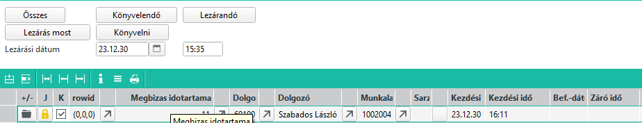
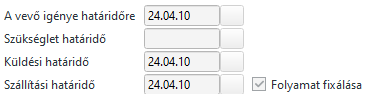
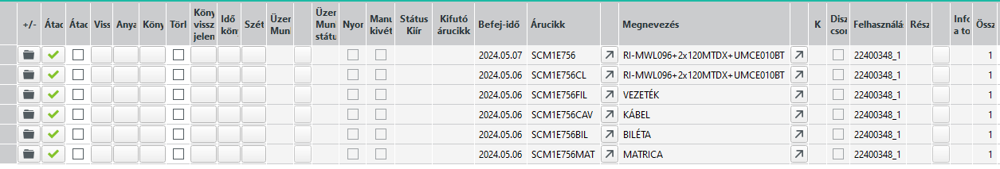
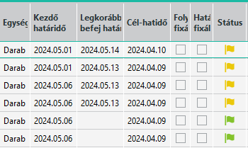
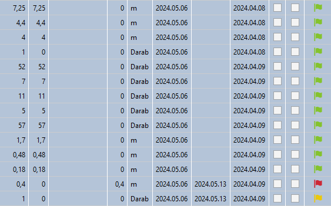
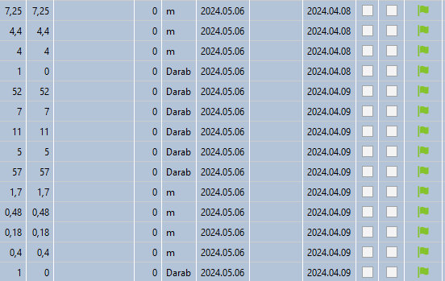
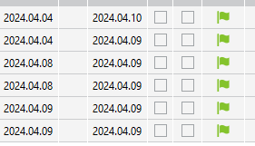
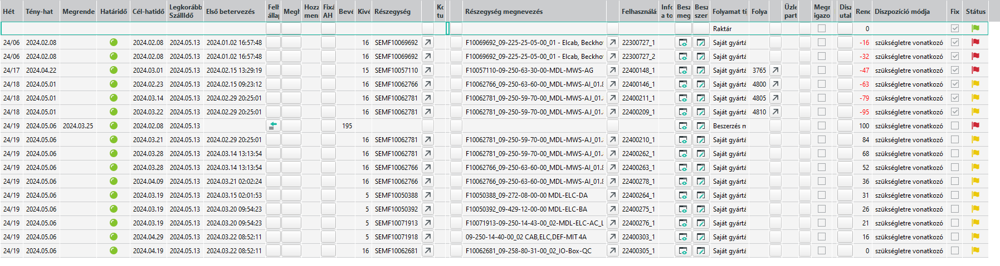
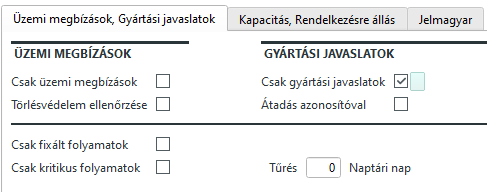
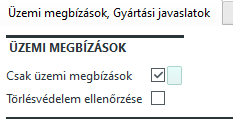

# Gyártás indítása

Amennyiben egy készterméket felveszünk megbízásra, a dispó futása után készül róla egy gyártási javaslat.

A gyártási javaslat gyártás kezdési időpontját úgy határozza meg, hogy a megbízásban rögzített szállítási határidőből levonja a gyártási időt. Ezt továbbá befolyásolja a már korábban elindított, vagy javaslatokban szereplő további késztermékek és a kapacitások.

Fontos, hogy az ABAS kapacitás tervezésnél abból indul ki, hogy a gyártást olyan sorrendben kezdjük el, ami a megbízásokban szereplő késztermékek teljesítése miatt logikus. Vagyis a korábban szállítandó termékeket előbbre sorolja, mint a később szállítandókat. (Természetesen ezt befolyásolja za elkészítési idő is).

Ettől függetlenül, mi más sorrendben is gyárthatunk, de ez a javaslatokat nem befolyásolja, csak majd a visszajelentések alapján fogja az időket, kapacitásokat újraszámolni.

## Gyártási javaslatok

A gyártási javaslatok a dispo lefutása után módosulnak, és működése az árucikk dispo módjának beállítása alapján kalkulálja a javaslatok sorait.

Amikor lefut a dispo, a következő történik: (most csak a gyártásra koncentrálva)

- Kiszámolja minden árucikkre az igényt. Ez lehet megbízás, átraktározás, vagy minimum készlet alá csökkenésből is.
- Ha a beszerzési mód saját gyártás és az igény nagyobb mint a készlet és a már létező gyártási javaslat összege, akkor gyártási javaslat sor készül.
- Ha a beszerzési mód saját gyártás és az igény kisebb mint a készlet és a már létező gyártási javaslat összege, akkor a gyártási javaslatokat csökkenti, ha tudja. (Már elfogadott javaslatokat nem törli a dispo).

Vagyis ha a gyártást nem indítjuk el, akkor a megbízáson szereplő sorok és a hozzá tartozó mennyiségek folyamatosan változtatják a gyártási javaslatokat.

Azt is vegyük figyelembe, hogy ez a dispo futás többszintű. Vagyis ha egy késztermékre egy gyártási javaslat létrejön és a gyártási listája tartalmaz olyan beépülő félkész terméket ami szintén saját gyártás beállítású, akkor arra is ugyan ez a folyamat lezajlik. 

Ennek következtében egy sor a megbízáson a javaslatokban 4-5 javaslatot generál: egy fő termék és CAV, FIL, MAT, BIL beépülőkkel és esetleg CL ContoLavoro kittel. Ezek egymástól független legyártandó tételek, vagyis a javaslatokat egymástól függetlenül el kell fogadni és le kell gyártani. Természetesen, mivel beépülőről van szó, amíg nincs kész a félkész termék, addíg a felhasználást nem tudjuk a fő terméken gyártáskor visszaigazolni.

## Gyártási központ

A gyártási központ Infosystem a legjobb kiindulópont a legtöbb gyártást érintő kérdésben. Itt láthatjuk a javaslatokat és a már elindított gyártásokat is.

### Gyártás indítása előtt mit látunk

Egy termék példájából kiindulva megnézzük, mit látunk és mit jelentenek a zöld, sárga, piros zászlók, és mi befolyásolj a akezdési határidő, legkorábbi befejezési határidő és cél határidő értékeit.

Alábbi példánál látunk egy megbízást 3 sorral:

Az első sor folyamat azonosítója 22400348_1

A megbízás első sorának, sornagyítóval megnyíló ablakának további részletek fülén ezt látjuk: 

> A folyamat fixálása nagyon fontos, később részletezem miért.

A gyártási központban, amikor erre a folyamatra szúrve lekérdezem az alábbi listát kapom:

Kicsit érdekesebbek a további oszlopok:

A cél határidő a megbízásban szereplő határidő miatt április 10 a fő és április 9 a fálkész termékekre.

A státusz sorban a két alsó zöld zászló van. Cél határidő az április 9 dátum, és azért zöld a zászló, mert a két beépülő az ABAS szerint legyárthető április 9-re.

A többi tételnél viszont azt látjuk, hogy a kezdési határidőnek az ABAS egy jóval a cél határidőt meghaladó dátumot ír, és a legkorábbi befejezési határidő nyilván ennél is későbbi.

Ez azért van, mert a gyártáshoz szükséges alapanyagok hiányoznak, és az alapanyagoknál beállított beszerzési időket figyelembe véve, ha azonnal megrendeljük, akkor is csak így teljesíthetőek a határidők.

A CAV félkész terméket lelistázva az alábbiakat látom:

Látszik, hogy az egyik kábel hiánya miatt nem lehet a cábelkitet legyártani időben.

Ha módosítom a készletet (mintha jött volna ma áru, amit nem vártunk), a következőt tapasztaljuk:

> Furának tűnik, hogy a kezdési határidő nem módosult. Ez azért van, mert az ABAS mindíg a legkésőbbi határidőt mondja, amikor el kell kezdeni a gyártást.
Hiába lehet gártami a kábelkitet már időben, mivel alkatrészhiány miatt a fő terméket nem lehet előbb gyártani, ezért ezt is lehet később kezdeni.

A fő terméken 3 tétel miatt van késedelem. Az egyik egy alapanyag a másik kettő a beépülő félkész termék. A CL és a FIL.

Ahogy a CL és FIL tételeken a hiányt toltam, a következőt látjuk:

Vagyis a cél határidő teljesíthető lett, minden zászó zöld.

### Megjegyzések a dátumokhoz és zászlókhoz

Az ABAS abból indul ki, hogy a gyártási listán szereplő tételek egyben műveleti sorrendek is. Vagyis ha a gyártási listán van egy tétel, ami nem szerezhető be határidőre, akkor az Piros színű lesz. Minden alatta lévő zászló sárga vagy piros. Piros, ha hiány van, sárga pedig, ha nincs hiány, de az ABAS azt feltételezi, hogy nem építhető be a korábbi hiány miatt.

Mivel az ERC esetében ez nem jellemző, ezért a legtöbb esetben a sárga zászló zöldnek tekinthető.

Azt is vegyük figyelembe, hogy ha a gyártási listán a CL beépülő előtt ott van egy bármilyen alakatrész ami hiányzik, akkor mivel a műveleti sorrend feltételezésből kiindulva a CL beépülőt csak a hiány megszűnését követően lehet beépíteni (az ABAS logikája szerint), ezért a CL beépülő gyártási időpontját is későbbre halasztja az ABAS. Lehetne előbb is gyártani, de mint korábban írtam, az ABAS mindíg a legkésőbbi határidőket javasolja.

> Ezen működés hibáinak csökkentése érdekében javasolt a beépülők helyét a gyártási listán minél korábbra rakni. Mivel a CL a mechanika műveletnél kell, akkor a Mechanika művlet soraiban legyen. Mivel, a MAT is a mechanika része, és feltételezhetően ott kevesebbszer lesz hiány mint a CL-ben, ezért a MAT előzze meg a CL-t.

A legkorábbi befejezési határidő akkor van kitöltve, ha a cél határidőt meghaladó érték jön ki.

A cél határidő a megbízáson szereplő határidő alapján kapja az értékét. Fontos viszont, ha a megbízáson a folyamat fixálása pipát nem kapcsoljuk be, akkor az ABAS a megbízás határidejét automatikusan eltolja arra az értékre, amire szerinte legkorábban teljesíthető a megbízás. Ez nekünk nem jó, ezért fontos, hogy a folyamatot fixáljuk.

> Ha a cél határidő üres, akkor a megbízáson a folyamat nincs fixálva, ezért a cél határidő sem létezik. Ekkor a megbízáson szereplő szállítási határidőből és az anyag rendelkezésre állásából kiszámolja a rendszer a kezdési határidőt és a legkorábbi befejezési határidőt, és ha kell, módosítja a megbízás szállítási határidejét is!

### Rendelkezésere állás értelmezése

Az ABAS a rendelkezésre állást a meglévő készlet, a megrendelések, szállítási határidők és tervlap alapján határozza meg.

Vegyünk egy alapanyagot, amit a rendszer szűk keresztmetszetként határoz meg. Látjuk, hogy piros a zászló és kezdési határidőnek több mint 40 nap van. A megrendelésekben pedig azt látjuk, hogy másnap érkezik 100 db. De ha holnap lesz 100 darab, miért mondja, hogy 40 nap múlva lehet csak gyártani.

Ennek az az oka, hogy a már gyártásban lévő, vagy a még nem elfogadott javaslatok miatt, más termékekhez is kell ez az alapanyag. A beállított szállítási határidők miatt a rendszer úgy gondolja, a beérkező 100 db más gyártáshoz fog kelleni, ezért ha ma rendselünk még, akkor az 40 nap múlva érkezik meg.

Ezt a folyamatot az adott alapanyag tervlapján is megtekinthetjük:

Azt látjuk, hogy jelenleg 6 termékbe is már késve fog megérkezni a megrendelt 195 db alapanyag. 
Ha megjön, akkor pedig látjuk mihez kellene.

Másik fontos dolog, hogy a gyrtási központba

## Gyártási lista szűrési lehetőségek

Attól függően mire vagyunk kíváncsiak, más más szűrési lehetőségeket érdemes bekapcsolni a gyártási központ InfoSystemen.

### Gyártási javaslatok

Ha arra vagyunk kíváncsiak, milyen még nem elfogadott javaslatok vannak, akkor a jobb oldalon a Gyártási Javaslatok részen kapcsoljuk be a "Csak gyártási javaslatok" jelölőt

Fontos lehet a megjelenített adatok sorrendje. Alapesetben a kezdési határidő a sorrend. Ez mutatja meg, hogy az ABAS szerint milyen sorrendben kellene elkezdeni a javaslatok elfogadását.

> Jó ha megértjük, és ismételjük az ABAS logikát. A cél határidő, ha a folyamat fixálva van, akkor a megbízás határozza meg. Erre kellene elkészülnie a készterméknek. A késztermékhez viszont gyártani kell, ami időbe telik. Vagyis a kezdési határidőhöz a cél határidőből a gyártási időt le kell vonnunk. Viszont a gyártáshoz alapanyag is kell, a hiányzó alapanyagokat meg kell rendelni. Figyelembe véve a jelenlegi megrendelés állományt és a rendelési határidőket, az ABAS eltolja a kezdési határidőt későbbre, abból kiindulva, hogy ha nincs alapanyag nincs értelme gyártani.

A cél határidő azért sem a legjobb sorrend, mert valamit 3 napig valamit 3 hétig kell gyártani, vagyis lehetséges, hogy valamit előbb kezdünk, de később van a cél határidő.

A gyártási központban az első oszlop mappa ikonját kinyitva láthatjuk az alapanyagokat és a azt is, hogy van e az alapanyagból készlet.

Lássuk azt is, hogy a kezdési határidő lehet múltban lévő határidő is. Amennyiben a folyamat fixálva van, a cél határidő fix, a kezdési határidő marad az eredeti értéken, viszont a legkorábbi befejezési határidőbő tolódik minden dispó lefutása után.

### Üzemi megbízások

A Csak üzemi megbizások jelölő bekapcsolásával látjuk a gyártás alatt lévő termékeket.
Itt az egyik legfontosabb érték az Üzemi megbízás oszlopban található.

Ha a mappa ikonnal lenyitjuk a listát, akkor látjuk az egyes műveletek vissza vannak e igazolva és látjuk mennyi alapanyag felhasználást jelentettünk vissza.

Az "Üzemi megbízás/munkalap státusz" oszlopban a * azt jelenti, hogy az a művelet teljesen kész.