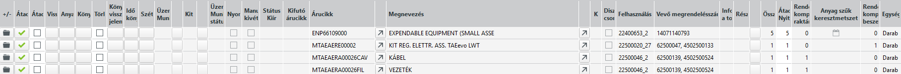

# Gyártási központ

A gyártásközpont az egész ABAS legfontosabb infosysteme. Az egész gyártási folyamatot megtekinthetünk és elemezhetünk vele. Nem minden szempontból tökéletes, ezért további Infosystemek használata is javasolt, de mindenképpen a legjobb kiindulópont.

## Sorok amik megjelennek

A gyártásközpont sorai több szintűek.

Az első szint a gyártási javaslatokat és/vagy az üzemi megbízásokat tartalmazzák.
(Az elfogadott gyártási javaslatból lesz üzemi megbízás)

A második szinten a megbízási gyártási lista sorai jelennek meg kiegészítve egyéb információval

## Szelekció

A gyártásközpont nagyon nagy mennyiségű adatot is tartalmazhat ezért fontos, hogy szelektáljuk a lehetségesen megjelenő adatokat.

### Szelekció mezőkön keresztül

- Üzemi megbízással egyetlen sort kapunk, az elfogadott, gyártásba adott kész vagy félkésztermék üzemi megbízását.
- Áruciikre szűrve kapjuk azokat a sorokat, ahol egy adott árucikket gyártjuk. Elvileg lehet több külön megbízásuk rá, és így külön javaslat/üzemi megbízás is keletkezhet.
- Részleg - csak akkor ad eredményt, ha az üzemi megbízásnál kitöltöttük a részleg mezőt.
- Raktárcsoport: alapértelmezetten a belső raktárcsoport van itt. A gyártás mindíg adott raktárcsoporton zajlik. EGy üzemi megbízás, mindenképpen valamelyik raktárcsoporthoz tartozik.
- Diszpó felelős: egy adott diszpó felelőshöz tartozó sorokat kapjuk. Használatához diszpó felelőst kell rendelni az üzemi megbízáshoz.
- Felhasználás: vevői megrendelésre vonatkozó gyártás esetén a késztermék és a félkésztermékek (amennyiben azoknak is vevői megrendelésre vonatkozó a dispo módja) egyben jellenek meg. 
- Kezdési időpont tól is: az adott intervallumban elkezdendő sorok jelennek meg. 
- Befejezési időpont: az adott időintervallumban kell befejezni a gyártást

### Szelekció szelekciós sablonon keresztül

Előre definiált sablon lekérdezések kiválasztása után leszűrt sorokat jelníthetünk meg

### Szelekció további pontosítása

A 2 féle szelekciót tovább szűkíthetjük a jobb oldali lehetőségekkel

A legfontosabb ezek közül a Csak üzemi megbízások és a Csak gyártási javaslatok. Vagy egyik sincs kitöltve és akkor nem szűkítjük a találatokat, vagy egyik ki van választva és az annak megfelelő sorok jelennek meg.

Csak kritikus javaslatok:
Egy ügylet akkor kritikus, ha a legkorábbi befejezési idő egybeesik a tény befejezési idővel vagy később van, ill. a kezdési idő a múltban van vagy a napi dátummal rendelkezik. Így a megbízás nem intézhető el. Egy ilyen bevitelt a diszpozíció a megnevezett mezőkben hajt végre.

Tűrés: Tűrésként azt a differenciát írhatja be naptári napban, ami a befejezési idő és a beszerzési javaslat legkorábbi befejezési ideje között van. Ha kijelöli a Csak kritikus-t és beír egy tűrést, akkor a beszerzési javaslatokban csak azok a javaslatok kerülnek kiadásra a táblázatba, amiknek a befejezési idő és legkorábbi befejezési idő közötti differenciája ezen a tűrésen túl van. Egy tűrésnek a Csak kritikus kijelölése nélküli bevitelekor a szelekciónak nincs hatása és az összes még nem jóváhagyott (átadott) javaslat kiadásra kerül.

## Gyártási javaslatok megjelenítése

A gyártási javaslatok megjelenítése esetén ehhez hasonló képet kapunk

Átadás gombok aktívak (Zöld pipa)
- befejezési határidő a cél határidő, amikorra be kellene fejezni a gyártást
- Látszik az árucikk
- Rendelkezésre álló komponensek raktáron, beszerzésen keresztül oszlopokban a legyártandó mennyiségeket látjuk (A leírás készítésekor, nem ismert miért egyikben vagy másikban van érték)
- Felhasználás oszlopban a megbízás és sora van kódolva
- Összmennyiség szintén a legyártandó mennyiséget látjuk
- Átadandó mennyiség oszoloban gyártási javaslatkor, ezt szeretnénk átadni gyártásra.
- Kezdő határidő az a dátum, amikor az ABAS szerint legkésőbb kezdeni kell a gyártást
- Legkorábbi befejezési határidő: alapból üres, de ha az ABAS szerint a cél határidő nem tartható, akkor az ABAS szerinti vállalható határidő kerül ide
- Cél határidő: Ekkorra kellene legyártani a terméket. Ha a megbízáson a folyamat fixálva van, akkor a megbízáson szereplő cél határidő jelenik itt meg. Ha ott a határidő nincs fixálva a dispo folyamatosan javítja a cél határidőt az ABAS szerint tartható dátumra.
- folyamat fixálva van, határidő fixálva van: ezek a mezők nem módosíthatóak, de automatikusan bekapcsolódnak, ha az ABAS által adott kezdési vagy befejezési határidőt kézeel átírjuk a javaslaton.

### Megjegyzés a határidőkhöz

Ha a rndszerbe nem piszkálunk bele, akkor a megbízásokon szereplő cél határidőt szeretné az ABAS betartani.
A cél határidő betartását anyaghiány megakadályozhatja, ekkor kitöltődik a legkorábbi befejezési határidő.
Szintén tolódik a határidő, ha nem kezdem el időben a gyártást, vagy elkezdem de lassabban haladok mint a tervezett. Ezt a visszajelentésekből látja a rendszer.

A kezdési határidőt alapvetően az határozza meg, hogy a cél határidőből visszaszámolja a rendszer a műveleti időket és így tudja , hány munkanap alatt készül el a termék. Ezt még kicsit megkavarja, hogy a műveletek gépcsoportokat foglalnak, amiknek kapacitásuk van. Ha több párhuzamos gyártás is ugyan azt a gépcsoportot használja, kapacitáshiány léphet fel. Az ABAS ezeket a kapacitás szűk keresztmetszeteket is figyelembe veszi, ezért lehet, hogy egyes termékek gyártását korábbi időpontra ütemezi a kapacitás miatt.

Fentebb említettem, hogy a gyártási javaslatban is az ABAS által javasolt kezdési vagy befejezési határidőt kézzel átírhatom és akkor a folyamat fixálva is lett. Az ABAS próbál ehhez igazodni, de ha például kapacitás szűk keresztmetszet miatt ezek a beállítások nem tarthatóak, a folyamat fixálása ellenére, módosíthatja a kezdési vagy befejezési dátumokat.

> Fontos ezeket a folyamatokat megérteni, ha értelmezni szeretnénk a gyártási központban a dátumokat és a jelöléseket.

### Gyártási javaslatok kibontása

A sor elején a mappa ikonnal a gyártási javaslat sor kibontható és láthatjuk a gyártási lista sorait.

> Fontos! Ez nem a gyártási lista. A megbízási gyártási listát is megtekinthetjük a soron állva és a gyártási lista gombra kattintva. 

Kibontás után a főbb oszlopok és jelentésük:
- Manuális kivét jelöli, hogy az anyagfelhasználást mi szabályozzuk, nem automatikus a művelet visszajelentésekor.
- Befejezési határidő, amior az ABAS szerint az anyagot fel fogjuk használni
- Árucikk és neve 
- Rendelkezésre álló komponensek raktáron: itt megmondja, hogy az igényelt mennyiségből mennyi áll rendelkezésre raktáron.
- rendelkezésre álló komponensek beszerzésen keresztül: itt az igényelt mennyiségből mennyi amit be kell még szereznünk.

> Itt most egy kis magyarázat! Lehet olyan sornál is azt mondja beszerzésen keresztül és raktárról 0, amiből van raktáron. Ez azért van, mert a raktáron lévő készlet más termék gyártásához kell. Nincs lefoglalva, csak a gyártási dátumok alapján a tervek szerint ez fog történni. lásd: [Tervlap](../raktarozas/tervlap.md)

- Raktárhely: innen fogja az anyag visszajelentés során az anyagot levenni. (Anyagfelhasználáskor ez felülírható, de ez az alapértelmezés)
- Nyitott mennyiség: a még nem felhasznált mennyiség. Az összmennyiségből le van vonva a már visszajelentett anyagfelhasználás.
- kezdő határidő: a cél határidő betartásához, legkésőbb ekkor kell elvégezi a felhasználást, műveletet. A műveleti időkből visszafelé számolással állapítja meg az ABAS. Ez lehet múlbéli idő is, ha a folyamatok fixálva vannak, és lehet nem betartható jövőbeni határidő is.
- Legkorábbi befejezési határidő: ez üres, ha a komponens a kezdési határidőre rendelkezésre fog állni. (Pl. beszerzés alatt van, de várhatóan beérkezik időre). Ha nem üres, az többnyire anyag szűk keresztmetszet miatt van. A státusz sorban ezt piros zászló jelzi is. A többi sornál is kitöltésre kerül a dátum. Ahol sárga zászló van, ott nem anyag szűk keresztmetszet miatt módosul a dátum, hanem mert az ABAS azt feltételezi, hogy az alapanyagokat sorrendben kell felhasználni, ezért ha egy alaktrészre várunk, a többi beszerelése sem lehetséges, magyarul áll a gyártás.
- Cél határidő: rendszerint a megbízáson a határidőt fixáljuk és ezért itt is ez a fixált határidő jelenik meg. Ez lehet múlbéli dátum is, ha nem tudtuk tartani a tervet.
- Státsz oszlopban zöld sárga és piros zászlók jelzik, hogy a folyamat tartható e.

### Rendelkezésre állás ellenőrzés

Egy árucikk soron állva a gombbal a rendelkezésre állást tudjuk megtekinteni.
pl:

A cikk azt mutatja 2,93 raktárról, 1,27 beszerzésen keresztül.

A cikkből 11,73 van raktáron, de a tervlap alapján erre a megbízásra csak 2,93 marad, ezért ez szerepel ott.

A rendelkezésre állás ezt mutatja meg.
Első sor raktári készlet 2,93 méter
Második sor Beszerzésből, 1,23 méter.

Az óra azt jelenti, határidőre nem fog merérkezni az áru.

A megrendelés folyamatra kattintva láthatjuk, hogy valójában ez nem is megrendelés, hanem csak megrendelési javaslat, és az értékek abban az esetben igazak, ha még a mai napon elindítjuk a megrendelést.

## Gyártási javaslatok elfogadása

A gyártási központból a legegyszerűbb a javaslatok elfogadása. Célszerűen felhasználásra szűrjükle és így egyben látjuk a késztermék és a félkésztermékeinek a javaslatait is.

Az átadás pipával lehet egyesével a javaslatokból üzemi megbízást készíteni.

Ha sikeres, akkor az üzemi megbízás oszlopban megjelenik az üzemi megbízás száma.

## Üzemi megbízások

Ez a rész majdnem azonos a gyártási javaslatokéval, csak a különbségeket emeljük itt ki.

A sorok eleján láthatjuk a törlésvédelem jelzését. Ez ha be van kapcsolva, az üzemi megbízás akkor sem archiválódik, ha a mennyiségi visszajelentés teljes. Ez azért kell, mert manuális anyagfelhasználás esetén akkor is archiválódna az üzemi megbízás, ha az anyagot még nem vételeztük ki. Archiválás után viszont erre már nincs mód.

Üzemi megbízás oszlop sárga, és a státusz sor sem üres, ha az üzemi megbízás teljesült. Egyéb esetben fehér.

### Üzemi megbízások kibontása

Ha kinyitunk egy üzemi megbízást, akkor a visszajelentések állapotát is láthatjuk.
Visszajelenteni műveleteket lehet.

Könyvelt visszajelentés oszlopban egy szem jelenik meg, ha már történt visszajelentés.

Tudunk visszajelenteni, anyagfelhasználást jelenteni és időt visszajelenteni.

Anyag visszajelentés után, amelyik anyagból az összes szükséges mennyiséget visszajelentettük, sárga lesz a mező az üzemi megbízás oszlopban.
Igy azonnal látszanak a hiányok.

