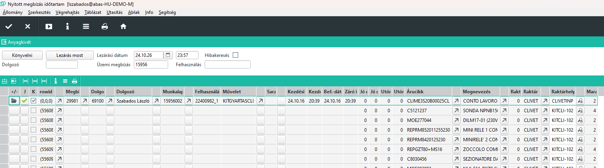

# Művelet könyvelése

# Üzemi megbízások felhasználása - Nyitott megbízás időtartam Infosystem

A programmal a nem lezárt visszajelentéseket lehet lezárni, valamint a lezárt visszajelentéseket lehet könyvelni.

## Nem lezárt visszajelentések lezárása

Amenniben egy dolgozó valamilyen okból nem zárta le a nyitott műveetet, a műszakvezető lezárhatja azt. Lezáráshoz meg kell adnia a befejezési dátumot és iőpontot.

> Ha egy napon túlmenő a visszajelntés, a beálljtott műszak alapján számolja a munkaidő végét és a másnapi kezdést. A jelenlegi beállításokkal ez nem szerencsés, jelenleg csak napon belüli időpontot fo2gad el, napon túli visszajelentést nem. Az ABAS elvileg ezt is támogatja, de akkor a műszakterveknek pontosan a valóságot kellene követni.

A lezárt visszajelentést ezután még el is kell fogadni, hogy könyvelődjön a munkaidő.

Lezáráshoz a lezárandó sort pipáljuk be és felső sávban adjuk meg a dátumot is időpontot.
Ha az időpont nem nagyobb mint a kezdés, a program nem csinál semmit.

## Lezárt visszajelentések könyvelése

A könyveléssel 2 dolgot végzünk egyszerre.

### Művelet mennyiségi visszajelentése

A művelet mennyiségi visszajelentése egyrészt a gyártandó termékre könyveli a dolgozó munkaidejét, valamint a megadott visszajelentett darabszámokat is könyveli.

#### Jó mennyiség visszajelentése

A jó darab oszlopban azt a mennyiséget látjuk, amit a dolgozó visszaigazolt. Elvileg ezzel a mennyiséggel van kész. A dolgozónak maximum a hátralévő mennyiséget engedi visszajelenteni, de egyéb korlátozás nincs, vagyis a dolgozó visszajelentheti a többi művelettől függetlenül a teljes mennyiséget is.

Az ABAS ha lejelentek egy műveletet, akkor megvizsgálja, hogy az előző, műveleteket már le lettek e jelentve ekkora mennyiségben. Ha nem, akkor automatikusan készre könyveli, mondván elhiszi, hogy kész, mert ha te kész vagy, biztosan az előzőek is kész vannak.

Ez a működés egy megengedő eset, de az ERC számára nem megfelelő. Ez előző műveletekre ekkor már csak időt lehet jelenteni, mert a mennyiség lejelentésre került. Nehéz a nyilvántartás, mert a rendszerben azt látjuk kész, stb.

Ennek kivédésére, a Jó darab elfogadott oszlopban a rendszer javítja amennyiséget (csökkenti), ha a korábbi műveletek mennyiségei alapján a mennyiség nem lejelenthető.

A jó mennyiség értéke növelhető is, ha a korábbi műveletek ezt lehetővé teszik, de maximum a még nem visszajelentett mennyiség erejéig.

#### Selejt mennyiség visszajelentése

Selejt valójában nem a műveletre fog vonatkozni, a rendszer 0 selejtet fog könyvelni, csak az anyagkivétnél adható meg a selejtezendő alapanyagnál selejtezett mennyiség.

#### Utómunka mennyiség visszajelentése

Utómunka esetén a már lejelentett mennyiség értékéig lehet darabszámot megadni és a korábbi lejeletéseknél hiányzó alapanyagok lejelentésére használjuk. Pl. már készre jelentett mechanikából még hiányzott egy alapanyag, ezt utómunkában lejelentjük, hogy beszereltük. 
Természetesen az alapanyagnak az üzemi raktárhelyen kell lennie.

### Alapanyag felhasználás lejelentése

Visszajelentésnél aművelet alatt megjelennek a művelethez tartozó alapanyagok.
A visszajelentett mennyiséggel természetesen felszorzódik a mennyiség, amit a "Jó darab" oszlopban láthatunk. 
Ez a mennyiség a "Jó darab elfogadott" oszlop értékétől függően változhat felfelés és lefelé is.
Ezen túlmenően a Raktárhely oszlopban lévő raktárhelyen keresi az alapanyagot a rendszer. Amennyiben itt nincs vagy nem elegendő mennyiség van, akkor a "Jó darab elfogadott" oszlopban lévő értéket csökkenti, vagyis csak azt a mennyiséget engedi könyvelni, ami rendelkezésre is áll. A "Raktáron" oszlopban láthatjuk, hogy mekkora készletet lát az ABAS az adott raktárhelyen.

Amennyiben tudjuk, hogy egy alapanyagot nem tettünk bele, akkor lehet a visszajelntett mennyiséget csökkenteni, de nem javaslom ezt ha amúgy nincs hiány. Ilyen esetben inkább 0 mennyiséget jelentsünk, és csak akkor jelentsük le a mennyiséget, ha kész a művelet teljesen.

