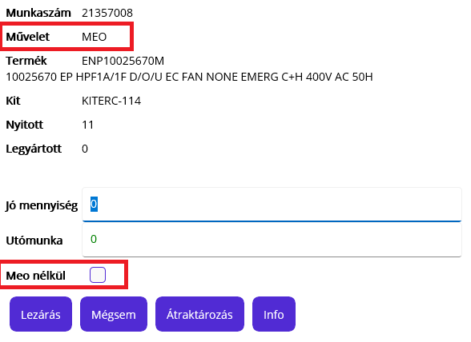

# Művelet lezárása

Amikor a dolgozó a műveletet bármi okból befejezi, akkor a műveletet le kell zárni.

A befejezés főbb okai, de lehet persze más is:
- végzett a művelettel
- vége a munkaidőnek
- más feladatot kapott

Művelet lezárásához ismét be kell jelentkeznie. Ekkor nem kell a visszajelentő papír, a rendszer tudja melyik műveletben van a dolgozó.

Bejelentkezés utána a lezáró ablakot látjuk,a művelet részleteivel

Látjuk a nyitott és a legyártott mennyiséget.

A nyitott mennyiség amit még nem jelentettünk késznek, a lezárt pedig a késznek jelentett mennyiség. A kettő összege az üzemi megbízáson igénylet mennyisége.

> Jó mennyiséget csak max a nyitott mennyiség értékéig jelenthetünk le.
> Utómunka a már készlek jelentett műveletnél lehetséges, ezért az értéke max a legyártott mennyiség lehet.

## MEO vagy TESZT lezárása 

MEO vagy TESZT műveleteknél megjelenik egy további kapcsoló, amivel úgy tudjuk készre jelenteni a műveletet, hogy közben jelezzük a rendszerrel, hogy a műveletet valójában nem végeztük el.
Vagyis, ha pl. nem végezzük el a MEO műveletet, a továbblépéshez akkor is le kell jelenteni jó mennyiségnek, hogy az ABAS a gyártást továbbengedje. Ekkor a jelöléssel konkrétan elmentjük, hogy itt a meózás elmaradt, így engedtük tovább a terméket. Később, egy esetleges reklomáció feldolgozásakor ennek nagy jelentősége lehet.

Ez az információ a későbbiekben kiértékelhető, a BDE adatbázisban a Megszakítás okaként szerepel a NoMeo vagy NoTest érték.

## Idő lejelentése

Amennyiben nincs kész a művelet bármi okból, akkor a jó mennyiségnek és az utómunka mennyiségnek is 0 értéken kell maradnia.
Lezárással befejezzük a műveletet, csak az idő könyvelődik.

## Mennyiség lejelentése

Amennyiben elkészült a művelet, akkor a nyitott mennyiség értékéig, le tudjuk jelenteni. A jó mennyiség értékéhez írjuk be az elkészül mennyiséget.

Ebben az esetben mennyiség és idő is könyvelődik

## Utómunka lejelentése

Amikor valami okból a lezárt művelethez kellmég időt lejelenteni, akkor utómunkát jelentünk le.

írjuk be hány darab terméken végeztünk utómunkát.

Az utómunka mennyisége és az idő is könyvelődik.