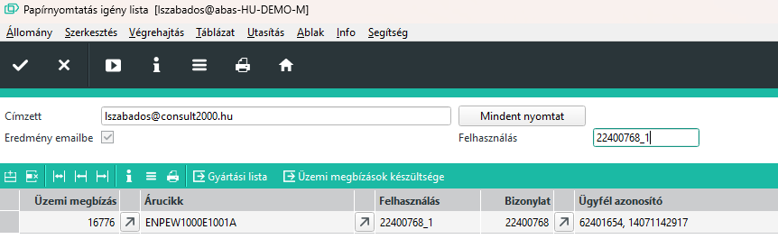

# Papírok nyomtatása

A papírokat a Céges/ERC/Gyártás/Papírok infosystemmel tudjuk megnyitni.

Ha futtatjuk, akkor a táblázatos részben megjelennek azok az üzemi megbízások, amelyekhez tartozik papírnyomtatás művelet, de még nincs visszaigazolva.

A papírnyomtatás több üzemi megbízás esetén hosszabb időt is igénybe vehet, ezért a program nem jeleníti meg az eredményt, hanem a Címzett mezőben szereplő email címre küldi el.

Minden üzemi megbízást külön emailbe kapunk meg, ahol az email tárgya tartalmazza azokat az információkat, amiből könnyen beazonosítható a megbízás, amihez tartozik.

> Alapértelmezetten a bejelentkezett felhasználó email címe jelenik meg, de módosítható igény szerint.

A mindent nyomtat gombbal a papírok elküldésre kerülnek.

## Nyomtatás utáni feladatok

Azért, hogy a már nyomtetott sorok eltűnjenek, a nyomtatás műveletet vissza kell igazolni.

Ehhez a [Megbízások készültsége](megbizasok-keszultsege.md) infosystemet kell használni.

## Már nyomtatott megbízások újra nyomtatása

Ha valamilyen okból újra kell nyomtatni egy megbízást, akkor a felhasunálás mezőbe írjuk be a megbízáshoz tartozó felhasználás értéket. így futtatva az infosystemet, megjelenik az üzemi megbízás aművelet visszaigazolása után is, így újra kérhetjük a nyomtatást.

> nyomtatás alatt azt értjük, hogy PDF file készül és emailben kerül az ügyintézőhöz.

## Nyomtatás utűni feladatok

A nyomtatás után emailen megkapott PDF fileokat ki kell valóban nyomtatni és szétszedni. 3 részre kell bontani a papírokat és a megfelelő részlegekre eljuttatni.

Fejléc, a kitszedés , a visszaigazolás és az anyaglista, valamint ha volt Conto Lavoro kit, akkor az ahhoz tartozó kiteszedés papírokat a Raktárnak kell átadni.

Fejkléc, Biléta és Matrica visszaigazolás papírok és anyaglista az irodának.

Fejléc, CAV és FIL visszaigazolás és anyaglista a tervezésre.

