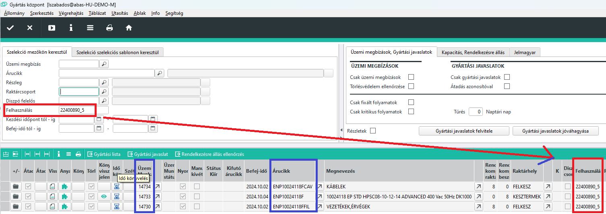
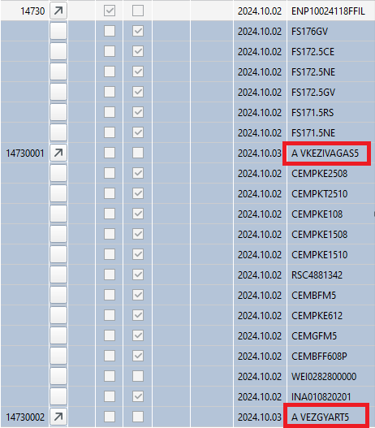
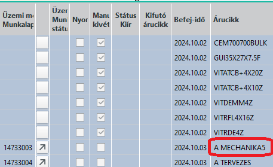
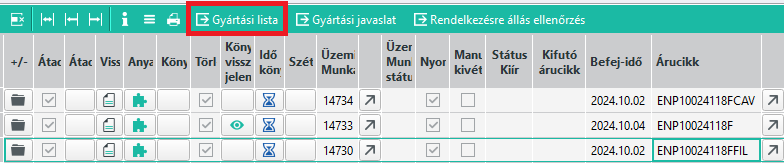
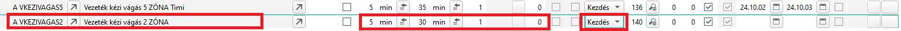
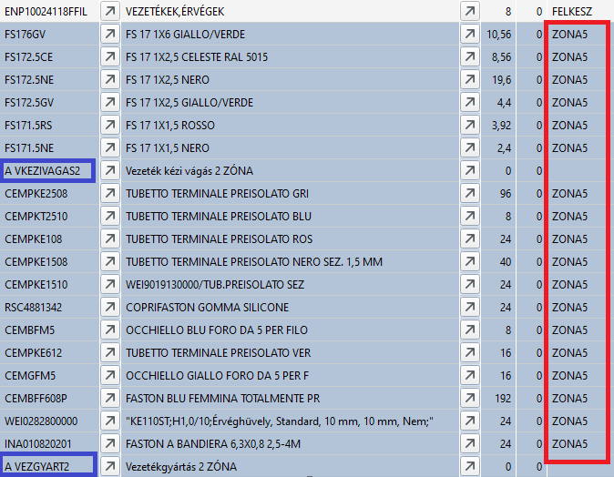
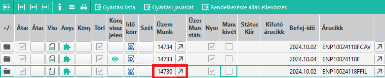
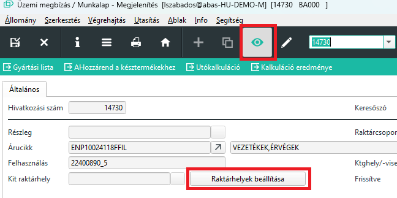
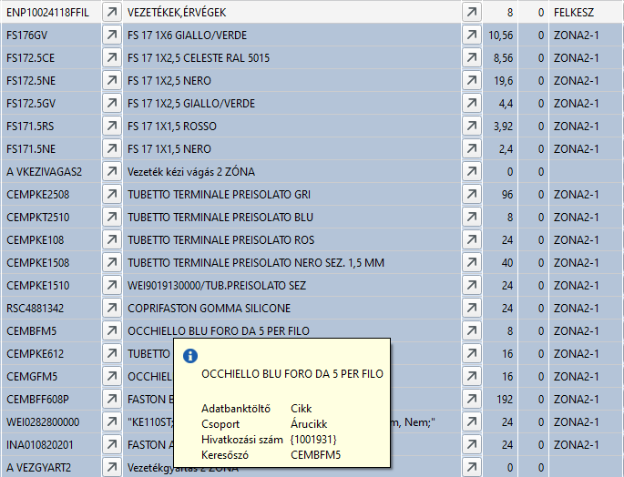

# Részlegváltás

A gyártási listákon a műveleteknél kötelező megadni a gépcsoportot, amivel a műveletet végzik. Ez azért kell, mert enélkül nem lehetne kapacitás számításokat végezni. Vagyis az ABAS elvileg tudja, melyik részlegen és azon belül melyik gépcsoporttal végzik az adott műveletet.

A Tervezés részleg a kapott információk alapján a gyártási listákon beállítja a műveleteket, annak megfelelően, hogy elvileg hol fogják azt elvégezni.

Időnként viszont a gyártásvezető kapacitás vagy egyéb megfontolásból úgy dönt, hogy másik részlegen végeznek el bizonyos műveleteket.

Ez annyiban okoz gondot, hogy a visszajelentéskor az ABAS annak a részlegnek az üzemi raktárhelyéről próbálja levenni az alapanyagokat, ahova a művelet tartozik.

Ahhoz, hogy ne legyen hibás anyagfelhasználás, a gyártási listán a műveleteket ki kell cserélni a megfelelőre.

## Gyártási lista megnyitása

A cseréhez meg kell nyitnunk az üzemi gyártási listát

A [Gyártásközpontot](gyartasi-kozpont.md) kinyitjuk és vagy az üzemi megbízásra vagy a felhasználásra szűrve elindítjuk.

Ekkor megkapjuk a megbízáshoz tartozó üzemi megbízás(oka)t. 

Ha a vezetékgyártást és a mechanikát akarjuk a ZONA2-be áttenni a ZONA5-ből akkor az ennek megfelelő műveleteket kell cserélni.

A vezetékgyártás a FIL végű félkészterméket produkálja, ebben van 2 művelet: VKEZIVAGAS5 és VKEZIVAGAS2

Ezeket kell cserélni VEZGYART5 és VEZGYART2 értékre.

A Mechanika művelet a főtermék gyártási listáján van, itt kell a MECHANIKA5 -öt MECHANIKA2-re cserélni.

## Művelet cseréje

A táblázati soron állva a gyártásközpontban, kattintsunk a Gyártási Lista gombra.

A gyártási lista eleve szerkesztésre nyílik meg

A műveletet nem tudjuk módosítani, de be tudunk új sort szúrni.
Az összes feletti értéket másoljuk át, de a gépcsoportot nemés a kezdési és befejezési határidőt se töltsük.

Ha kész, töröljük a felesleges régi műveletet tartalmazó sort.

Ezt ismételjük mindenhol ahol szükséges.

## Raktárhelyek beállítása

Alábbi példán látható, hogy a műveletk már megfelelőek, de az abas még a régi helyekről venné le az anyagot. 

Ezt át lehet egyesével állítani, de nem kell!

Nyissuk meg az üzemi megbízásta gyártási központból.

 Így, betekintési nézetben kattintsunk a Raktárhelyek beállítása gombra.

 

 A gomb hatására elinduló program, végignézi a gyártási listát, és a műveletnek megfelelő raktárcsoportot vagy kit raktárhelyet beállítja.

 

 Látható, hogy a ZONA5 -ből ZONA2 lett a raktárhely.

 Ezt a műveletet minden érintett üzemi megbízással el kell végezni.

