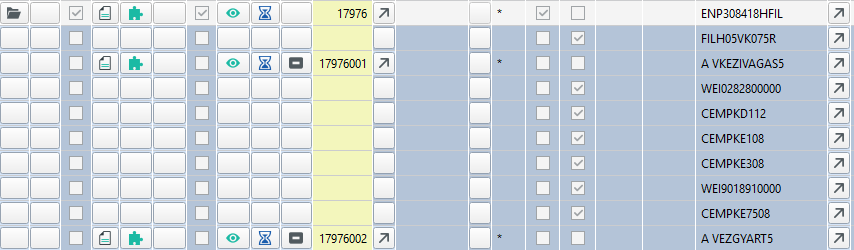
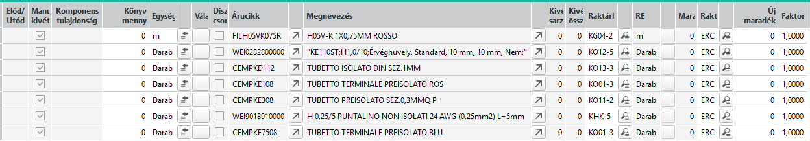
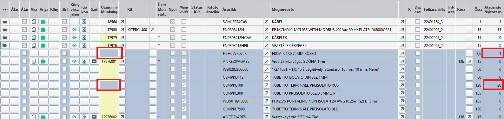
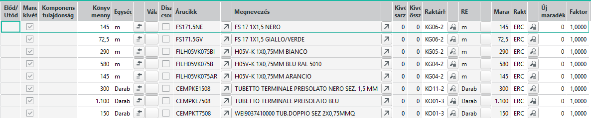
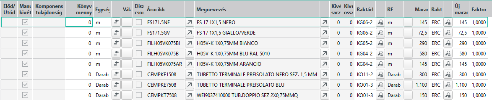
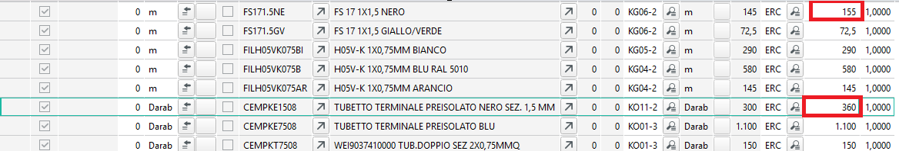
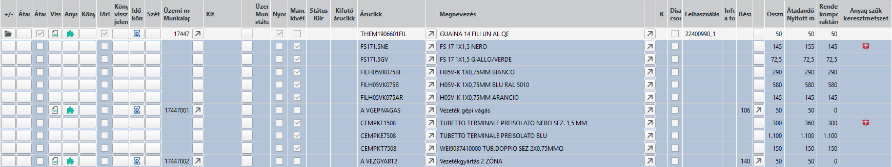

# Selejtezés

Selejt akkor keletkezik, ha a gyártás folyamán valameliyk alkatrész, vagy az alkatrészek egy csoportjából előállítani szándékozott félkész termék használhatatlanná válik.

Ha egy alkatrész hibás, törött vagy egyéb módon használhatatlanná válik, esetleg a tesztelénél derül ki, hogy nem működik, akkor azt ki kell cserélni. Főleg aban az esetben, amikor a csere után a hibás vagy hibásnak vélt alapanyagot vissza akarjuk küldeni a szállítónak, akkor az alapanyagot vissza kell raktározni a raktárnak, hogy vissza lehessen küldeni.

Amennyiben már nem üzemi raktáron vagy kitben van az alapanyag, hanem már az anyagfelhasználást visszajelnetettük, akkor kiszereléssel az alapanyagot ki kell szerelni a termékből.

Ezen folyamat le van íva a [Szétszerelés](szetszereles.md) leírásban.

Egy másik eset, amikor az alkatrész láthatóan a mi hibánkból tönkremegy, javíthatatlan, és a visszaküldés eleve kizárt, vagy ha úgy keletkezik a selejt, hogy egyéb felhasznált alapanyagokat is érint. Pl. kábelgyártás során a kábel megsérül. Ekkor nem csak a kábel, hanem az addig felhasznált érvégek is a selejt részét képezik.

Ebben az esetben, a kábelből is és a már felhasznált érvégekbő plusz igény keletkezik, a valóságban többet használunk fel a gyártáskor, mint ami a tervekben (gyártási listán) szerepelt.

Ennek a leírásnak a feladata, hogy bemutassa az ilyen többletfelhasználást hogyan tudjuk lejelenteni.

## A többletfelhasználási igény admimisztrálása

A gyártási lista alapján az üzemi gyártási listán az ABAS tudja, melyik alapanyagból mennyire van szükség.

Az visszajelentéskor az anyagfelhasználást is visszajelentjük, vagyis az ABAS folyamatosan tudja, hogy mekkora volt az eredeti igény, és még mennyi alapanyagra van szükség a gyártáshoz.

A többletfelhasználás adminisztrációjának első lépése, hogy az ABAS-al tudassuk, hogy a felhasználási igény megnövekedett, vagyis hogy melyik alpanyagból mennyivel kell többet felhasználnunk.

A gyártási listán keressük ki az üzemi megbízást, ahol a selejt keletkezett.

Példának egy teljesen késznek jelentett vezeték félkészterméket hozok.

Látszik, hogy minden alapanag felhasználást visszajelentettünk, és az ABAS szerint a félkész termék készen van.

Szeretnénk plusz 1m vezetéket és a CEMPKE108 érvégből 20db -ot selejtnek jelenteni (vagyis ennyivel több felhasználást).

Kattintsunk az üzemi megbízás (nem annak valamelyik műveletének) az anyagkiadás gombjára.

A megjelenő ablakban kattintsuk az Anyag betöltése gombbra.

Valami hasonlót kell kapnunk:

AZ Új maradék oszlop mutatja, az ABAS még mennyi alapanyagot szeretne felhasználni. Mivel a termék kész, és hiánytalan, itt végig 0-a van.

Itt módosítsuk az értékeket a FILH05VK075R árucikk sorában írjunk be 1-t és a CEMPKE108 sorában pedig 20-at az új maradék oszlopba.
Felül a megjegyzéshez írjuk: "selejt miatti pótlás"

Ha nincs a gépcsoport kitöltve, azt meg kell adni. Én itt a vezetékgyártás (108) gépcsoportot adtam meg.

Mentsük el és frissísük a gyártási központot.

Látható, hogy az átadandó nyitott mennyiségnél megjelentek az igények.

Ezt követően a gyártást végző kolléga már a szokott módon lejelentheti a vezetéksgyártás műveletet, visszajelentéskor az ABAS le fogja vonni az itt megadott plusz mennyiségeket az üzemi raktárhelyekről.

## Igény növelése, amikor még nem volt visszajelentés, vagy nem volt teljes

Amikor még nem vagy csak részleges volt az anyagvisszajelentés, és a selejt már ekkor keletkezett, akkor is tudunk plusz igényt jelenteni.

Ilyen esetben, egy másik példánál, az anyagbetöltés után ilyesmit láthatunk:

Látjuk, hogy a könyvelt mennyiség oszlop végig ki van töltve, az új maradék oszlop pedig végig 0. Ez azért van, mert az ABAS előre az összes alapanyg felhasználást vissza szeretné jelenteni. Ez nekünk nem jó, ezért a Könyvelt mennyiség oszlopba írjunk végig 0-át.

Ha megtettük, ezt látjuk:

Látható, hogy az ABAS az új maradék oszlopot kitöltötte az értékekkel, hiszen ha nem köyvelem a mennyiséget, akkor marad az igény.

Ha most szeretném a selejt igényemet pl. a FS171.5NE vezetékből 10métert és a CEMPKE1508 érvégből 60db-ot selejt miatt mint felhasználási igényt az ABAS-nak jelezni, akkor ennyivel kell az Új Maradék oszlop értékét növelnem:

A selejt mennyiséggel megnöveltem az igényt.

A megjegyzés és gépcsoport mezőket most is tölteni kell mentés előtt.

Mentés után a gyártási központban ezt látom:

Látszik, hogy a korábban rendben lévő listán két helyen anyag szűk keresztmetszet keletkezett, mert a selejt miatt készlethiány lépett fel! Ez azért érdekes, mert az alapanyagból bőven van raktáron. A jelenség oka, hogy az abas az alapanyag tervlapján kiszámolta ehhez a termékhez mennyi alapanyag szükséges, most meg több kell. Semmi gond. Futtassuk le a diszpót, ami az alapanyag tervlapját frissíti, és el fog tűnni a szűk keresztmetszet jelölés, ha amúgy van elegendő alapanyag.

> Vegyük észre, hogy mindkét esetben az Új maradék oszlop értékét növeltem azoknál az alapanyagoknál, ahol selejt keletkezett, csak az első esetben a 0 maradékot kellett növelni, míg a második esetben még meglévő igényt kellett tovább növelni.

