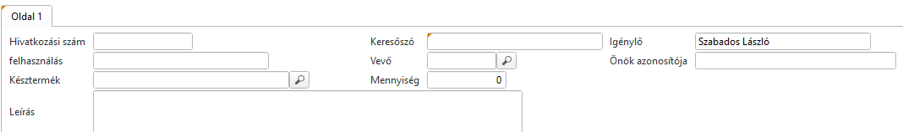
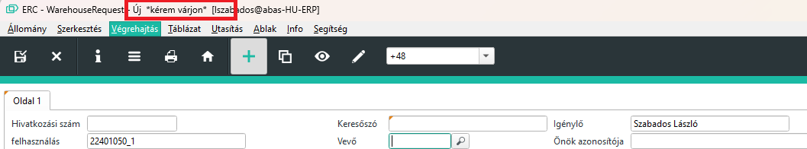
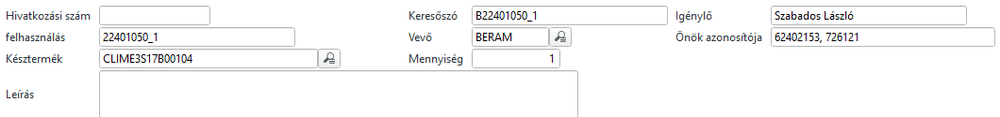
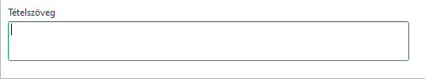
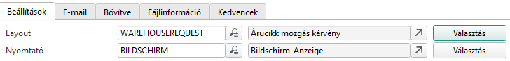

# Raktár árucikk mozgatási kérelem

Ez egy kiegészítő adatbázis, ahol a raktár felé lehet árumozgatási kérelmet benyújtani.

Az ABAS-ban tudjuk kitölteni, és nyomtatható formátuma révén, szabályos egységesített árumozgatási kérelmet tudunk a raktár felé intézni.

Ez egy általános űrlap, vagyis nincs előre definiált célja az űrlapnak, azt nekünk kell megadni.

Az alábbi nem hiánytalan lista, amikor az űrlapot használhatjuk:

- Revízióváltás gyártás közben. Ekkor új anayagok vételezése és esetleg anyagok visszaküldése is lehetséges.
- Selejtes vagy selejt gyanús alkatrészek. MEO, TESZT vagy gyártás során, ha egy alkatrész selejtes vagy selejt gyanús, akkor a hibás alapanyagot át kell raktározni a selejtraktárba, és esetlegesen csere darabot kérni a raktártól
- Bármilyen egyéb esetben amikor a raktárnak visszaadunk vagy a kartártől kérünk alkatrészt

## Fejlécadatok

Amikor új űrlapot viszünk fel, a rendszer automatikusan kitölti az igénylő személy nevét. Ezt csak első belépéskor teszi meg, átírható és a rendszer nem írja felül.

A keresőszón kívül semmilyen más adatot nem kötelező megadni, de ritkán van így.

### Felhasználás

Ha az alkatrész amit kérünk vagy visszaküldünk egy üzemi megbízáshoz kapcsolható (kevés esettől eltekintve így van), akkor meg kell adnunk a felhasználás számot.
Ha megadjuk, a rendszer automatikusan tölti a leíráson kívül az összes mezőt.

A felhasználás beírása után, ha átkattintunk egy másik mezőre, akkor a rendszer elkezdi keresni az adatokat. Felül a "kérjem várjon" felirat jelzi, hogy dolgozik.

Ha nem írtuk el a felhasználási számot akkor megjelennek az adatok

### Mennyiség

A fejlécben lévő mennyiség, az érintett késztermékre vontakozik, ennyit gyátanánk. Amennyiben az áru mozgás kevesebb készerméket érintene, akkor csökkentsük a mennyiséget.

### Leírás

Ide adjuk meg a mozgás okát. Pl: revízióváltás, vagy selejt. Részletesen is írhatunk, max 2999 karakter hosszan.

### Önök azonosítója

A felhasználás alapján beazonosított megbízásról veszi át a vevő megrendelési számát.

## Tételadatok

A tételadatokat tetszőlegesen tölthetjük.

- Viszáru : jelöljük be, ha a tételsor anyag visszaadását jelöli. Áru a raktárba megy. Ha nem jelöljük be, akkor árut kérünk a raktártól.
- Üzemi megbízás: ha meg tudjuk adni, akkor írjuk be. Egy felhasználás 4-5 üzemi megbízásból is állhat. Annak a számát kell megadni, amelyiknek a gyártási listáját érinti az anyagmozgás.
- Fő termék: az a késztermék vagy félkésztermék, amelyiknek a a gyártási listáján az érintett alapanyag van/volt.
- Árucikk: a mozgatott alapanyag
- Mennyiség: ez a mennyiség amit kérünk/visszaadunk a raktárnak, szorozva a fejléc mennyiséggel. Vagyis ha egy revízióváltás miatt plusz 3 relé kell panelonként, akkor ide 3-at írunk és ha ez 5 panelt éruint, akkor felül 5-öt. Ha így nem adható meg pontosan, akkor a fejlécbe 1-et írjunk és ide a pontos mennyiségeket.
- Bevét, kivét raktárhely: amikor raktártól kérünk alapanyagot, meg kell mondanunk hova kérjük. Ez lehet egy KIT vagy egy üzemi raktárhely. Ez lesz a bevét raktárhely. Ilyen esetben a kivét raktárhelyet nem is engedi a rendszer tölteni, mert nem tudhatjuk a raktár honnan akarja levenni, nem is kell tudnunk. Ha visszaadunk, akkor a kivét hely aktív, azt kell töltenünk, és a bevét hely tiltott, mert nem tudjuk a raktár hova teszi.

A tételsoron duplán kattintva a sornagyítóval lehet minden tételsorhoz megjegyzést fűzni, max 2999 karakter hosszan. Nyomtatásban ez is megjelenik a tételnél.

### Conto Lavoro árucikk mozgatása

Ha az árumozgás olyan terméket érint, ami ContoLavoro gyártási listán volt, akkor az árucikket ki kell szerelni vagy bele kell jelenteni a Conto Lavoro félkész termékbe.

Ennek leírása a [Kiszerelés](kiszereles.md) dokumentációban.

## Nyomtatás

Válasszuk az "Árucikk mozgás kérvény" Layout-ot

PDF formátumban kapjuk magyar és olasz nyelven.

> Nyomtatásban a tételsorok mennyiség fel van szorozva a fejléc mennyiséggel. 

