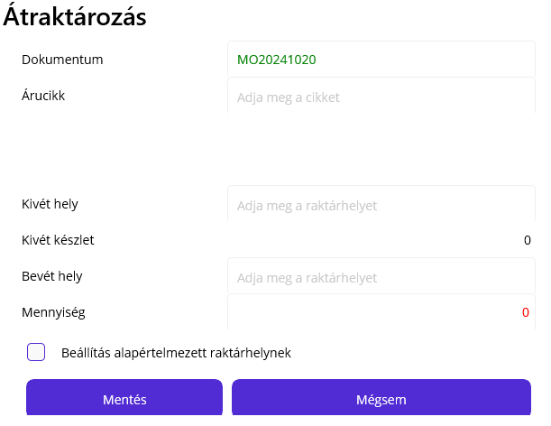
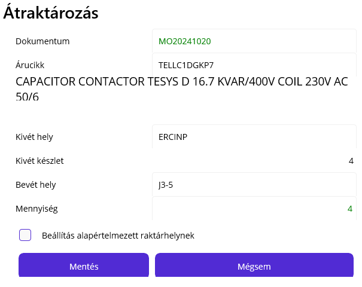

# Átraktározás

Az átraktározás egy tetszőleges árucikket bármelyik olyan raktárhelyről, ahol van készleten bármelyik raktárhelyre át tudunk mozgatni, kivéve KIT raktárhelyekre.

Ez a művelet nem gyártás specifikus, vagyis akkor tudjuk indítani, ha nincs elindított műveletünk.

Az applikációban az Átraktározás menüpontot válaszzuk ki.

> Csak megfelelő jogosultság esetén jelenik meg a menüpont!

## Dokumentum mező

A dokumentum mező automatikusan töltődik, de van lehetőség átírni.

> Amennyiben az átraktározásra egyedi kérés miatt kerül sor, pl. gyártásba kértek alapanyagot, esetleg cserét, akkor ezt egy írásos dokumentummal kérték. Ilyen esetben érdemes a dokumentum mezőbe ennek a dokumentumnak a sorszámát beírni! Csere esetén 2 átraktározás művelet történik. Egy visszavett áru és egy kiadott áru.

## Árucikk mező

Ide kell az árucikk kódját beolvasni. Célszerű a polcról a címke beolvasása. Amennyiben van az árucikknek egyedi vonalkódja és korábban ez rögzítve lett, az is használható. Szintén lehetséges az árucikk nevánek beírása, de ez csak akkor működik, ha pontosan írtuk be.

Ha a rendszer megtalálta az árucikket, akkor az árucikk neve alatt megjelenik az árucikk leírása is.

A gombsor alatt azonnal megjelnik hol van elérhető készlet az árucikkből.

## Kivét raktárhely

Kivét raktárhelynek bármilyen érvényes raktárhely kódot elfogad a rendszer.
A kiválasztás után a kivét készlet sorban megjelenik azon a raktárhelyen elérhető mennyiség.

> Fontos olyan raktárhelyet kiválasztani, ahol van elérhető készlet

> *INP raktárhelyek a gombsor alatt megjelenő listából is választhatóak, a többi raktárhelyet be kell olvasni.

## Bevét raktárhely

Bevét raktárhelynek bármilyen érvényes raktárhely kódot elfogad a rendszer, a KIT raktárhelyeket kivéve. Kiválasztani nem lehet, be kell olvasni! 

> Azért kell beolvasni,mert a cél, hogy a polchoz menjünk és olvassuk le a helyet, hogy biztosan oda is tegyük az alapanyagot.

> KIT raktárhelyekre csak kitszedés indokkal kellhet átraktározást indítani, a kitszedés viszont a gyártás folyamat része, ezért el kell indítani a kitnek megfelelő KITSZEDÉS műveletet. Ez a funkció biztosítja, hogy csak azt tudjuk és csak annyit oda raktározni, amennyit a rendszer szerint kell, valamint a művelet munkaidejét is így tudjuk mérni, ami az utókalkulációhoz szükésges.

## Mennyiség

A mennyiségnél 0-nál nagyobb és maximum a kivét raktárhely mennyisége adható meg.

## Beállítás alapértelmezett raktárhelynek

Ez az opcionális pipa a bevét raktárhelynél megadott raktárhelyet állíja be alapértelmezett raktárhelynek. Ez akkor lehet indokolt, ha úgy döntünk, hogy a cikket a továbbiakban máshol készletezzük.

> Fontos! Jelenleg ez a funkció csak a belső raktárcsoporton működik!