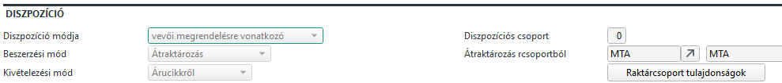
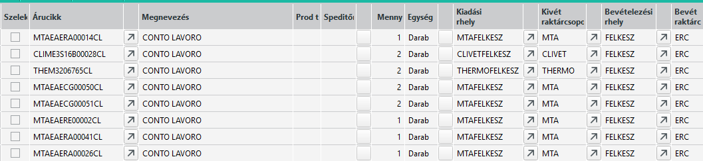
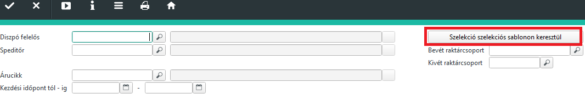
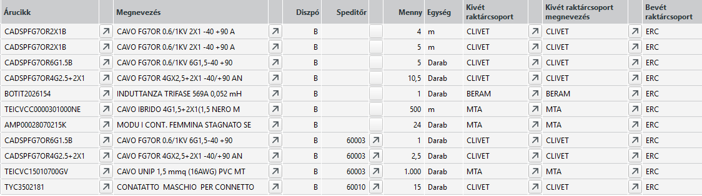
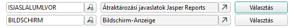
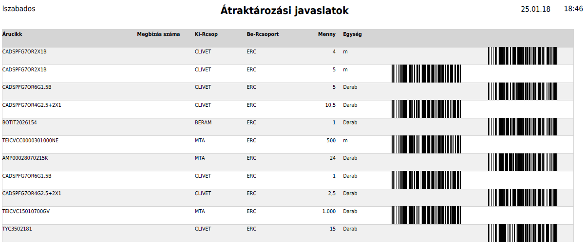

# Átraktározási javaslatok

Az ABAS rendszerben az árucikkeknek többféle beszerzési módja létezik.
Legjellemzőb, amikor beszerezzük egy másik cégtől. szintén beszerzésnek számít, ha mi magunk előállítjuk a termékt, gyártjuk.

A beszerzésnek egy újab formája, ha egy másik raktárcsoportból szerezzük be.

> Ebben az esetben, mivel a másik raktárcsoport is a miénk, ezért ez nem számít külső cégtől beszerzésnek.

Az ilyen jellegű beszerzésekhez, hasonlóna a külsőcégtől való beszerzésekhez, beszerzési javaslatok készülnek, de ebben az esetben "Átraktározási javaslatnak" hívjuk.

Az átraktározási javaslatokat is a dispo állítja elő, és egy adatbázisban tárolja. Ezt a Standard/beszerzések/Átraktározási javaslatok mask-al tudjuk megtekinteni.

> Fontos! A javaslatok minden igényt amit a dispo talál felsorol, de lehetséges, hogy az ártaktározás nem lehetséges, mert a forrás raktárcsoporton nem áll rendelkezésre az átraktározandó anyag.

## ContoLavoro kitek

A gyártáskor a fő termék Mechanika művelete felett szerepel a ContoLavoro kit, amit viszont a külső raktárcsoporton állítjuk elő, saját gyártással.
Amikor a megbízás miatt a dispo felvesz egy készterméket, érzékeli, hogy a CL-kitet a külső raktárcsoporttól kell átraktározni. Ez magán acikken van beállíta:

Ennek hatására a dispo átraktározási javaslatot generál.

Ezek az átraktározások csak akkor végezhetőek el, ha a kitek elkészülnek és lesz készletük.

> Cono Lavoro kitek átraktározását egy fejlesztés miatt nem kell elvégezni, gyártás végén ez automatikusan megtörténik!

## Egyéb CL ártaktározások

Amikor a gyártási listában olyan termék szerepel, aminek a beszerzési módja átraktározás, ezekre az alapanyagokra is készül javaslat.

Ezeket az átraktározásokat, amennyiben a készlet rendelkezésre áll, a raktárnak el kell végeznie.

Jellenmzően lehet CL kábel, amit az ERC kábelraktárba kell mozgatni a gyártás előtt, hogy a felhasználáskor rendelkezésre álljon.

Másik kör az egyéb üzemi alapanyagok, vezeték, érvég, jelölők, stb. Ezeket pedig az üzemi raktárhelyre kell mozgatni.

## Átraktározási javaslat nyomtatása

A javaslat nyomtatásához az Átraktározási javaslat infosystemet indítsuk el: Standard/Beszerzés/Kiértékelések és jelentések/Átraktározási javaslatok

Válasszuk a szelekciós sablonon keresztüli lekérdezést, és a bal alsó sarokban fogadjuk el. Ez előre paraméterezett lekérdezés, az átraktározási javaslatok a ContoLavoro kitek nélkül.

Ezt követően futtassuk az infosystemet és megkapjuk a nyitott javaslatokat.

Válasszuk a nyomtatást és ott az "Átraktározási javaslatok Jasper Reports" layoutot.

A lista tartalmazza a kivét és bevét raktárcsoportot valamint az árucikket. Árucikket vonalkóddal.

## Raktárhelyek beállítása

Az átraktározásnál az ABAS az árucikknél beállított alapértelmezett bevételezési helyre veszi be, és a külső raktárcsoportról pedig az alapértelmezett kivét raktárhelyről akarja levonni. 

Fontos, hogy átraktározáskor a rendszer "nem tudja", hogy mi a végső célja az alapanyagnak. Pl. egy adott érvégből átraktározik a rendszer 50 db-ot, de ez lehet, hogy 3 külön termékbe fog beépülni. Hasonlóan a külső beszerzéshez, először a raktárcsoport bevételezi az átraktározott alapanyagot, utána kell a felhasználási helyre átraktározni. Persze, ha tudjuk a célt lehet azonnal oda, de ha nem tudjuk, akkor kövessük az alábbi lépéseket.

Az olyan alapanyagok, amik csak ContoLavoro beszerzéssel érkeznek, azoknál érdemes a bevét és kivét raktárhelyet ugyan arra az értékre állíani.

Kábelek esetében egy ERC kábel raktárhelyet, mert a felhasználás a kábelraktárból fog történni.

Egyéb esetben egy alapanyagraktár helyet, akár ERCINP, vagy PREV legyen az érték.

Az anyagáramlás a következő:

1. Megbízás miatt keletkezik egy alapanyagra átraktározási igény az ERC raktárcsoportra az MTA raktárcsoportból.
2. Ha nincs az igényelt alapanyagból az MTA raktárcsoporton, akkor az igény miatt keletkezik egy megrendelési javaslat MTA raktárcsoportra.
3. Amikor az MTA raktárcsoporton az alapanyag rendelkezésre áll, át lehet raktározni. Átraktározás MTA-ról ERC-re történik, a cikk BEVÉT raktárhelyére.
4. Ha ERC-en a cikkenk a BEVÉT és a KIVÉT raktárhelye nem azonos, át kell raktározni a KIVÉT raktárhelyre. (Ez nem kötelező, és el is kerülhető, ha a BEVÉT és KIVÉT hely azonos.)
5. KÁBEL esetében nincs további feladat, a kivét raktárhelyről történik a felhasználás.
6. Üzemi felhasználású alapanyag esetén az [Üzemi igény](uzemi-raktarhely-feltoltes.md) megmondja, miből mennyit és hova kell átraktározni.

