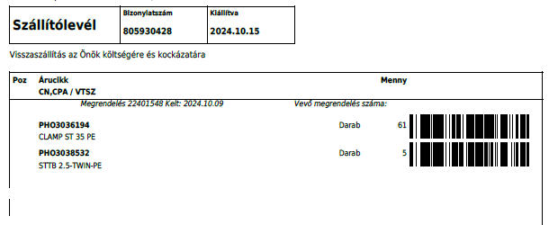
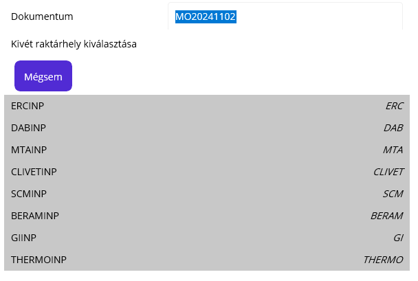
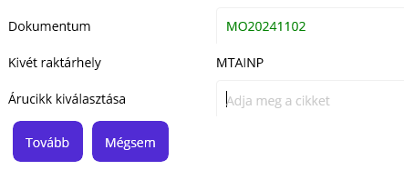
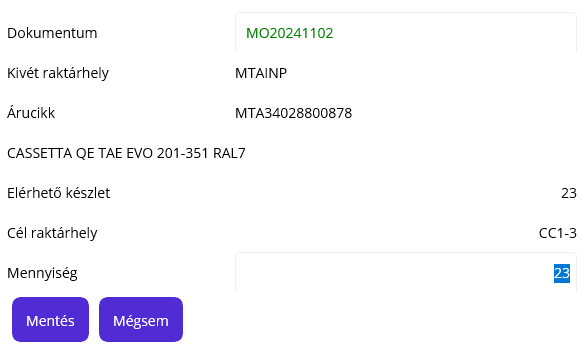
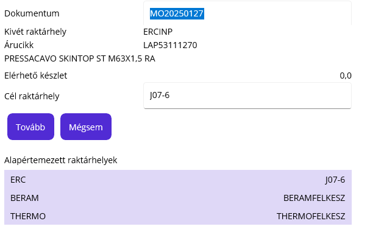

# Bejövő készlet helyre rakása

A bejövő készletről mindenképpen beszerzési szállítólevél kerül rögzítésre, az az alapja a raktárkészlet növelésnek.

> Lásd: [Beszerzési szállítólevél](../Beszerzes/Szallitolevel)

Minden raktárcsoportnak definiálva van egy INP végződésű raktárhely, mindent ezekre a raktárhelyekre vételezünk be.

## Szállítólevél nyomtatása

A szállítólevél rögzítése után, ki kell nyomtatni a szállítólevelet voalkódokkal. Ehhez a szállítólevelet meg kell nyitni, majd a nyomtatásnál a "Beszerzési szállítólevél vonalkóddal" layoutot válasszuk ki.

Olyan nyomatot kapunk, ahol az árucikkek vonalkóddal is fel vannak tüntetve:

## Átraktározás

PDA-n válasszuk a "Bejövő készlet" lehetőséget.

A dokumentum neve automatikusan kitöltésre kerül, de itt most megváltoztathatjuk.

Alul listában felsorolásra kerülnek a raktárcsoportok. Ebből kell választani az, aminek a bejövő készletét helyre szeretnénk mozgatni.

> A rendszer nem ellenőrzi, van e itt készlet, csak felsorolja a létező raktárcsoportokat.

Kiválasztás után az árucikk kiválasztását kéri a rendszer. Ezt beolvashatjuk a cikk vonalkódjával, ha létezik és hozzá lett a cikkhez rendelve.

Másik lehetőség a fentebb nyomtatott szállítólevélről a kód beolvasása.

Kiválasztás után látjuk az árucikk keresőszavát és megnevezését.
Láthatjuk a kivét raktárhelyen elérhető készlet mennyiségét. Max ennyi tudunk átraktározni.

Cél raktárhely az árucikk beállításai alapján automatikusan kitöltésre került és a mennyiség is a maximális értékkel fel van töltve. 

> Ez azért történik így, mert jó beállítás esetén az esetek döntő többségében ide raktározunk és mindent.

**Opció* Ha itt a mégsem gombra kattintunk, akkor a rendszer törli a mennyiség mezőt és a cél raktárhely mezőt szerkeszthetővé teszi, hogy másik célt tudjuk megadni.

A mentéssel az átraktározás megtörténik és a rendszer újból a cikket kéri.

> Itt a rendszer feltételezi, hogy a dokumentum és a kivét raktárhely ugyan az, ismétlődik. A mégsem gombbal vissza tudunk lépni, hogy az első lépésre kerüljünk.

Kilépni akkor tudunk, ha itt az első lépésnél ismét a mégsem-et választjuk.

## Gyakorlati tanács

