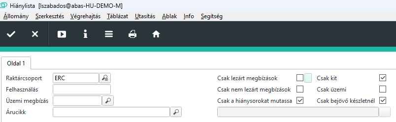
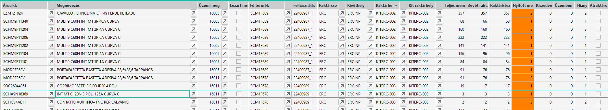
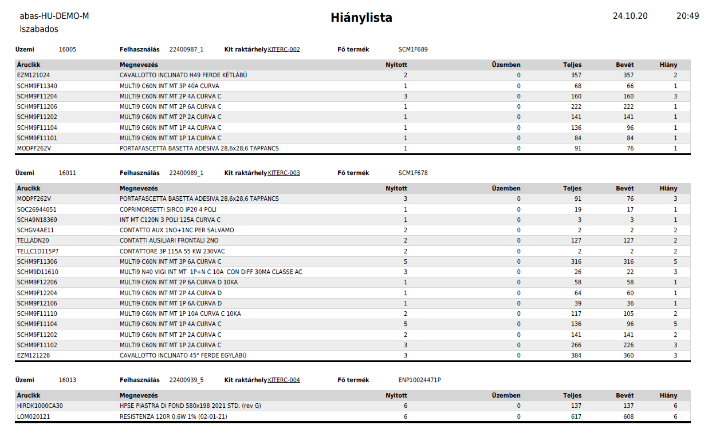

# Bejövő készlet pótláshoz

Amennyiben jött áru, akkor az valamelyik vagy több raktárcsoport INP raktárhelyére érkezik. Pl.: ERCINP

Az elvárás az, hogy először az esetlegesen hiányosan legyártott vagy gyártás alatt lévő, de hiányos kitekbe pótoljuk az árucikkeket, amennyiben jött ilyen.

Fontos az is, hogy a kit pótlás egy késztermékre művelettel elszámolható tevékenység, vagyis az adott kithez tartozó kitszedés műveletet kell elindítani és az átraktározás végén lezárni a műveletet.

A rendszer automatikusan látja a hiányt és látható a bejövő készleten az elérhető mennyiség.

## Érintett KIT-ek keresése

Az ABAS rendszerben a Céges/ERC/GYÁRTÁS/Hiánylista infosystemet kell elindítani.

Az alábbi beállítások ellenek a bejövő készletből a kit feltöltéshez:

Ha üres táblázatot kapunk, akkor nem jött olyan alapanyag, ami KIT-ből hiányozna.

A műveletet minden raktárcsoportra külön el kell végezni!

Az alábbihoz hasonló listát fogunk kapni, amennyiben jött hiányzó készlet

Nyomtatáskor a "Hiánylista Jasper Reports" lehetőséget válasszuk és az alábbihoz hasonló formában kapjuk meg

Mivel ez most az ERCINP-re lett szűrve, nyilván az ERC-es bejövő készletből az ERC kiteket tudjuk szedni.

Amennyiben jött készlet más raktárcsoportra, úgy azokat is nyomtatni kell, és lehet szedni.

A nyomtatott papír egyben arra is jó, hogy a kiszedett alkatrészeket átvetessük a gyártásban.