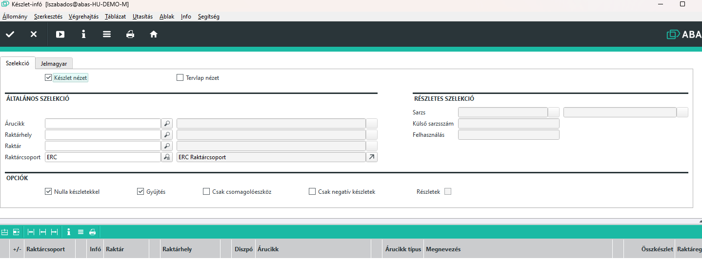

# BESTAND Infosystem

 A Bestand infosystem (Készlet infó) a raktárkészlet pillanatnyi állapotáról ad pontos információt.

 

 Az Általános szelekció részben Árucikkre, raktárhelyre, raktárra vagy egész raktárcsoportra lehet készletinformciót lekérni.

 > A megnyitáskor alapértelmezetten a belső raktárcsoport van kijelölve, de át lehet írni, sőt üresen is lehet hagyni.

 A részletes szelekciórészen sarzs és felhasználás alapján is lehet szűrni az eredményt.

## Opciók

 Szűrési opciók a szűrési feltételeknek megfelelő tételeket tovább szűrik vagy csoportosítják.
 - Nulla készletekkel jelölő bekapcsolása esetén a nulla készlettel rendelkező árucikkeket is megmutatja raktárhelyenként
 - Gyűjtés bekapcsolása esetén az ugyanazzal a tulajdonsággal - mint pl. sarzs vagy felhasználás - rendelkező készletek, amik különböző raktári bevétekből keletkeztek, össze vannak foglalva.
 - Csak csomagolóeszköz bekapcsolása esetán csak azok az árucikkek jelnnek meg, amik csomagolóeszköznek vannak jelölve
 - csak mnegatív készletek bekapcsolásával azok az árucikk-raktárhely páros jelenik meg, ahol az adott raktárhelyen az árucikkből negatív készlet van.
 - Részletek: alapesetben raktáranként kapjuk meg a mennyiségeket és az első oszlopban a mappa kinyitásával láthatjuk a raktárhelyenkénti mennyiségeket. A részletek bekapcsolásával minden mappa automatikusan ki van nyitva és látjuk a részleteket azonnal.

## Eredmények

A kapott eredményeknéllátszik az árucikk mennyisége, mértékegysége, faktora, felhasználás és sarzs értéke.
Ha egy raktárhelyen több felhasználás vagy sarzs is van, akkor azok külön soron jelennek meg.
Minden árucikknél az adott raktárhelyen az utolsó bevét és az utolsó kivét dátumát is látjuk.

Amennyiben a folyamat oszlopban egy szemecskétlátunk, akkor az ügylettípusnak megfelelő maskot tudunk megnyitni, pl. beszerzési szállítólevél. Ez az utoló ranzakcióra vonakozik.