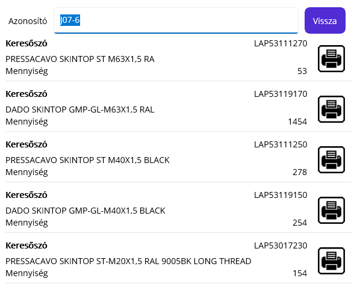
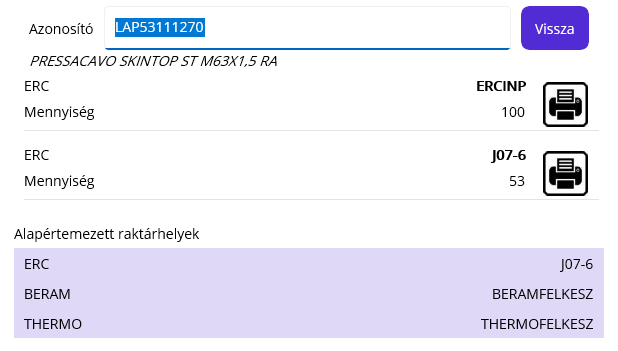

# Info

Ez a visszajelentő platformon (Windows/PDA) elérhető funkció.

Egy árucikket vagy egy raktárhelyet kér bemenő paraméterként.

Az infó funkció indítható a főmenüből, és a visszajelentés alól is! 

## Raktárhely infó

Egy raktárhely megadásával láthatjuk a raktárhelyen elérhető alapanyagokat ésmennyiségüket.

## Árucikk infő

Egy árucikk kód megadásával láthatjuk az árucikk melyik raktárhelyen érhető el, és ott mekkora a készlete.

> Csak a nem 0 készletű helyeket mutatja meg a program!

A lista alatt az árucikk alapértelmezett kivét raktárhelyét is kiírja a program raktárcsoportonként.

