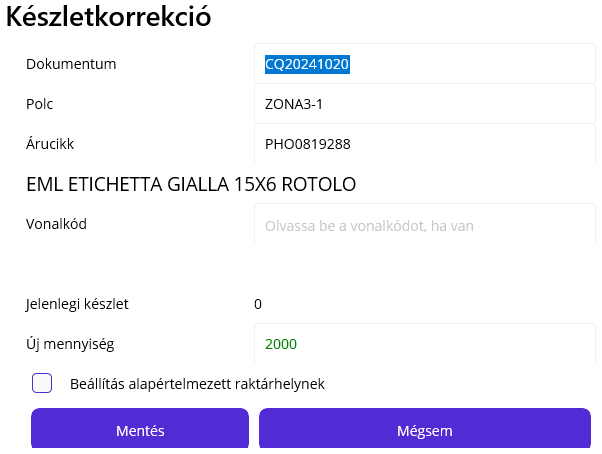

# Készletkorrekció

> **FIGYELEM**
> Ezt a funkciót csak nagyon indolokt esetben szabad használni ott ahol amúgy az E.R.C. dokumentációja szerint nem indokolt.

## Miért és hol végezzünk készletkorrekciót

A legjobb példa a használatra az üzemi raktárhelyeknél az olyan alapanyagoknál, ahol a fogyást és a mennyiséget is csak nagy közelítéssel tudjuk megállapítani.. Csavarok esetében, ahol a mennyiséget is mérleggel számoljuk, óhatatlanul pontatlan a készlet, és a fogyást is csak megközelítőleg tudjuk megadni.

Ilyen készletek ellenőrzésekor, ha egy bizonyos mértéket meghalad az eltérés, akkor készletkorrekciót hajtunk végre.

## Dokumentum

A dokumentum mező automatikusan kitöltődik, de átírható igény szerint. Ha van papír alapú bizonylat a készletmódosításról, akkor annak sorszámát adjuk itt meg.

## Polc

Ennél a műveletnél a raktárhely kódját kell elsőnek megadni, hiszen a készletmódosítás egy adott raktárhelyre vonatkozik csak.

> Nem lehet egy cikk készletét globálisan módosítani, csak egy adott raktárhelyét!

## Árucikk

Bármilyen árucikk megadható, nem csak amiből jelenleg is van készlet az adott helyen, hiszen lehet pont az a módosítás lényege, hogy a rendszer azt feltételezi elfogyott, de van még.

Ha érvényes kódot adunk meg, az árucikk leírása is látható

Azonnal megjelenik a "Jelenlegi készlet" sorban a raktárhelyen elérhető készlet az adott árucikkből.

## Új mennyiség

Az új mennyiség 0 vagy nagyobb lehet, más korlát nem nagyon van.

## Beállítás alapértelmezett raktárhelynek

Opcionális. Ha bepipáljuk, akkor a megadott raktárhely lesz az új kivét raktárhelye az árucikknek.

> Fontos! Jelenleg ez a funkció csak a belső raktárcsoporton működik!

## Nyomtatások

Amennyiben van árucikk kiválasztva egy nyomtató ikon jelenik meg. Rákattintva azonnal kijön egy árucikk címke a nyomtatóból.
Ha a cél raktárhely ki van töltve, akkor pedig egy "hely" ikon jelenik meg, amivel polc címkét tudunk nyomtatni.

