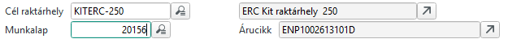
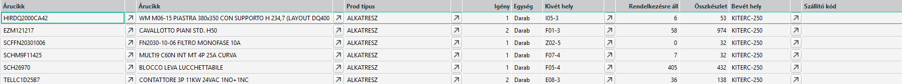
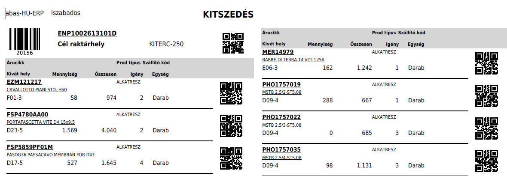
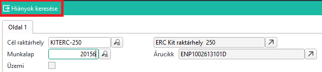

# Kitszedés Infosystem

A kiszedés papír nyomtatás ezt az Infosystemet használja

## Kit listázása

A kit minden esetben egy adott üzemi megbízáshoz tartozik. A program a Kit raktárhelyet vagy az üzemi megbízás számát vára bemenő paraméternek.
Ha egyiket megadjuk, a másik automatikusan kitöltődik. Ha nem érvényes, akkor viszont nem fogadja el.

Az infosystem elindítása után láthatjuk az eredményt.

Az igény oszlopban van a kitből még hiányzó mennyiség.

> Fontos! Ha a gyártáshoz 20 darab kell, és már 5 felhasználást visszajelentettünk és a KIT-ben van még 10db, akkor a igény 5, mert az eredeti 20-ból 5-öt felhasználtunk és még további 10 a kitben kiszedve van, tehát a Kitből már csak 5 hiányzik. Gyártásközpontban még 15 hiányt látunk, hiszen ennyi felhasználás még nincs visszajelentve.

Kivét hely, az alapanyag alapértelmezett kivét raktárhelye.

Rendelkezésre áll: a kivét helyen ennyi van. Lehet van más helyen is szabad készlet.
Összkészlet: összesen ennyi van a termékből. Lehet nem szabad készlet, vagy más raktrcsoport készlete.

Bevét hely: a kit ahova szedjük az alapanyagokat.

> Fontos, a lista minden kitbe szeendő alapanyagot felsorol, de a mennyiség 0 lehet, ha már ki van szedve.

## Kit nyomtatása

Nyomtatáshoz válasszuk a kitszedés layoutot.

## Lezárt kitszedések hiányai

Ha lezártuk a kitszedést, vagyis visszajelentettük, hogy kész van, lehetséges hiány, vagy egyéb okból nem elegendő készlet. Pl. változott a gyártási lista.

Ilyen esetben jó a kitszedés infosystem "Hiányok keresése" funkció

Csak azokat a kiteket tartalmazza, aminél teljesen visszajelentett a kitszedés művelet. Ennek értelmében a lista csak a valódi hiányokat, és az esetleges hibákat tartalmazza.
Ez a lista nem tartalmaz 0 igényű sorokat.

