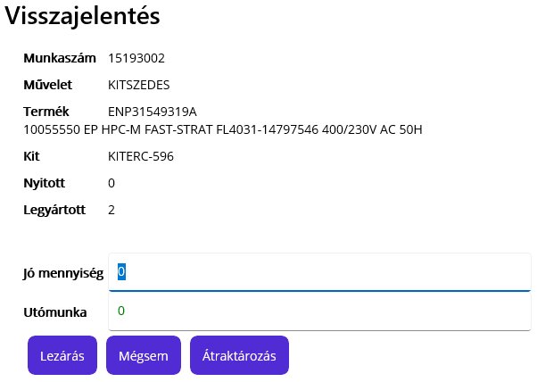
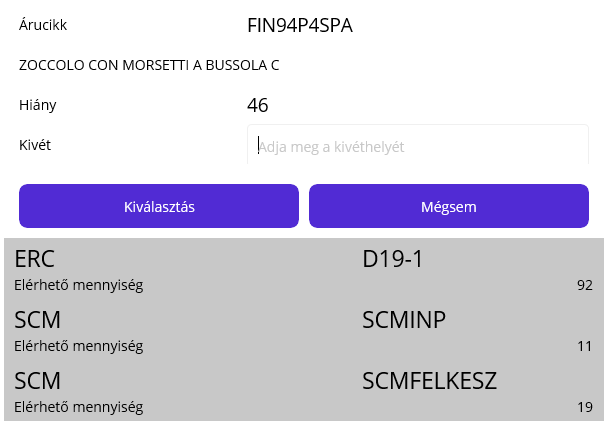
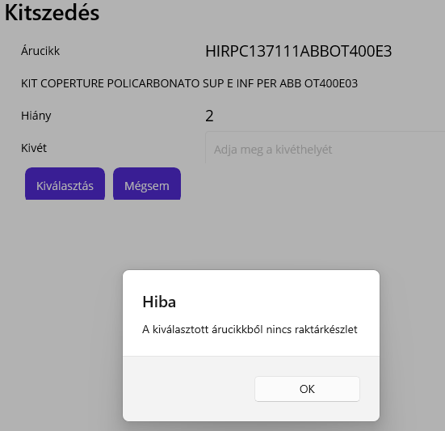
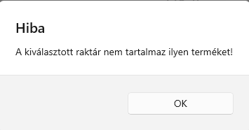
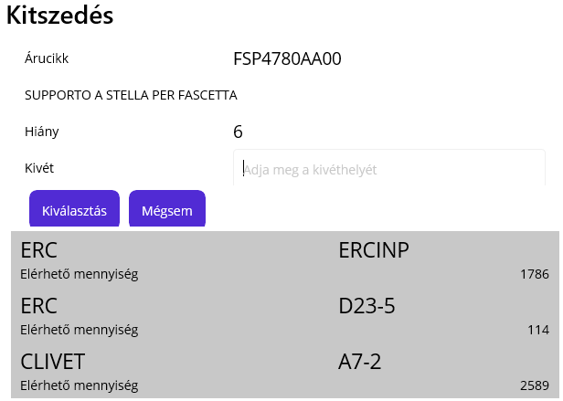
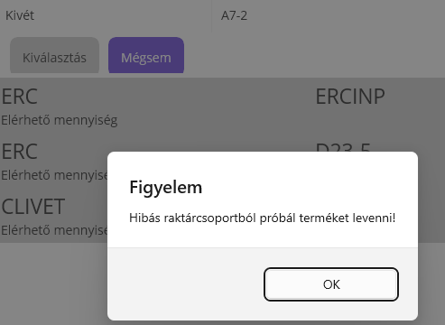

# Kitszedés

A kitszedés egy gyártási lista művelet, ezért a kitszedéshez mindenképpen el kell kezdeni az adott üzemi megbízásnak a "Kitszedés" műveletét.

> Lásd még : [Művelet megkezdése](../Gyartas/Muvelet-megkezdese)

## Kitszedés elindítása

A kitszedést a PDA-n futó Android alkalmazással tudjuk elvégezni. A kitszedés művelet elindítása utána a program a művelet visszaigazolás lapján áll. Amennyiben megvan a megfelelő Raktáros jogosultságunk a gombsorban megjelenik az "Átraktározás" lehetőség.

## Kitszedés képernyő

Az átraktározás gombbra kattintva, belépünk a Kitszedés részbe.

> Itt kicsit dolgozik a rendszer, mert lekéri az ABAS rendszerből, hogy az adott Kit esetében melyik árucikkeket kell kiszedni. A rendszer, csak a még hiányzó alapanyagok kiszedését engedéslyezi, vagyis a korábban már kiszedett, vagy a késztermékbe már belejelentett alapanyagokat nem!

A rendszer a műveletből és a hozzá tartozó üzemi megbízásból tudja melyik kitet akarjuk szedni, ezt nem kéri be a rendszer. Vagyis csak azt kell megmondani, melyik alapanyagból, honnan és mekkora mennyiséget szeretnénk átraktározni.

Az alábbi képernyő minta szerint az árucikket kell megadni elsőre.

Az árucikket lehet választani a gombsor alatti listából, vagy vonalkóddal beolvasni a felső mezőbe.
Az árucikk neve utána jobb oldalon a hiányzó mennyiséget látjuk az árucikkből.

> Csak a kitből hiányos alapanyag kódot fogad el a rendszer. Ha bármilyen okból egyég alapanyagot is szeretnénk a kitbe mozgatni, akkor azt az [Átraktározás](./Atraktarozas) funkcióval tudjuk külön megtenni.

Ha olyan alapanyagot választunk ki, amiből nincs raktáron, akkor a rendszer nem engedi folytatni a műveletet.

## Kivét hely megadása

Az árucikk kiválasztása vagy beolvasása után az alábbihoz hasonló oldalt kapunk:

Látjuk az árucikk nevét és leírását. Hiány sorban a kitbe még kiszedendő mennyiséget.
A Kivét sorba kéri a rendszer azt a raktárhelyet, ahonnan a szedést végrehejtjuk.

> A gombsor alatt az rendszer felsorolja azokat a raktárhelyeket, ahol az árucikk elérhető. A rendszer nem választ automatikusan kivét raktárhelyet akkor sem ha csak egy lehetőség van. Oda kell menni és a polcról vonalkód olvasóval be kell olvasi a polc kódját!

### Hibás kivét raktárhely kiválasztása

Amennyiben nem jó raktárhelyet választunk a rendszer hibaüzenetet küld

### Rossz raktárcsoport

Az alapanyagokat abból a raktárcsoportból kell szedni, ahonnan a rendszer kéri. Vagyis ERC kitet ERC raktárcsoportból, CLIVET kitet CLIVET raktárcsoportból, és így tovább.

A rendszer ennek ellenére, az alapanyag kiválasztása után a más raktárcsoportba tartozó raktárhelyeket is felsorolja, ahol elérhető az alapanyag. A rendszer ezt a raktárhelyet is engedi kiválasztani, de figyelmeztetést küld, hogy nem jó a raktárcsoport.

> Fontos! Ez csak figyelmeztetés, de a rendszer engedi a kitszedést így is. Viszont ezt csak vezető jóváhagyásával szabad folytatni! Az árucikk mozgásadatait vissza lehet nézni és látszani fog minden nem szabályos árumozgás!

## Mennyiség megadása

A kivét raktárhely megadása után a rendszer a kivett mennyiséget kéri be. Ideális esetben ez a mennyiség a hiánnyal megegyező értékű. Ez persze lehet kevesebb is, ha a raktárhelyen nincs elegendő készlet.

> A rendszer engedi a szedést több részletben, vagy több helyről is elvégezni

> A kiszedett mennyiségnek 0-nál nagyobbnak kell lennie és maximum a hiány értékéből vagy az elérhető mennyiség értékéből a kisebbik lehet.

Az átraktározás gombbal a művelet végrahajtódik.

Ezt követően a program visszakerül a kitszedés kezdő oldalára, ahol ismét az árucikk kiválasztását kéri a rendszer.

> Az árucikk, ha a teljes hiányt kiszedtük, eltűnik a listából. Ha nem a teljes hiányt szedtük ki, akkor az árucikk neve mögött lévő hiány érték csökkenni fog.

A kitszedést addig kell folytatni, amíg van alapanyag felsorolva a gombsor alatt, kivéve ha készlethiány van.

