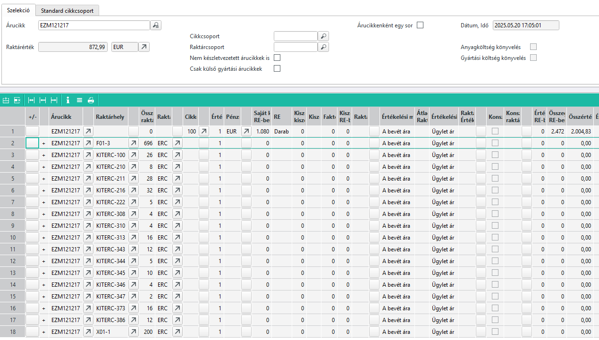
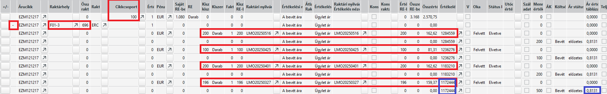

# Készlet aktuális lekérdezése

## Aktuális raktárérték (értékelés) infosystem

A raktárkészlet lekérdezéséhez rendelkezésre áll infosystem, amely a készletet annak beszerzési értékén tartja nyilván.

Infosystem: 10396 LAGERWERTAKTUELL

- Vagy konkrét, vagy minden árucikkre szűrhetünk.
- Kérhetjük árucikkeenként egy soron hozza az eredményt, ekkor a beszerzési árakat átlagolja.
- Megadhatunk konkrét raktárcsoportot

Miden a raktárhelyeken lévő készlet beszerzési árát mutatja.

> Saját gyártású árucikkek esetén, az árucikkek valós, a visszajelentéseken alapuló előállítási költsége a beszerzési érték. Vagyis 
 - a belejelentett alapanyagok beszerzési értéke.
 - a belejelentett saját gyártású árucikkek előállítási költsége.
 - a műveletek bérköltsége
 - a műveletek (gépek) költségei
 Gyakorlatilag az utókalkuláció értéke kerül ide mint beszerzési érték.

 ### Példa használat

 

 A EZM121217 árucikkre kérdezzük le.

 Az első sor a teljes készletet és a készlet összértékét mutatja. Csak ebben a sorban van cikkcsoport oszlop kitöltve.

 

A második sortól a raktárhelyenkénti mennyiség sorokat látjuk. A sorok elején a "+" vagy a "-" jelek találhatóak. A + jel esetén az előtte lévő gombbal lehet kinyitni, "-" jel esetén bezárni a részletek megjelenítését.

Ha a részleteket megnyitjuk, minden bevételezés 2 soron jelenik meg. Egy ahol a bevételezett mennyiséget látjuk és az össértéket. A második sor pedig az egységárat tartalmazza.

> a teljes lista kirakható excelbe és a sorokat szűrve lehet vagy az összesítő vagy a részletek soroakt megjeleníteni.

> Amennyiben a lekérdezésnél azt kértük, hogy árucikkenként egy soron kérjük az eredményt, akkor nem lehet cikkre szűrni. Ebben az esetben a raktárhelyeket sem látjuk, így a készlet értékében a gyártásra már átadott, de még felhasználásra nem lejelentett készlet is benne lesz az értékelésben.

> Érdemes külön lekérni az ABAS-tól, hogy melyik raktárhely melyik raktárba tartozik, excelben ezt mellérendelni a sorokhoz, hogy a gyártási raktárak készleteit ki tudjuk szűrni.

## Gyártás alatt lévő árucikkek

Gyártás alatt lévő árucikkek nem szerepelnek raktárkészleten, hizsen még a termék nincs kész.

> Fontos, az itt leírtak a félkésztermékekre ugyan úgy érvényes, mint a késztermékekre. A félkésztermék gyártási folymata ugyan az mint a késztermékeké, csak a félkészterméket rendzserint a végén nem értékesítjük tovább.

A gyártáskor a készülő termékbe a visszajelentéskor felhasznált alapanyagok a raktárkészletről levonásra kerülnek, ezért ezek nem jelennek meg a raktárkészlet lekérdezésében, viszont a termék sincs kész, ezért annak árában sem szerepel. így elsőre úgy tűni, ezek a készletek a gyártás folyamata alatt "elveszett készletek". De ez nem igaz, hiszen a gyártás végén a termék kész lesz, és a késztermékek között fog szerepelni. A gyártás alatt lévő árucikkek a gyártás végén kerülnek át a késztermékek közé, és az árukészlet értéke is megjelenik a raktárkészlet lekérdezésében.

## Egy üzemi megbízás költségei infosystem

A gyártás alatt lévő árucikkek költségei a gyártás végén kerülnek át a késztermékek közé, és az árukészlet értéke is megjelenik a raktárkészlet lekérdezésében.

A 10395 BAKOST infosystem a gyártás adott napján egy üzemi megbízás aktuális költségeit mutatja meg.

> A már befejezett gyártás esetén is használható. A megadott üzemi megbízás esetén visszamehetünk a gyártásbármelyik napjára és azon a napon érvényes állapotot látjuk.

Amennyiben azokat az üzemi megbízásokat kérdezzük le, amelyek még nincsenek készre jelentve, akkor láthatjuk a már bele jelentett alapanyagok beszerzéis árait mint anyagköltséget. A fenti "raktárkészlet" lekérdezésekből ez a készlet hiányzott. Viszont jelneleg nincs olyan lekérdezés, ami ezt összesítve, a csak nyitott üzemi megbízásra lekérné ezeket az adatokat, egyesével tudjuk megtenni.
