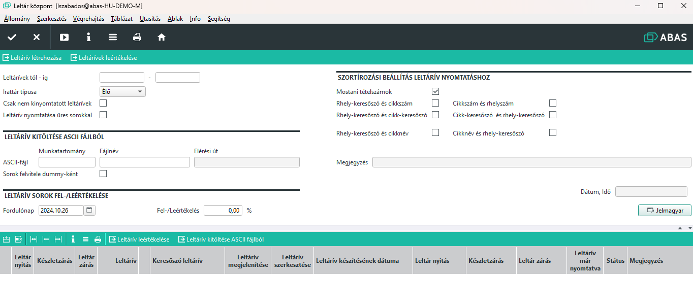

# Leltárközpont

A leltárközpont egy a leltározást segítő Infosystem. Bár e nélkül is mindent meg lehet csinálni, mégis érdemes minden leltározási folyamatot innen indítani, mert sokkal gyorsabban, egyszerübben és áttekinthetőbben lehet látni a folyamatokat.

Az Infosystem a leltáríveket mutatja meg táblázatos formában.

Szűrési lehetőségek: 
. leltárívekre (tól -ig tartományban)
- élő, archív vagy midkettő
- Csak a nem kinyomtatottakat
- Üres (sorokat nem tartalmazó) leltárívek

A leltáríveket ASCII (szöveges) fileból is fel lehet tölteni, ha pl. a leltárívek tartalmát egy külső programmal, pl. excel fileból akarjuk kezelni.

Leltársorok fel és leértékelése.

A program használatát, az egyes funkciókat a [Leltározás folyamata](leltarozas-folyamata.md) leírásban lehet megismerni.