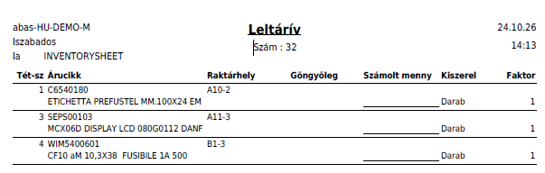
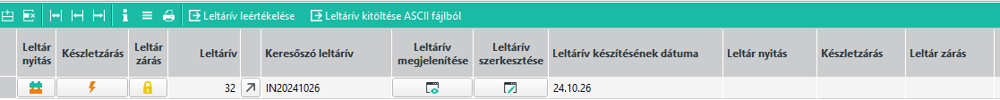
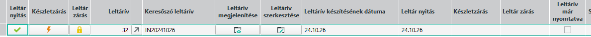
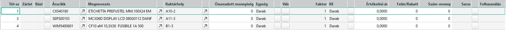
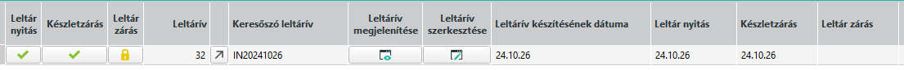
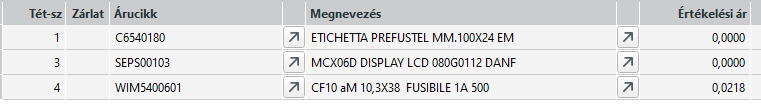
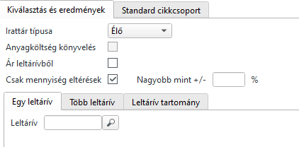
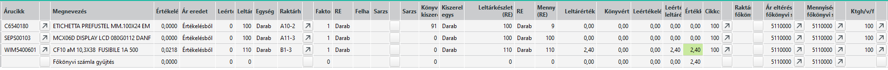
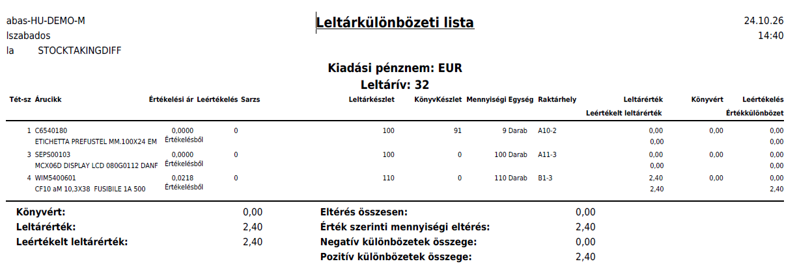
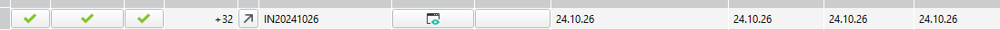

# A leltározás folyamata

## Leltározás megtervezése, előkészületek

A leltározás során az egyes raktárhelyeken tárolt készleteket kell megszámolni és rögzíteni a mennyiségeket.
Maga a leltározás lehet több lépcsőben, vagyis nem szükséges a teljes vállalat készletét egyidőben leltározni. Akár polcsoronként vagy raktár részenként is végezhetjük a leltárt.

Érdemes előre eltervezni, egy egy leltározási időben mely részek lesznek leltározva és ezek elvégézéséhez hány leltárívet fogunk létrehozni.

> A leltárívek ne legyenek túl rövidek, de túl hosszúak sem. Egy leltárívet egy személy vagy csapat kezeljen, nem jó megoldás nagy leltárívet készíteni, amit aztán darabokra szedünk. Egy leletárívért egy személy vagy csapat feleljen.

Gondoskodni kell róla, hogy mindenleltározandó raktárhely felkerüljön a leletárívekre.

Leltározás előtt a [Nulla készlettel rendelkező mennyiségek törlését](../nulla-keszlettel-rendelkezo-mennyisegek-torlese.md) el kell végezni azokon a raktárhelyeken, ahol nagy számú árucikk fordul meg, így a leltárív szükségtelenül hosszú lenne.

A leltáríveket jóval a leltározás előtt el lehet készíteni, de mivel a raktármozgások folyamatosak, így a tényleges leltározás dátumához minél közelebbi időpontban érdemes elkészíteni, hogy kevesebb olyan árucikk legyen, ami nem került előre a leltárívekre.

## Leltárív készítése

A [Leltárív](leltariv.md) készítéséhez nyissuk meg a [Leltárközpontot](leltarkozpont.md).

A bal felső sarokban a "Leltárív létrehozása" gobbal hozzunk létre egy új leltárívet.

A keresőszó az IN előtaggal az aktuális dátummal egyezik meg. Ha szeretnénk ezt változtassuk meg aszerint, hogy mikor tervezzük a leltár indítást.

> Több leltárívnek is lehet ugyan az a keresőszava, a leltáríveket alapvetően a sorszámuk fogják meghatározni, amit mentéskor a rendszer automatikusan ad.

Bár van pár kapcsoló és beállítás, aminek a funkcióiről az ABAS súgó ad felvilágosítást, itt nem részletezzük, mert alapesetben a használatuk nem szükséges.

> A leltárív sorairól és a kitöltésről a [Leltárív](leltariv.md) dokumentáció ír részletesebben.

## Leltárív nyomtatása

Leltárívet 2 helyen tudunk nyomtatni

### Leltárív nyomtatása leltárívből

Az olvasásra vagy módosításra megnyitott leletáívnél a nyomtatás gombbal a "Leltárív nyomtatása" layouttal nyomtathatunk.

### Leltárív nyomtatása leltárközpontból

Leltárközpontban a leltár soron állva a táblázati sorok feletti kis nyomtató ikonnal tudjuk a leltárívet nyomtatni. Ezzel ugyan azt az eredményt kapjuk, mintha megnyitottuk volna a leltárívet.

Ha a leltárküzpontban sikerül egy leltárív tartományt leszűrni, akkor a felső nagy nyomtató gombbal az összes táblázati sorban szereplő leltárívet tudjuk egyetlen művelettel kinyomtatni.

## Leltárnyitás

A leltárközpontban a nyitandó leltárív sorában a Leltárnyitás ikonra kell kattintani.

Sikeres leltárnyitás esetén látjuk a nyitott állapotot (zöld pipa), és a nyitás dátumát

> **Leltárnyitást követően a leltárkészlet zárásig nem szabad olyan raktármozgást végezni, ami a leltáríven szereplő raktárhelyeket érinti.**

Most szabad elkezdeni a leltárívvel a raktárhelyeken lévő mennyiségek megszámlálását és a leltárívre írását.

## Számlált mennyiségek rögzítése

Meg kell nyitni a leltárközpontból szerkesztésre a leltárívet és betölteni a sorokat.

A sorok végén a "Szám-mennyiség" oszlopba kell a megszámolt mennyiségeket beírni.

> Fontos! Mentsünk a rögzítés végén. Lehet több menetben is rögzíteni, lehet szünetet tartani, ilyenkor érdemes menteni.

## Leltárkülönbözeti lista nyomtatása a megszámlált mennyiségek rögzítése után

A mennyiségek rögzítése után tudunk leltárkülönbözeti listát nyomtatni, de nem biztos, hogy ezt készletzárás előtt érdemes, mert így a lista az értékelési árakat nem fogja tartalmazni. 

> A lista nyomtatását egy későbbi pontban írjuk le.

## Leltárkészlet lezárása

A mennyiségek rögzítése után a leltárközpontban a "Leltárzárás" gombbal tudjuk a leltáríven a készletzárást elvégezni.

Készletzárás után két fontos dolgot kell megjegyezni:
1. készletzárás után már sem ezen sem más leltáríveken nem lehet a raktárhely készletét módosítani vagy rögzíteni a leltárban. A készlet, ha eltérés volt a nyilvántartott mennyiségtől a leltárkor felvett mennyiségre módosul (az adott raktárhelyen).
2. ettől az időponttól a leltárív által érintett raktárhelyeken ismét szabad raktármozgással járó műveleteket végezni.

A készletzárás időpontja is látható

## Értékelési árak meghatározása és módosítása

Készletzárás után, ha az ABAS-nak volt a cikkről értékelési ára, akkor ez bekerül az Értékelési ár oszlopba.

Ha megnyitjuk a leltárívet szerkesztésre, akkor a mennyiségek már nem, de az értékelési árak módosíthatóak.

Ha valahol nem jó ár szerepel, vagy nincs ár, de szeretnénk, akkor itt van lehetőség a készlet egységárának megadására.

> Fontos! Ez nem azonos az árlistában szereplő árral minden esetben. Vegyük figyelembe, hogy itt raktáregységre vonatkoztatott árak szerepelnek ami eltérhet a beszerzési egységtől, így a beszerzési árat ennek megfelelően faktorálni kell!

## Leltárkülönbözeti lista nyomtatása

A Raktárgazdálkodás/Leltár/Leltárkülönbözeti lista infosystem elindításával tudjuk megkezdeni.

A listához be kell tölteni a leltárív(ek)et.

Egy, több, vagy tartomány kijelölésével lehet betölteni a leltárívek sorait.

Az ABAS a leltározott és a nyilvántartott mennyiségeket és az esetleges eltéréseket határozza meg raktári egységben. Ha rendelkezésre áll az értékelési ár, akkor összegszerűen is.

Nyomtatással a "Leltár különbözetek" layouttal lehet megnézni a listát.

## Leltárzárás

Ha végeztünk a leltárral, akkor le kell azt zárni. A leltárközpontban a Leltárzárás gombal a leltárív sorában lehet indítani.

Leltárzárás után a leltárív archiválódik. Archívumból is kekereshető és megtekinthető a későbbiekben.

