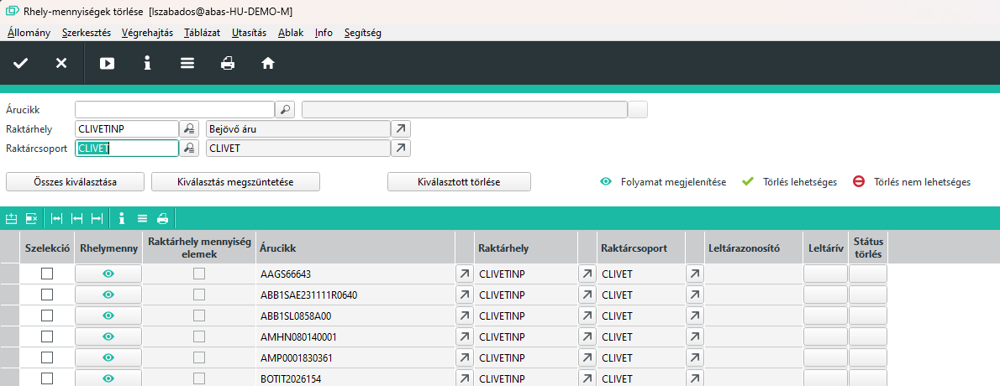
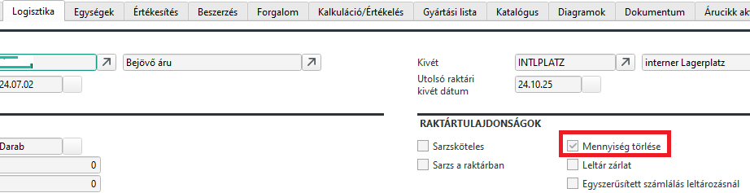
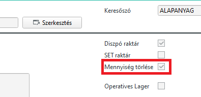
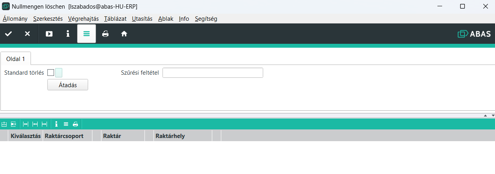

# Nulla készlettel rendelkező mennyiségek törlése

0 készletű raktárhely mennyiségek betöltése és törlése
Ha vannak okok, hogy miért nem lehetséges a törlés, akkor az ok átláthatóvá kerül tételre.

Az infosystem fejrészében kiválasztási kritériumokat írhat be a raktárhely mennyiségek szelekciójához, pl. egy bizonyos árucikkhez. Ha az azonos nevű mezőben beír egy raktárhelyet, akkor megjelenítésre kerül a hozzá tartozó raktárcsoport a megfelelő mezőben.

Az adatok a Start nyomógombra való kattintás után kiadásra kerülnek a táblázatban. Hajtsa végre a kiválasztását egyenként vagy válassza ki az összes rekordot az Összes kiválasztása nyomógombbal! A Kiválasztás megszüntetése nyomógombbal egy lépésben visszavonhatja a táblázat komplett kijelölését. A Kiválasztottak törlése nyomógombbal törölheti a kiválasztottakat.

A Raktárhely mennyiség mezőben egy kattintással megjeleníttetheti a folyamatot. Megtekintheti pl. a készletet és hogy rendelkezésre állnak-e raktárhely mennyiség elemek.

Ha rendelkezésre áll leltár azonosító, akkor lehívhatja a hozzá tartozó leltárívet.

A Törlés státus mező azt jeleníti meg, hogy a raktárhely mennyiség törlése lehetséges-e vagy sem.

## Nulla készletű mennyiség tiltása

Van lehetőséh, hogy az ABAS ne tárolja a 0 készletű mennyiséget. Ehhez két beállítás szükséges.

1. Engedélyezni kell az árucikknél, hogy ne tároljuk a nulla készletet.

2. Engedélyezni kell a raktárban, hogy ne tárolja a nulla készletet.

Itt fontos észre venni, hogy csak abban nem tárolódik a nullás készlet, ha az árucikknél és a raktárnál is engedélyezve van a nullás készlet törélse.

> A már nullás készlettel rendelkező tételek esetében hiába állítjuk át ezeket a kapcsolókat, nem törlődik a nullás készlet. Ha viszont töröljük, ismételeten nem jelenik meg újból.

## Tömeges törlés indítása

Az ABAS beépített programja nagyon jól működik, egyetlen probléma vele, hogy a raktárhelyeket egyesével kell törölni vele.

A leltározás előtt érdemes lenne az öszzes KIT* , *INP és *PLATZ raktárhelyekre lefuttatni, mert ezeken a helyeken nagy számú árucikk megfordul ideiglenes jelleggel.

Ez jelenlegi állapotban több mint 3100 raktárhelyet jelent. Nyilván ezt egyesével törölni nagyon fáradságos munka lenne.

Készült egy kis infosystem, amivel lehet egy feltételnek megfelelő raktárhelyek csoportjára elindítani a törlést.

A "céges/ERC/Raktár/Nulla mennyiségek törlése" infosystemet kell indítani.

Első lépésben meg kell határozni a törlendő raktárhelyeket. Ehhez két lehetőség van.

1. Szűrési feltétel mezőt kitöltva, ahol a [Helyettesítő karakteres keresés](../egyeb/helyettesito-karakteres-kereses.md) módszerrel kell keresési feltételt beírni.

A beírt feltételnek megfelelő raktárhelyeket a rendszer felveszi a listába, futtatáskor.

2. Standard törlés mezőt bejelöljük

A standard törlés az összes *INP, *PLATZ és KIT* raktárhelyeket felveszi a listába.

A kiválasztott raktárhelyekre a készlet nullázás funkciót az Átadás gomb indításával kezdi a rendszer.
Minden raktárhelyre külön meghívja a fenti infosystemet, ezért az esetleges hibák esetén sem áll le a program, mert nem egyetlen tranzakció történik.

Az eredményről log készül, látjuk, hol vannak problémák.

