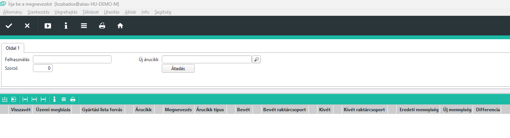
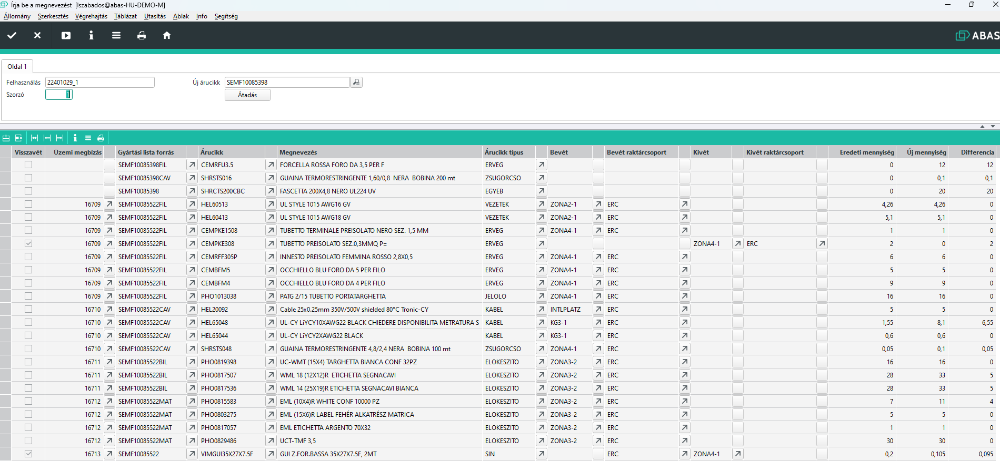
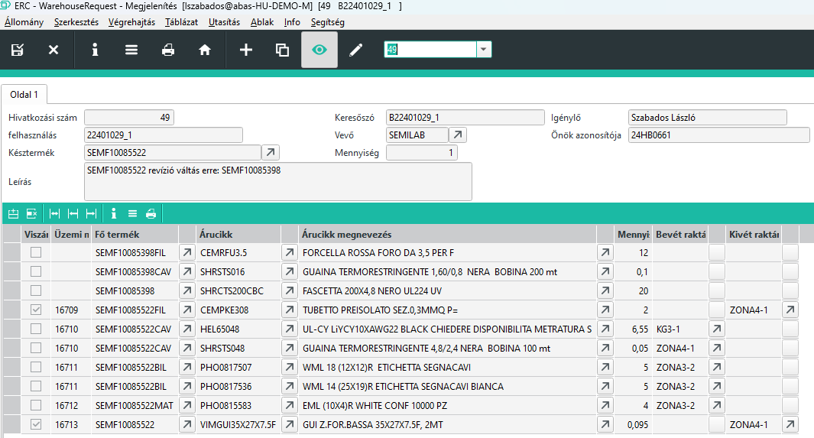
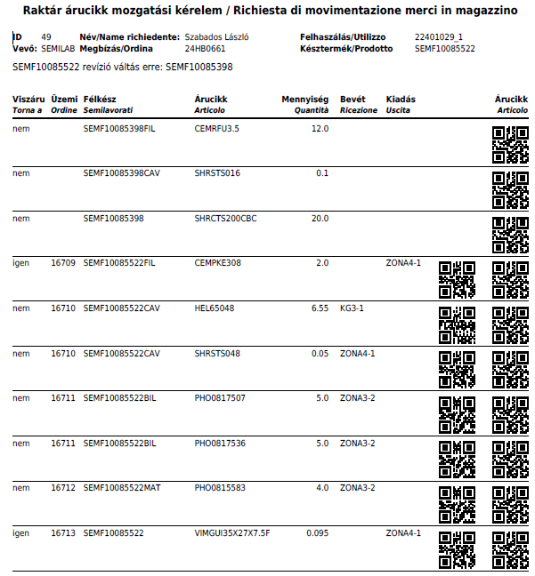

# Raktármozgás igénylés Infosystem

Az infosystem célja, hogy egy elindított, gyártás alatt lévő késztermék és annak félkésztermékeinek az anyagszükségletét összehasonlítsa az új revízió gyártási listájával.

A felhasználás mezőbe az elfogadott javaslat felhasználási számát kellbeírni, ami az összes dokumentáción szerepel, vagy a gyártási központból leszűrhető.

Az új árucikkhez a késztermék új revízióját kellmegadni.

Fontos! Az új revízió gyártási listájának már késznek kell lennie, enélkül hamis eredményt kapunk.

A szorzót alapértelmezett 0 értéken hagyva a felhasználás alapján beállítja a gyártandó mennyiséget. Ha konkrét számot írunk be, akkor annyi panelra összesítve adja meg a különbséget.

## Különbségek lekérése

Az infosystem elindításával az összehasonítás megtörténik.

Az alábbi példa nem teljesen valós eset, két hasonló panel különbségét mutatja.

Az első 3 soron látszik, hogy az üzemi megbízás nincs kitöltve, ezek az árucikkek, amik újonan kerülnek bele.

Amiből anyag felesleg van, ott a visszavét oszlop be van állítva, és a kivét raktárhely van töltve.

> A lista minden különbséget felsorol, nem csak a raktár igényt.

## Különbségek átadása

A különbségeket az Átadás gombbal tudjuk az [Árucikk mozgás kérelem](arucikk-mozgas-kerelem.md) masknak átadni, ami ki is tölti a kérelem űrlapot.

Ez az űrlap lehet a raktár és a beszerzési osztály felé a jelentés és kérelem egyben.

Nyomtatásban meg így néz ki:

> Fontos! Ez a különbség, nem a valós alapanyag többletet mutatja, hanem a két gyártási lista közötti különbséget. Részletekért olvass tovább a "Üzemi gyártási lista javítása" pontnál.

