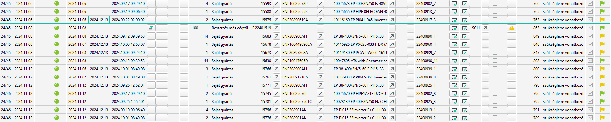

# Tervlap

A tervlap egy nagyon fontos infosystem egy adott árucikk készletgazdálkodása szempontjából. Ennek megértése és ismerete rávilágít a megrendelési javaslatok működésére is.

Elérése Árucikk maskon az  Infosystem (I) / Anyaggazdálkodás / Tervlap futtatásával

Egy példa cikk tervlapja a leírás készítésekor:

A listában az igényeket látjuk felhasználás sorrendjében. A felhasználás sorrendjét az határozza meg, hogy milyen dátummal keletkezik a gyártáshoz az igény.

Az oszlopok vége felé a rendelkezésre áll oszlopban azt látjuk, a sor pillanatában mekkora a várható készlet.
Látjuk a sorokon a folyamat típusánál pl. saját gyártás sz fogyasztja a készletet, mert felhasználás történik. A beszerzés más cégtől pedig növeli a készletet.

Láthatjuk a megrendeléseket és ha van akkor a megrendelési javaslatot is.

Azt is látjuk adott esetben ha a megrendelés teljesült, vagyis bejött az áru.

Acél határidő az a dátum, amikor fel kellene használni az alapanyagot.
A legkorábbi Száll idő, pedig azt mondja, hogy az ABAS szerint ennél korábban nem lehet felhasználni. (Ez akkor van kitöltve, ha az ABAS szerint a cél határidő nem tartható)

Itt álljunk meg egy pillanatra. A státsusz oszlopban lehet zöld, sárga vagy piros zászló.

A sorok nem azt jelölik van e készlet, hanem hogy mi a felhasználásnak az üteme, és ekkor mekkora a készlet várhatólag.

 - Ha a zászló zöld, akkor a cél határidő tartható az ABAS szerint. A Gyártás cél határideje!
 - Ha sárga, akkor nem tartható a határidő, de nem emiatt a cikk miatt. Vagyis annak a részegységnak a gyártása csúszik egy másik alkatrész miatt ami korábban fog kelleni mint ez. Emiatt hiába van raktáron, nem szerelhető be, ezért sárga zászló.
 - Ha piros, akkor határidőre nem szerelhető be ez a cikk. Ha a határidő már a múltban van, de még nem igazoltuk vissza az anyagfelhasználást, akkor piros zászló van. Akkor is, ha van készlet. Mert nem a készlet miatt piros, hanem amiatt, hogy határidőre nem lett beszerelve.
 Ha a határidő a jövőben van és piros a zászló, akkor pedig az ABAS szerint nem lesz szabad készlet arra az időpontra. (Nincs rendelve, vagy van, de arra az időpontra nem fog megérkezni.)

Ha az készlet 0 vagy a minimális alá csökken, az ABAS egy megrendelési javaslatot szúr be. Ha elfogadjuk, akkor a javaslat törlődik, helyette lesz ott a megrendelés.

A [Gyártásközpont](../gyartas/gyartasi-kozpont.md) is ezeket az adatokat listázza ki.

