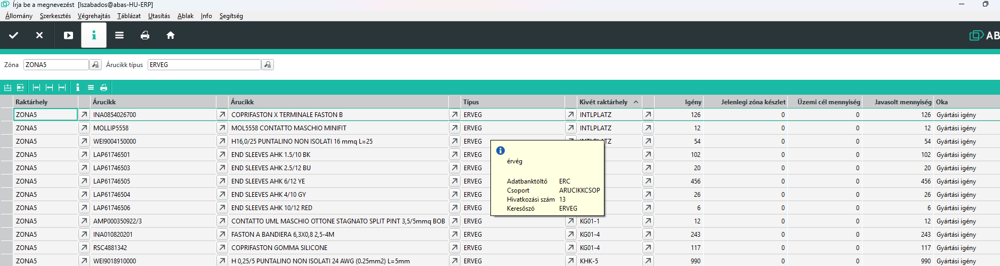

# Üzemi raktárhelyek feltöltése

Az üzemi raktárhelyeken kell minden alapanyagot biztosítani, ami nem a KIT-be kerül bele. Ehhez a raktárnak a gyártás előtt vagy közben folymatosan töltenie kell a raktárhelyeket.

A visszajelentések során az anyagfelhasználás fogyasztja az üzemi raktárhelyeken lévő készletet is, és ez alapján meg lehet határozni, miből és mennyi kell a gyártás során.

## Üzemi raktárhelyek

Az ilyen üzemi alapanyagok egy részét folyamatosan üzemi raktárhelyeken tartunk, amiből sok fogy és rendszeresen használjuk. Zónánkánt megadható árucikkenként a tárolók maximális kapacitása, vagy az a mennyiség, amire maximálisan feltölti a raktár a készletet.

Ezeket a [Üzemi raktárhelyek](uzemi-raktarhelyek.md) leírás alapján lehet beállítani. Amikor a készlet a visszajelentések alapján úgy érzékeli, hogy 50% alá csökken, akkor javaslatot tesz a hiányzó mennyiség feltöltésére.

> Itt fontos megjegyezni, hogy ha a ZONA1 max készlete 1000 db egy adott árucikkből, de még 600db van, valamint az elindított gyártások alapján további 5000 db fog fogyni, a rendszer 0 db átraktározását kéri, hiszen a készlet még 50% felett van. Vagyis azonknál az árucikkeknél, ahol van üzemi készlet meghatározva, a rendszer listázza a várható igényt, de csak akkor kéri a feltöltést, ha 50% alá csökken a készlet, és csak 100%-ig tölteti fel, hiszen a rendszer szerint a többit nincs hol tárolni. Ez a működés megfelelő, mert ha naponta ellenőrizzük az üzemi készletet, akkor soha nem fogy ki.

## Működés

A Céges/ERC/Raktár/Üzemi igény infosystemmel tudjuk indítani aprogramot.

Két féle szűrési lehetőség van, de nem kötelező.

1. Zóna megadása.
Itt ki kell választani a cél zóna raktárhelyet, és csak azokat listázza, amit ide kér a rendszer.

2. Árucikk csoport kiválasztása
Itt árucikk csoportot tudunk kiválasztani. Pl. vezeték, érvég, stb..

A csoportosításokkal tudjuk a más más típusú alapanyagokat külön menetben átraktározni, mert lehet más részleg, vagy más dolgozó végzi.

> Ha  kivét oszlop szerint rendezzük nyomtatás előtt, akkor a szedés a polcsorokon belül sorba megy!

Látjuk a cél zónát, az árucikk kódját és nevét, árucikk típusát.

- igény: az a mennyiség, ami az elindított de még nem visszajelentett mennyiséget mutatja meg.
- jelnelegi zóna készlet: ekkora mennyiség van az árucikkből a zónában
- Üzemi cél mennyiség: ha van üzemi raktárhely, ekkor amximális mennyiségig tölti a rendszer
- Javasolt mennyiség: Az átraktározásra javasolt mennyiség

> Ha üzemi cél mennyiség 0, akkor a teljes igény átraktározást javasolja a rendszer.

> Ha az üzemi cél nem 0, akkor csak akkor javasol átraktározást a rendszer, ha a Jelenelgi zóna készlet az üzemi cél készlet felénél kevesebb.

## Nyomtatás

Éredems a kapott listát nyomtatni és az átraktározást eszerint elvégezni.

A nyomatról az árucikk kódját be lehet olvasni, így a kézi eszköz alapján már látjuk a raktárból hol van az árucikk.
A cél raktárhely is beolvasható.

