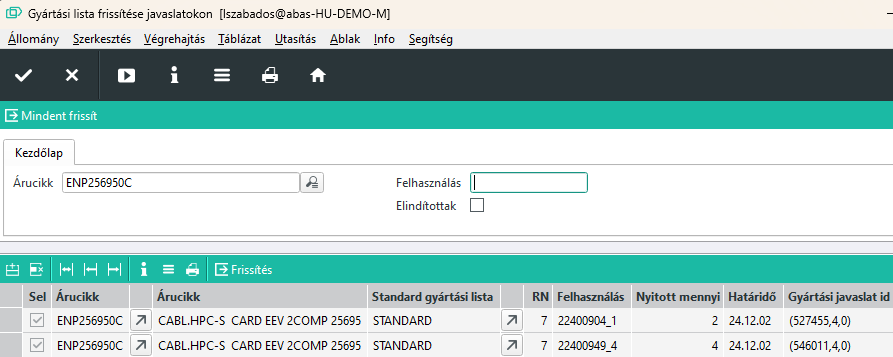
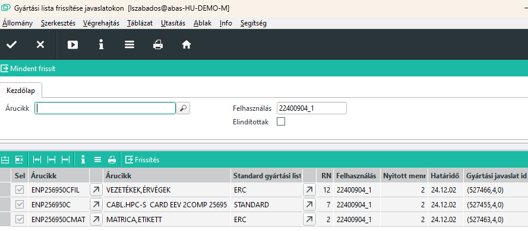

# Gyártási javaslatok gyártási listájának frissítése

Gyártási lista frissítése javaslatokon infosystem indításával használhatjuk.

Abban az esetben, ha egy ajánlatből megbízás lesz, a diszpó futása után, amennyiben a késztermékből nincs szabad készlet raktáron, gyártási javaslat készül.

A gyártási javaslat lemásolja a késztermék standard gyártási listáját, és így létrejön az üzemi gyártási lista.

Ez az üzemi gyártási lista akkor sem változik, ha időközben az árucikk gyártási listáját módosítjuk.

Ez egy gyártáskor szükséges lépés, hiszen a gyártásba adott termék gyártási listáját nem lehet véletlenül sem elrontani, az árucikk gyártási listájának módosításával.

Vannak viszont esetek, amikor jelentős változtatásra van szükség a gyártási listán és ez vonatkozna a már megbízásokon lévő termékekre is.

## Csere javaslatokon

A gyártási javaslat azonnal létrejön amikor a megbízást rögzítjük. Üzemi megbízás viszont csak akkor lesz, ha a javaslatot elfogadjuk.

Ebben a köztes állapotban egyszerű a gyártási lista cseréje, hiszen visszajelentések nem történtek.

Az infosystem ezekben az esetekben tudja a meglévő de el nem indított gyártási listákat cserélni.

Vagy árucikket vagy felhasználást adunk meg, esetleg mindkettőt.

### Árucikk alapján csere

Ha árucikket adunk meg, és az árucikk több megbízáson is szerepel, akkor több sort is kapunk eredményül.

A táblázati sorno kiválasztjuk azt a tételt, aminn végre akarjuk hajtani a gyártási lista frissítését, és a Frissítés gombbal elindítjuk a műveletet.

Ha az összes soron frissíteni akarunk, akkor a felső menüsor "Mindent frissít" gombját is használhatjuk.

> Vegyük észre, hogy így a fő termék frissül, de a beépülő félkész termékek nem. Ha azokat is frissíteni kell, külön el kell végezni!

### Felhasználás alapján csere

Ha a felhasználást adjuk meg, akkor egy konkrét megbízás konkrét árucikkját fogjuk frissíteni, viszont a felhasználás a beépülő félkész termékeket is azonosítja.

így igaz csak az egyik megbízás, de az összes kész és félkésztermék frissül.

## Frissítés elindított üzemi megbízásokon

Van olyan eset, hogy az üzemi megbízást elindítottuk, de még visszajelentés nem volt rá. Ekkor még van mód a cserére. 
Az Elindítottak mező beállításával ezeket a gyártási listákat kapjuk eredményül. A kapott sorokon a program tudja cserélni a gyártási listát. Amit nem sorol fel, azokon már nem lehet.

> Amikor egy visszajelentés történi az üzemi megbízásra, akkor olyan folyamatok indulnak el a háttérben, amik fixálják a visszajelentett sorokat a gyártási listán. Ezeket a sorokat nem lehet törölni. Egy komplett gyártási lista cseréje biztonsággal nem hajtható végre, ha alecserélendő listában vannak nem törölhető elemek, mert akkor ezeket nyilván cserélni sem lehet.

> Kézzel a módosítások elvégezhetőek ezeken a gyártási listákon is, amennyiben az érintett sorra még nem történt visszajelentés. (Idő vagy anyagfelhasználás, vagy készre jelentés)

Lásd: [Megbízás gyártási lista javítása](megbizasi-gyartasi-lista-javitasa.md)