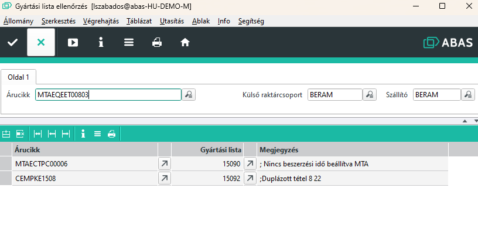

# Gyártási lista ellenőrzés

Ez a segédprogram az elkészült gyártási listákon végez ellenőrzést és az esetleges hibákat felsorolja.

Amennyiben a gyártási lista conto lavoro CL végű félkész terméket is tartalmaz, a szállító helyes beáálításához a külső raktárcsoportot és a szállítót is meg kell adni.

A fenti példában 2 árucikknél talált hibát a program.

> A duplázott tétel az lehet hiba, de nem biztos. Ugyan azt az érvéget tartalmazhatja a CAV és FIL félkész termék is, ezért ez valójában nem hiba.

> Egy árucikknél lehet több hiba is, a megjegyzés mezőben pontosvesszővel elválasztva fel vannak sorlova a hibák, több találat esetén.

> A program nem javít hibákat, csak ellenőriz.