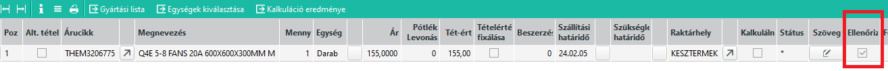

# Tervezés

A tervezési részleg elsődleges feladata, hogy a gyártáshoz szükséges gyártási listákat létrehozza és karbantartsa.

## Árajánlat szakasz

Árajánlat kérés vagy konkrét megbízás esetén is először árajánlatként rögzíti a [beszerzési](../beszerzes/index.md) részleg a gyártandó késztermékeket.

### Késztermék adatai

Akésztermék keresőszavát és raktáregységét már rendszerint létrehozták, enélkül nem lehetne az ajánlatra tenni a sort.

A két alap értéken kívül további beállítások is szükségesek, ami a készterméket érinti. Lásd [Áricikk](../torzsadatok/cikkek.md) leírást.

### Gyártási lista

Vagy már létezik gyártási listája a terméknek, vagy új termék esetén nincs neki. A tervezési részlegen a megbízótól kapott tervek alapján a gyártási listát el kell készíteni, vagy ki kell javítani. 

Lásd még: 
- [Gyártási lista](gyartasi-lista.md)
- [Gyártási lista ellenőrzés](gyartasi-lista-ellenorzes.md)
- [Késztermék másolása](kesztermek-masolasa.md)
- [Összesített előkalkuláció](osszesitett-elokalkulacio.md)
- [Külső raktárcsoport váltása](kulso-raktarcsoport-valtas.md)
- [Cikkcseréje gyártási listán](cikk-csereje-gyartasi-listan.md)

Ha elkészült a javítás, az árajánlat maskon könyvelni kell, az Ellenőrizve mező beállításával. 

Ez különösen akkor hasznos, ha sok tétel van az ajánlaton, így tudja a technikus, mely sorok ellenőrzésével végzett.

## Átadás megbízásra

A technikus az ellenőrzött sorokat, vagy ha egyben kész az egész árajánlatot átadja megbízásra.

Ezt végezheti több ütemben is. Ennek elírása a [Megbízás](../ertekesites/megbizas.md) leírásban.

## Gyártás alatt gyártási lista módosítás

Gyártás közben felmerülhetnek problémák, amik érinthetik a gyártási listát is. A gyártási lista javításával viszont az üzemi gyártási listák már nem módosulnak, azokat kézzel vagy segédprogrammal kell külön javítani.

Ehhez az alábbi dokumentumok állnak rendelkezésre:

- [Megbízási gyártási lista javítása](megbizasi-gyartasi-lista-javitasa.md)
- [Gyártási javaslatok gyártási listájának frissítése](gyartasi-javaslatok-gyartasi-listajanak-frissitese.md)
- [Felhasználások helyettesítése](felhasznalasok-helyettesitese.md)