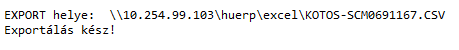
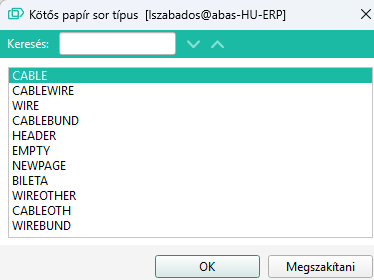

# Kötős papír

A kötős papír egy E.R.C. kiegészítés az ABAS rendszerhez.

Többes célja van:

- Kötős papírok egységesítése, mivel jelenleg nem egységes szerkezetben, struktúrában vannak a kötős papírok elkészítve
- Alapanyagok pontos definiálása, gyors cseréjének lehetősége. Jelenleg a kötős papírokon nincs átvezetve az alapanyag változások
- Sommázás segítése. Jelenleg nagy probléma, hogy jelentős eltérés van a kötős papír tartalma és a gyártási lista szerinti anyagigány között, ezért az árkalkuláció sem lehet pontos, valamint az anyagszükséglet is jelentősen eltér a valóságtól

Indítása Céges/ERC/Tervezés/Kötős papír menüponttal lehetséges.

## Fejléc adatok

A kötős papírnak fő fejléc adatai:
- Késztermék: ide kell annak a készterméknek a kódját megadni, amihez a kötőspapír készül.
- Keresőszó: lehetőleg egyezzen meg a késztermék keresőszavával
- Megnevezés: tetszőleges leírás
- Ellenőrizve, Ellenőrizte mezők nem tölthetőek. Amikor a technikus ellenőrizte a kötős papírt, akkor az "Ellenőrrzés kész" gombra kell kattintani szerkesztés nézetben. Ekkor a bejelentkezett felhasználó azonosítója bekerül az Ellenőrizte mezőbe és az aktuális dátum az Ellenőrizve mezőbe. Itt minden esetben az utolső ellenőrzés dátuma és személye található.

## Táblázatos rész

### Sornagyító

A sorok táblázatos részen, vagy sornagyítóval maskon is tölthetőek. A sor típusától függően tölthetőek vagy sem az egyes mezők.

#### Vez/Kábel

Ebben a mezőben a fő alapanyag adaható meg. Ide konkrét alapanyagot kell választani az ABAS árucikk törzséből. Vezeték esetén a vezeték típusa, kábel esetén a kábel típusa. Kötegelők vagy egyéb alkatrészek esetén pedig a választott kiegészítő választható ki. Ezek fognak a CAV és FIL gyártási listákon mint alapanyag megjelenni.

#### Megjegyzés

Max 60 karakter hosszan lehet egy soros megjegyzést a sorhoz írni. (Pl egy utasítás vagy figyelmeztetést) 

HEAD típusú sornál vastagítva nagyobb betűtípussal és középre igazítva jelenik meg, egyéb esetben a sor alatt fog megjelnni dőlt betűkkel nyomtatáskor.

> A NEWPAGE és az EMPTY kivételével, bárhol megadható.

#### Fejléc szöveg

Max 60 karakter szélességű többsoros szöveg. Az adott sor alatt jelenik meg. Hossazbb magyarázat vagy leírás megjelneítésére. Max 2999 karakter.

> A NEWPAGE és az EMPTY kivételével, bárhol megadható.

#### Nézet

A Nézet mezőbe egy tetszőleges 1 karakter kerülhet vagy üresen is hagyható. Csak kábel és vezeték típus esetén tölthető.
A B C D érték a tilpikus, ahol A esetén a vezeték mindkét végén normál módon van a jelölés felhelyezve. B esetén a jobb oldali fejjel lefelé, C esetén a bal oldali van fejjel lefelé, és D esetén mindkettő fejjel lefelé.

#### Szín

Sok esetben aktív mező. A vezeték vagy kábel adott vezetékének a színe adható meg. Amennyiben a szín az előre definiált színek egyike, akkor a rendszer meg is jeleníti a színt. (Ez igény szerint bővíthető) Max 30 karakteres lehet. Bár nem csak szín adható meg, javaslom, hogy csak indokolt esetben írjuk ide mást.

#### Átmérő

Főleg vezeték esetén használatos. Az átmérőt lehet megadni milliméterben. Bár az árucikk meghatározza az átmérőt is, javasolt a kitöltése.

#### Hossz

Kábel teljes hossza, vezeték teljes hossza, kötegelők hossza, stb
Megadása miliméterben értendő.

Az OTHER (egyéb) sortípus esetén a hossz mezőbe a mennyiséget kell megadni!

#### Conto lavoro

Jelenleg csak kábelek és vezetékek esetében lehet bejelölni. Ha bejelöljük, akkor automatikusan Vevői megrendelésre vonatkozóra lesz beállítva az alapanyag a gyártási listán.

#### Összekötés pipa

Csak vezeték esetén aktív.
Ebből kettő is van, egy az "eleje" és egy a "vége" esetére. Ha a következő sorban lévő vezetékkel közösíteni kell az elejét vagy a végét, akkor itt jelöljük.

> Fontos! A rendszer logikailag nem nézi, hogy a következő sor valóban vezeték e, és ha a sort másoljuk, mozgatjuk, akkor sem viszi magával az így "összekötött" sorokat. 

#### Összekötés szöveges mező

Csak kábel vezeték típusnál aktív. Ide tudunk hivatkozást beírni egy másik kábel vezetékére, amivel közösíteni kell. 

#### Biléta

Amennyiben bilétára nyomtatjuk a jelöléseket, akkor itt adhatjuk meg a biléta típusát. 

> Jelenlegi verzióban egy sorhoz csak egy típusú bilétát adhatunk meg, vagyis mindkét oldaláta vezetéknek vagy kábel érnek ugyan olyan bilétával lehet jelölni. Meg kell vizsgálni, mekkor igény van rá, hogy a két oldalt külön adhassuk meg. Nyilván rugalmasabb, ha külön megadható, de így pont 2x annyi munka a bilétát megadni, mert a két oldalt akkor külön kell.

> Amennyiben a biléta értéke üres, de a lentebb tárgyalt SZÁM mező kitöltésre kerül, akkor ott a vezetékre nyomtatjuk a feliratot.

> A rendszer a sommázáskor 2 bilétét számol ha a SZÁM és SZÁM B mezők is töltve vannak. Ha csak az egyik akkor 1-et és ha egyik sem akkor 0 bilétával számol soronként.

#### Elejes és vége

A vezetékek és kábel vezetékek típusoknál a vezetéknek két vége van. "Eleje" és "Vége" elnevezéssel. Ez lehetne "BAL" és "JOBB" vagy egylb is, de jelenleg ez a megszokott.

Az eleje és vége esetén is az alábbi paraméterek adhatóak meg:

##### Kezdet

A kapcsolási rajzon szereplő jelölés. Max 30 karakterben

##### SZÁM és SZÁM B

A bilétára vagy a vezetékre nyomtatva ez a szöveg kerül.

##### Végződés

Ez egyből 2 mező. Az első egy konkrét árucikk az ABAS árucikk törzsből, pl egy érvég. A második mező pedig egy max 30 karakteres szabad szöveg.

Célszerűen ezek közül az egyiket tölteni kell. Pl ahol nem választunk árucikket, ott oda írjuk szövegesen, hogy semmi, vagy forrasztás.
De lehet azért is semmi, mert az előző sorral közösítve egyetlen érvégbe kerül a 2 vezeték.

##### Hántolás

Kábel esetében aktív mezők, és megadható a kábel 2 oldala milyen hosszan van hántolva.

### Sor típus

Egy sor beszúrásakor minden mező inaktív a sor típust kivéve. Ennek megadása fogja a sor mezőit engedélyezni a sor típusának megfelelően.

A típus pontos felsorolás típus, ezért választani kell de persze be is gépelhető.

A típust sor beszúrása után egyetlen alkalommal lehet kiválasztani, módosításra nincs lehetőség. Ha nem jót választottunk ki, akkor törölhetjük a sort.
A sorok tetszőlegesen mozgathatóak feljebb vagy lejjebb, de a sorbarendezés funkció nem elérhető, mivel értelemszerűen a sorok egymáshoz viszonyított helyzete, főleg a kábelek esetében lényeges, de a vezetékeknél is ahol a végpontok közösítve vannak.

A programban nincs semmilyen logika ami a sorokat összefogja, vagyis a sorrend csak rajtunk múlik, nekünk kell gondoskodni a megfelelő sorrendről.

A típusok jelentése:

#### NEWPAGE

A típus megadásakor semmilyen mező nem aktív, egyedüli hatása, hogy nyomtatáskor az ezt követő sorok új lapra kerülnek.

#### EMPTY

Egy üres sort jelent, igazából egy térköz a sorok között, ami nyomtatáskor és a táblázatos részen is elválaszthat egyes részeket.

#### HEADER

A megjegyzés szöveg és a fejléc szöveg tölthető.

#### WIRE

Vezetékek definiálására szolgáló sor. A legtöbb mező aktív és tölthető.

#### CABLE

Kábel definiálása. Alapvetően megadandó adatok: kábel típusa, hossza és a két végének a hántolás hossza.
Opcionálisan a szín és a conto lavoro jelölés.

#### CABLEWIRE

Alapvetően a CABLE sort követik a CABLEWIRE sorok, ahol a kábel vezetékeit adjuk meg. A vezetékhez hasonlóan már a szín is megadható, valamint a végződések típusai és jelölések is.

A WIRE típustól a különbség, hogy átmérő itt nem adható meg, mert az adott, valamint az összekötés amennyiben van, szöveges hivatkozás, hiszen biztosan távolabbi sorra kell hivatkozni.

> jelenlegi verzióban a hossz mező is megadható, de ennek értelmezését még definiálni kell, hogy ez itt pontosan mit jelent.

#### WIREOTHER, CABLEOTHER

Ezek a sorok kiegészítő alkatrészek hozzáadását teszik lehetővé. A mennyiséged darabban, a hossz mezőnél kell megadni.
Opcionálisan a szín mező is tölthető. Ez lehet pl. matrica, vagy egyéb jelölő, amit fel kell ragasztani. A WIREOTHER a fili a CABLEOTHER a cavi anyaglistára kerül rá. 

> mivel a mennyiséget darabban várja a rendszer, olyan alapanyagok megadására használható, ami darabban van megadva.

#### WIREBUND, CABLEBUND

A kötegelők, zsugorcsövek, stb megadására szolgál. Igazából bármi kiegészító alapanyag lehet az "OTHER"-hez hasonlóan, csak itt a hossz mezőben valóban a hosszat kell megadni milliméterben.

> mivel a mennyiséget milliméterben kell megadni, olyan kiegészítő alapanyag megadására szolgál, ami a rktárban méterben van tárolva.

> A milliméter-méter átváltást a rendszer elvégzi

> Célszerűen a kötegelendő sorok elé vagy után szúrjuk beezeket a sorokat és az EMPTY sorokkal válasszuk szét az egy kötegbe tartozó sorokat, hogy egyértelműbb legyen. Ha kell használjuk a megjegyzés mezőt további magyarázathoz.P

## Betöltő programok

A meglévő EXEL alapú fileok betöltését segíti. Használatához egy előkészített, kötött formátumú excel file-ba kell az adatokat átmásolni, és esetlegesen az javítani. Ebből az excelből lehet az adatokat az ABAS programba átmásolni vágólap segítségével.

Mivel a vezeték és kábel kötőspapítok adattartalma és struktúrája az excelben eltér, ezért a betöltés is külön végzendő.

### Vezeték betöltés

A vezeték betöltés egy speciálisan előkészített excel formátumból tudja a vezetéklistát betölteni. A meglévő excel alapú kötőspapírok gyors(abb) importálására.

> A betöltést mindenképpen a meglévő sorok alá végzi a rendszer, amit tetszőlegesen betöltés után áthelyezhetünk.

### Kábel betöltés

A kábel betöltés egy speciálisan előkészített excel formátumból tudja a kábel listát betölteni. A meglévő excel alapú kötőspapírok gyors(abb) importálására.

> A betöltést mindenképpen a meglévő sorok alá végzi a rendszer, amit tetszőlegesen betöltés után áthelyezhetünk.

## Sommázás

A sommázás a kész és ellenőrzött kötöspapír adatait összesíti és átmásolja a CAV, FIL, és BIL félkésztermékek gyártási listájára.
A CAV, FIL és BIL félkész termékeknek létezniük kell, és létezniük kell a gyártási listájuknak is, legalább egyetlen sorral.

> A program nem végez törlést vagy javítást biztonsági okokból, ezért a CAV, FIL és BIL gyártási listákra, a sorok aljára kerülnek beszúrásra az összesített sorok.
Itt van lehetőség, hogy a régi adatokkal összehasonlítsuk az újakat.

## Nyomtatás

