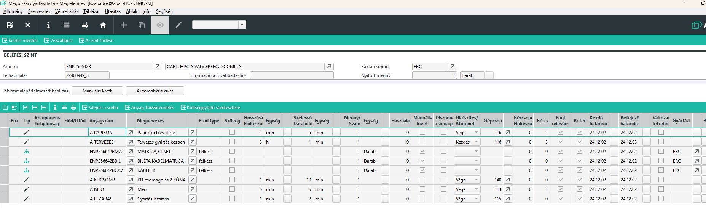
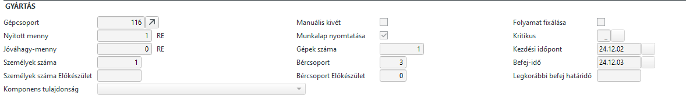
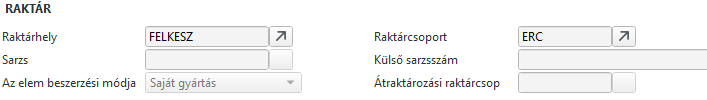

# Megbízási gyártási lista javítása

A megbízási gyártási listát a megbízás létrejötte után a Gyártási javaslat hozza létre, amennyiben a Dispó futásakor gyártási listát készít.

Ezt követően az árucikk gyártási listájának változtatása nem befolyásolja a megbízási gyártási listát.

A megbízási gyártási listát töbféleképpen is megtekinthetjük.

- Gyártásközpontban a táblázati soron állva a Gyártási lista gombbal.
- Gyártási javaslatból, szintén a gyártási lista gombbal
- megbízásból a táblázati soron állva a gyártási lista gombbal

A kapott lista hasonlít a standard gyártási listára , de valójában teljesen más.

A gyártási lista táblázati során sornagyítóval láthatjuk is a különbségeket.

Megjelenik egy gyártás rész, ahol a visszajelentések és még elkészítendő vagy felhasználandó mennyiségeket látjuk.

Alapanyag esetében a raktár részen látjuk, honnan történik a felhasználás.

## Megnyitás szerkesztésre

A gyártásközpontból megnyitva vagy a megbízásból módosítás nézetben megnyitva szerkesztési nézetben nyílik meg.

A gyártási lista számos mezője írásvédett, de lehet sorokat törölni és beszúrni.

## Gyártásba adott javaslat

Mikor a javaslatot elfogadjuk üzemi megbízás keletkezik.

A gyártási lista az üzemi megbízás maskról is előhívható.

Azok a tételek, amire történt visszajelentés már ne törölhetőek és mennyiségi értékük is csak a nem visszajelentett részükkel módosítható.
Bővíteni viszont lehet.

A sorrend is csak akkor változtatható, ha nem érint a sorrend változás visszajelentett tételt.

A gyártási lista javítása után futtassunk [Diszpozíciót](../diszpozicio.md), hogy az anyagbetervezés végrehajtódjon.

## Új vagy cserélt sorok

Ha új sort szúrunk be bővítés vagy csere miatt, figyeljünk a következőkre:

- az ABAS azúj tétel kivét raktárhelyének a raktári kivét raktárhelyet állítja be. KITbe szedett alapanyag esetén a kit raktárhelyet, üzemi raktárról szedett alapanyag esetén a megfelelő üzemi raktárhelyet állítsuk be.

- Az ABAS új sor beszúrásakor automatikusan automatikus anyagfelhasználás beállítással veszi fel a sort. Ne felejtsük el beállítani a Manuális kivét mezőt.

