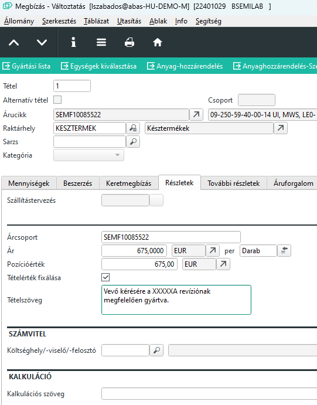
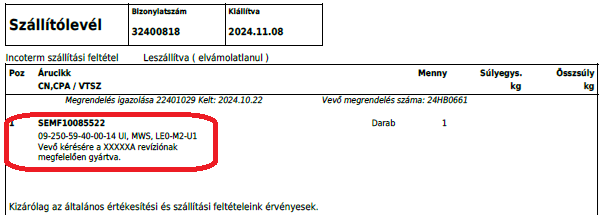

# Revízió váltás

Megbízás rögzítését követően a dispo lefutásával a szükséges késztermékek és a késztermékek gyártásához szükséges saját gyártású félkésztermékekre gyártási javaslat készül.

Ezeket a gyártási javaslatokat a gyártási központban is láthatjuk. A megbízás minden táblázati sora kap egy felhasználási számot. Ezzel a felhsználási számmal tudjuk a gyártási központban a vevői megrendelésre gyártott kész és félkésztermékek javaslatait listázni.

Minden ilyen javaslat egyben tartalmazza a termék gyártásilistájának a másolatát, üzemi gyártási lista formájában.
Ez az üzemi gyártási lista gyártási javaslat létrejöttekor másolódik le a termék gyártási listájáról, de kiegészül plusz információval, amiből a legfontosabb a a gyártandó mennyiség és minden alapanyagigény ezzel fel van szorozva.

## Revízió váltás gyártás elindítása előtt

Ha még a javaslat nincs elfogadva, akkor a megbízáson kell a régi revíziót tartalmazó sornál a mennyiséget csökkenteni, akár 0-ra.

Ha 0-ra csökkentjük a mennyiséget, akkor mentés után a sor törlődik.

Egy újabb dispó futtatása utána a gyártási javaslat is eltűnik.

Az új revízióval lehet a megrendelést javítani, és akár kinyomtatni és a megrendelőnek visszaigazoláskánt elküldeni.

Dispo lefutása után, az új revízióra lesz gyártási javaslatunk.

> Fontos! A megbízásra a rögzítést, hasonlóan a [megbízások rögzítése](../ertekesites/megbizas.md) fejezethez, csak akkor végezzük el, ha már a tervezés az új revízió gyártási listáját javította. Ha erre nincs mód, a tervezésnek utólagosan kell a gyártási listát [frissítenie](gyartasi-javaslatok-gyartasi-listajanak-frissitese.md).

## Revízió váltás, gyártási javaslat elfogadása után

A gyártási javaslat elfogadása után igazából pár óra elteltével már számos folyamatnak végbe kell mennie, hiszen a papírnyomtatás és a művelet visszaigazolása nagyon hamar végbemegy. Ha még kásőbb kérik a revízióváltást, akkor már sok esetben a kitszedés, sőt egyes gyártási műveletek visszajelentése is megtörtént.

Ilyen esetben, nem szabad a megbízásról törölni a sort, mert az elindított gyártás ettől már nem áll le. Ha a megbízáson cserélem a sort, akkor a régi revízió gyártása megtörténik, de a dispo az új revízióra is ad gyártási javaslatot. Ez nyilván nem cél.

A megoldás, hogy a régi revízióval folytatjuk a gyártást, de a gyártási listát módosítjuk az új revíziónak megfelelően.

A lépések ehhez, ahol sok esetben a sorrend is fontos.

### Megbízás javítása

A megbízáson, a revíziót váltó késztermékek sorainál a sornagyítót megnyitva van mód a tételszöveg megadására, ahova beírjuk a revízió váltást.
pl: A termék a megrendelő kérésére XXXXXA revízióval kerül legyártásra.
Ezt lehet több nyelven, vagy a megrendelő nyelvén. 

Ez a szöveg minden szállítólevélen és számlán is szerepelni fog. 

A termék ára is valószínüleg változni fog. Ezt is javítani kell, amint megkapja az iroda az új árat hozzá.

### Új revízió gyártási listájának elkészítése

Az új revíziónak el kell készíteni a gyártási listáját. Ezt a tervezés végzi. Ez egy fontos lépés, a többi műveletnek ezt be kell várnia.

### Új és régi revízió közötti alapanyag különbségek

Az új revízió miatt lehetséges hogy egyes alapanyagokból több vagy kevesebb szükséges, valamint lehetnek teljesen felesleges vagy teljesen új alapanyagok is.

Ezt egyrész tudatni kell az értékesítésért felelős személyekkel, hiszen a termék árát is befolyásolja, valamint értesíteni kell a raktárat is.

A különbségek felderítéséhez használja a [Raktármozgás igénylés](../raktarozas/raktarmozgas-igenyles-infosystem.md) Infosystemet.

### Visszajelentett alpanyagok kiszerelése

A különbségek listában vannak tételek, amik esetlegesen ki kell venni a gyártásból, vagy csökkenteni a mennyiséget.

Ez 2 féle lehet

1. alkatrész. Rendszeritn ez a raktárnak vissza is adjuk
2. egyéb szerelvény. Csavar, vezeték, érvég, stb

A 2. pontban lévőket egyrészt lehet nem is kell bántani, vagy "kiszerelni", hiszen ezen alkatrészek többsége a beszereléssel elhasználódott. Lehet fizikailag ki kell szerelni, de nem kell a raktárkészletre felvenni, mert kidobásra kerülnek.

Az 1-es pontban lévő tételeket viszont, amennyiben már a felhasználásuk le lett jelentve, ki kell szerelni az ABAS-al is, mert visszaraktározni is csak így lehet.

Ha nem szereljük ki, akkor nem tudjuk visszaraktározni és a gyártási listában is látszik, hogy raktárról mínusz mennyiséget várunk. (Jelzi a rendszer, hogy vissza kellene adni)

Olvassa el a [Kiszerelés](../gyartas/szetszereles.md) leírást.

### Üzemi gyártási lista javítása

Ahhoz, hogy az ABAS az elindított javaslatokon is jó anyagmennyiséget akarjon levenni, a üzemi gyártási listákon a különbségeket ki kell javítani. Ez a Tervezés feladata.

A javításkor vegyük figyelembe, hogy a már belejelentett alapanyagokat kiszerelik és visszaküldik a raktárnak, viszont lehetnek olyan anyagok, amit cserélnek vagy kiszerelnek, de hulladék lesz belőle.

Pl. Egyik 80cm-es vezetéket 10 cm-le hosszabbra kell gyártani. A legyártott vezetéket kiszedik, de sem a vezeték, sem az érvégek nem használhatóak, teljesen újat kell gyártani. Vagyis lehet, hogy a különbség lista azt mondja a diferencia 10cm egy adott vezetékből, de a valóságban most 90cm-el több kell és 2-vel több érvég is. De ez konkrétan ehhez az üzemi megbízásra igaz csak.

Ennek megfelelően az igény, a régi és az új gyártási lista összehasonlításából önmagában nem állapítható meg.

### Raktármozgás

A kinyomtatott [Árucikk mozgás kérelem] alapján, a raktár kiadja és átveszi az alapanyagokat. Kevés esettől eltekintve, ezek KIT-ben lévő tételek.

### Részlegek értesítése

- értesíteni kell azt a részleget, ahol az árkalkulációt végzik.
    1. Meg kell állapítaniuk (ha még nem volt), az új revízió árát
    2. Meg kell állapítaniuk a régi revízióval elindított, de újjal legyártott késztermékek árát. Ez szükségszerűen magasabb, mint az új revíziós termék ára, mert a gyártás közbeni revízióváltás tervezési, raktározási és gyártási munkafolyamat többlettel járt az alapanyagigny különbségen felül.

- az új revízió árát fel kell vinni az árlistába
- a revíziót váltott megbízásokon javítani kell az árat és a tételszöveget
- a régi és új revíziók közötti már korábban legyártott félkésztermékek közötti különbségeket le kell gyártatni ezért erről értesíteni kell az adott részleget
    1. matrica, biléta
    2. Vezeték és kábel vágás
    3. Vezeték és kábel gyártás
    4. Mechanika (ki és beszerelés)
    5. Árumozgás (raktár)
    6. Kötés
    7. MEO/TESZT

    > A felsorolásból azokat a részlegeket, ahol még nem tarott a gyártás ki lehet hagyni

- Beszerzési osztály (esetleges alkatrész beszerzése miatt)

