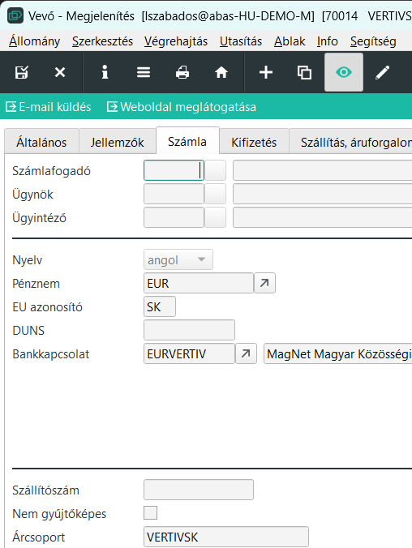
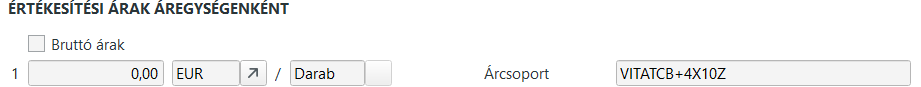
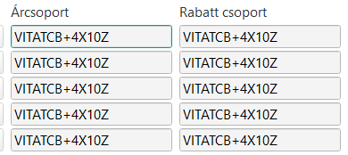
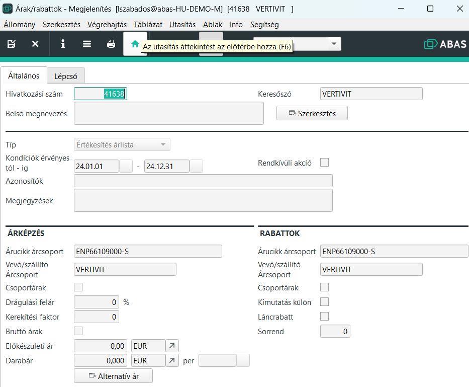

# Árak rabbatok

Az árak-rabbatok egy külön adatbázis az ABAS-on belül, ami árlisták karbantartását tesziu lhetővé.

Ehhez az ABAS biztosít egy Árak Rabbatok adatbázist és infosystemeket a karbantartáshoz.

## Vevő/szállító árcsoport

Minden vevőnél és szállítónál megadható 1 árcsoport. Az adott vevő/szállító ebbe a csoportba tartozik.

Fontos, az árlistát nem a vevő vagy szállító neve vagy kódja hastározza meg, hanem a beállított árcsoport.

Ez bármi lehet, de alapból a vevő keresőszava vagy number értéke.

Ez a megoldás azért jó, mert ha van pl egy szállítónk, akinek franchise üzletlánccal rendelkezik. 5 külön adószámmal rendelkező üzled, de mégis ugyan az. Egy áron dolgoznak. Elegendő egy árlista, csak az árcsoportot azonosra állítjuk és kész.

## Árucikk árcsoport

Hasonló az elv a Vevő/szállító árcsoporthoz.

A lényeges különbség, hogy az árucikkhez tartozik egy értékesítési árcsoport, valamint a beszerzés oldalon minden szállítóhoz egy beszerzési árcsoport.

Az egészet megfejeli, hogy amennyiben vannak külső raktárcsoportok, ott külső raktárcsoportonként lehetséges 5-5 szállító, mindnek lehet 5-5 beszerzési árcsoportja. (Értékesítési árcsoport nincs a külső raktárcsoporton!)

> alapesetben raktárcsoporton belül egyforma árcsoportot szokás beállítani, rika, ha ettől el kell térni.

## Árak rabbatok fő oldal

Keresőszónak rendszerint a vevő kódját vagy árcsoportját írjuk. így egy árlista minde elem, ugyanazon néven fut.
Keresés megkönnyítésére a megnevezésnél írjuk be az árucikk nevét

Nagyon fontos a típus. Értékesítési árlista vagy beszerezési árlista.

Ezt követi 3 alapvető érték:
1. dátum. Mikortól és meddig érvényes az árlista.
2. Árucikk árcsoport
3. Vevő/Szállító árcsoport

Az a 3 alapvető érték, hogy az árlista kiválasztásra kerül e.
Ha egy megbízásnál a kiválasztptt vevő árcsoportja megegyezik az itt megadotal, akkor a vevőre érvényes az árlista.
Megbízás esetén értékesítési árlistának kell elnnie.
Ha a megbízáson szereplő árucikk árcsoportja megegyezik az itt megadott árucikk árcsoporttal, akkor az árucikkre érvényes az árlista
Az aktuális dátumnak a megadott intervallumba kell esnie.

### Hiányos adatok és hatásuk

Sem a dátumot, sem az árcsoport mezőket nem kell kitölteni. Mi történi, ha valami nincs megadva.

- ha a dátum üres, akkor minden időpontban érvényes az árlista. 
- ha a dátum tól értéke üres, akkor bármikortól érvényes
- ha a dátum ig értéke üres, akkor az árlista bármeggig érvényes
- ha a vevő/szállító árcsoport üres, akkor minden vevőre/szállítóra érvényes
- ha az árucikk árcsoport üres, akkor minden árucikkre érvényes.

### Több érvényes találat

Abban az esetben, ha több érvényes árlistánk is van, akkor a pontosabb vagy szűkebb értelmezés az elsődleges.
pl. Van egy árunk ahol a dátum nincs kitöltve, vagyis az ár mindíg érvényes.
Ha másik ár is van, de ott a dátum ois ki van töltve és a dátumok között vagyunk, akkor ez az ár lesz az érvényes.

