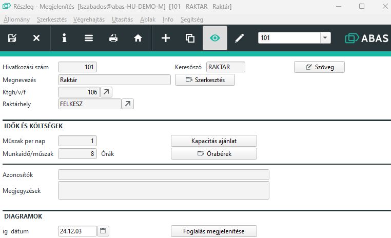

# Kapacitások (Részlegek/Gépcsoportok)

A kapacitások alatt részlegeket, ill. gépcsoportokat foglal össze a program. A részleg a fő fogalom. Egy részleghez több gépcsoport is hozzárendelhető. Ehhez a gépfoglalás is rendelkezésére áll.

Az árucikkek közvetlenül is összeköthetők részlegekkel. Egy árucikk gyártási listájában feltüntetett műveletek gépcsoportokkal vannak összekötve. A részlegek és gépcsoportok rekordjai főképp a kapacitás-számításhoz, a kapacitás-tervezéshez és a diszpozícióhoz tartalmaznak adatokat. Továbbá az előkalkuláció csak a gépcsoportok tervezett órabéreire nyúl vissza, amiket a műveletekbe és árucikkekbe beírtak.

A kiszállított naptárak raktárcsoport-specifikusak és időben korlátlanul érvényesek. A kapacitás ajánlatok a részlegekhez a standard naptáron alapulnak. A gépcsoportok kapacitás ajánlatai a hozzá tartozó részleg naptárán alapulnak.

Olvassa el a [Naptárak](naptar.md)leírást is.

## Részleg

A "Költséghely/-viselő/-felosztó"-hoz adja meg a [Költséghelyet](koltseghely.md)

### Idők és költségek

Megadhatja, hogy a részleg naponta hány műszakban üzemel, és a műszak hány órából áll. Az órabéreket is megadhatja.

## Gépcsoport

Egy részlegnek lehet több gépcsoportja is, viszont egy gépcsoport kizárólag egy részleghez tartozhat.

Amennyiben a gépcsoport működtetéséhez kell képesítés, akkor ezt itt lehet jelölni, és csak olyan dolgozót tud a gépcsoporton foglalkoztatni, aki a megfelelő képesítéssel rendelkezik.

A gépek száma mezőben megadhatja, hogy hány gép tartozik a gépcsoportba. Ennek a kapacitás tervezésnél van jelentősége.

Műszak/nap ésmunkaidő/műszak értékek a részlegből átvételre kerülnek, de módosítható.

Kihasználási fokés hatásfok alapból 100% értéken, de kevesebb lehet. 0-nál nagyobb mindenképpen!

Egyedi kapacitás = Munkaidő/Műszak * Műszak * Kihasználási fok * Hatásfok.

