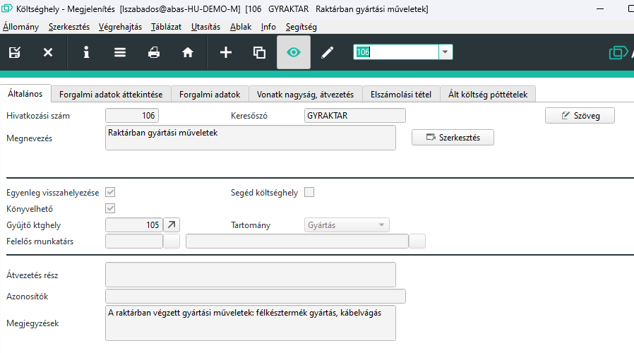

# Költséghely

A költséghely a költségszámításhoz szükséges.

A költséghelyek hiarerhiába szervezhetőek, minden költséghelynek adható meg gyűjtó költséghely.

A költséghelyekra az értékeket pl a gépcsoportok tölthetik a műveleteken keresztül.

